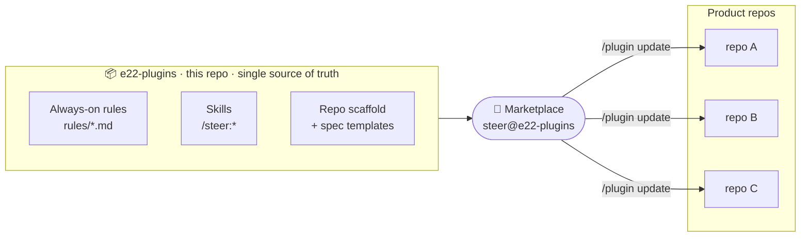
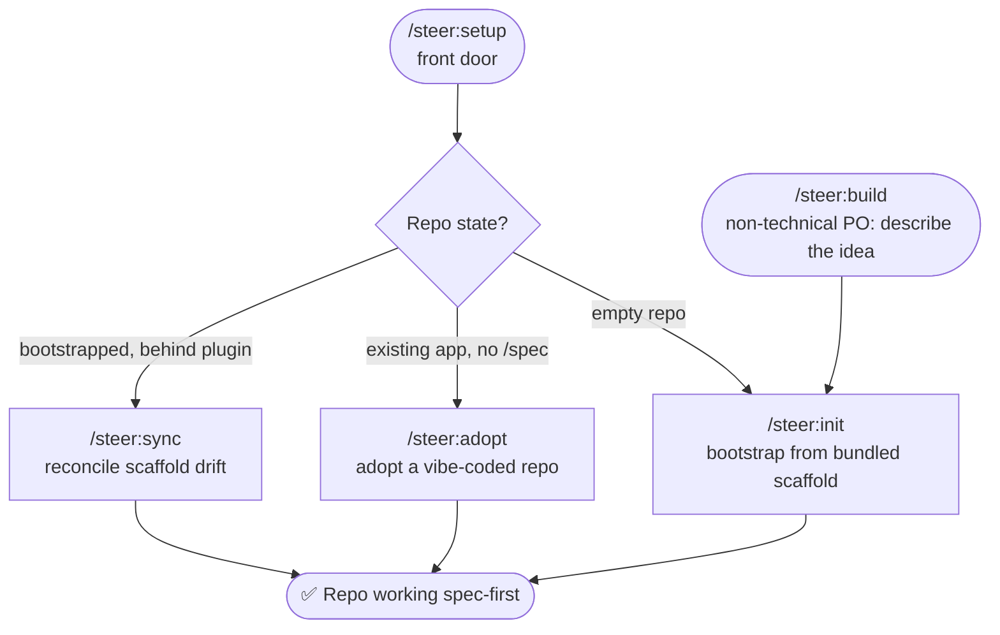
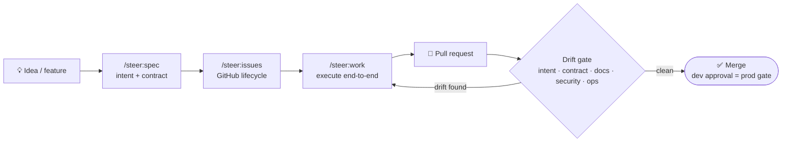

<div align="center">

# 🧭 e22-plugins

### Org-wide engineering standards for Claude Code — edited once, propagated everywhere

An [engineering-standards Claude Code plugin marketplace](https://code.claude.com/docs/en/plugin-marketplaces).
Its primary plugin, **`steer`**, injects an always-on engineering operating
manual into every product session and ships the skills + scaffold that stand a
repo up spec-first — so standards live in **one place** and update **centrally**
instead of being frozen into every forked repo.

<br>

[](https://github.com/element22llc/e22-plugins/actions/workflows/docs-deploy.yml)
[](https://github.com/element22llc/e22-plugins/actions/workflows/plugin-quality.yml)
[](./CHANGELOG.md)
[](./LICENSE)
[](https://ai.element-22.com/)

</div>

> **Edit the rules once here; every product repo picks them up on the next `/plugin update`.**

The marketplace also **re-lists** Anthropic's upstream **`frontend-design`**
plugin (referenced via a SHA-pinned `git-subdir` source, never vendored) so it
can be installed from the same catalog; it is **not** auto-enabled in product
repos — install it explicitly if a repo wants it.

**This repo is the canonical source** of the standards *and* of repository
bootstrap: the plugin bundles the full repo scaffold
(`plugins/steer/templates/scaffold/`) and the spec-spine templates, so
`/steer:init` and `/steer:adopt` stand a repo up without any external template.
The old static `repository-template` (a private repo, intentionally not linked
here) is **replaced** by this plugin-driven bootstrap — see
[Migrating from `repository-template`](#migrating-from-repository-template).

## How it fits together

One catalog, edited here, distributed to every product repo. Standards prose and
the scaffold are **never copied** into product repos — the plugin injects the
rules at session start and the skills pull the latest templates on demand.



## What `steer` ships

| Component | Contents |
|---|---|
| **Always-on rules** (`rules/*.md`) | Injected into every session by a SessionStart hook: PO/dev roles, stack defaults, monorepo layout, spec workflow, **living documentation** (natural-language → spec, action history, app docs), **issue-tracker integration** (client-agnostic), testing rules, Definition of Done, **pre-merge drift gates**, high-risk areas, secrets handling, **audit-aligned delivery** (SOC 2 / ISO 27001-*aligned*, not compliant), change-size model, baseline patterns/anti-patterns, design-sources summary, end-of-session checklist. |
| **Skills** (on-demand, invoked as `/steer:<skill>`) | Grouped by area:<br>**Setup & maintenance** — `/steer:setup` (**the front door** — detects repo state and routes to the right path below), `/steer:doctor` (detect + confirmation-gated install of the local prerequisites — git, mise, Docker — before init/build/dev; *usually via setup*), `/steer:init` (repo bootstrap from the bundled scaffold; *usually via setup*), `/steer:adopt` (adopt an existing "vibe-coded" repo; *usually via setup*), `/steer:sync` (bring a bootstrapped repo up to the current plugin; *usually via setup*), `/steer:protect` (verify/apply GitHub branch protection on `main` from `policy/branch-protection.yml` — the real PR gate, steer being advisory locally), `/steer:tidy` (sweep loose files into `/spec`; *usually via audit*).<br>**Spec authoring** — `/steer:build` (PO-guided idea→working-app flow), `/steer:spec` (brainstorm + `approve` + `validate` a feature spec, no build), `/steer:intake` (absorb a PO's new/updated spec or roadmap document — docx/pptx/xlsx/pdf — by diffing it against the last version and folding the real changes into `/spec`), `/steer:spec-scaffold` (instantiate intent+contract — *internal helper invoked by spec/build/init/adopt, hidden from the slash menu*), `/steer:questions` (sweep open questions; *usually via spec/issues*), `/steer:adr` (ADR).<br>**Issues & execution** — `/steer:issues` (GitHub Issues lifecycle), `/steer:roadmap` (generate a release-milestone timeline — viewable as a GitHub Projects v2 roadmap — from target features or a spec-gap from `/steer:audit spec`; *usually via issues*), `/steer:work` (execute an issue end-to-end; add `--reviewed` to wrap it in a review-gated loop — plan-gate + `/code-review` gate + bounded fix, vetted not first-draft), `/steer:tracker-sync` (the GitHub gateway — *internal helper invoked by issues/work, hidden from the slash menu*).<br>**Navigate & audit** — `/steer:next` (cross-workflow "what next?"), `/steer:help` (browse the whole capability set as a plain-language menu — sourced from the router table, no repo state needed), `/steer:audit` (read-only repo audit — `code` whole-repo health, `spec` as-built-vs-intended conformance, `all` for both), `/steer:report` (file a defect in the steer plugin *itself* upstream — scrubbed, deduped, confirmation-gated; not for product bugs).<br>**Reference prose** (*materialized into `/spec/reference/`*) — `/steer:reference [conventions\|traceability\|design-sources\|context-hygiene\|architecture-diagrams]`; and `/steer:standards` (load the always-on rules on demand — for Cowork, see below). |
| **Templates** | Bundled spec templates (`feature-intent`, `feature-contract`, `adr`, `productionization`, `vision`/`users`/`glossary`, `history` (action log), `tracker`, `app-docs`) and the full reference prose, so scaffolding always uses the latest org templates. |
| **Repo scaffold** (`templates/scaffold/`) | The complete bootstrap bundle — `mise.toml` + standard tasks, `compose.yaml`, CI, the drift-gate PR template, issue templates, `configs/`, `.env.example`, `.claude/settings.json`, editor config, infra conventions — installed by `/steer:init`/`/steer:adopt` per its `MANIFEST.md`. |

The always-on rules are delivered by a `SessionStart` hook that concatenates
`plugins/steer/rules/*.md` to stdout (which Claude Code injects as
session context). It runs once per session when the plugin is enabled.

## Bootstrapping a repo with the plugin

The plugin *is* the bootstrap mechanism — no template repo to fork. Start from
**`/steer:setup`**, the single front door that detects repo state and routes:



1. Create an empty repo (or open an existing app), install the plugin (below).
2. **New product** → run **`/steer:init`**: instantiates the bundled scaffold
   (toolchain + tasks, Docker Compose, CI, PR/issue templates, editor config,
   `.env.example`) and the spec spine (`vision.md`, `users.md`, `glossary.md`,
   action history, tracker declaration, app guide), interviews you to fill it,
   pins the toolchain, and leaves the repo working spec-first.
   **Existing app with no `/spec`** → run **`/steer:adopt`** instead.
   **Non-technical PO** → type **`/steer:build`** and describe the idea.
3. From there, Claude documents in parallel as you talk: intents/contracts per
   feature, ADRs for decisions, open questions for ambiguity, the app guide
   for behavior, an action-history entry per change — and flags drift
   (intent/contract/docs/security/ops) in the PR before merge. A dev approving
   the PR remains the production gate. The workflow is **SOC 2 / ISO
   27001-aligned** (traceability, review evidence, change history) — alignment
   is a workflow property, not a compliance claim.

## The spec-first delivery loop

Once a repo is bootstrapped, the day-to-day loop keeps intent, code, and docs in
lockstep. The pre-merge drift gate is the checkpoint — a dev's approval remains
the production gate.



## Migrating from `repository-template`

`element22llc/repository-template` is no longer the bootstrap source; this
plugin carries everything it provided (latest versions, centrally updated).

- **New repos:** don't fork the template — start empty and run `/steer:init`.
- **Existing forks keep working.** Nothing breaks; the fork already has the
  scaffolding. On the next `/steer:init` run (or by asking Claude), back-fill
  the artifacts the template never shipped: `/spec/HISTORY.md`,
  `/spec/tracker.md`, `/spec/app/README.md`, and the drift-gate PR template —
  all instantiated from the plugin's bundle.
- **Scaffolding updates** (CI, `mise.toml` tasks, PR template, …) now arrive
  via `/plugin update` + the template-reconciliation convention instead of
  manual copying between repos. Standards prose and scaffolding files are
  maintained **only here**; the template repo should be archived once active
  forks have back-filled.

## Where hooks fire (surfaces)

Where the plugin's hooks fire depends on the surface (validated June 2026). The
Claude Desktop app has three tabs — **Chat**, **Cowork**, and **Code** — and they
don't behave the same:

| Surface | Rules auto-inject | `PreToolUse` gates | Skills | Use for |
|---|:---:|:---:|:---:|---|
| **Claude Code** (CLI, IDE extensions, Desktop **Code** tab) | ✅ | ✅ | ✅ | The supported path — all engineering work. |
| **Cowork** tab | ⚠️ | ⚠️ | ✅ | PO/knowledge-work only — specs, question sweeps, repo-scoped GitHub triage. No install/build. |
| **Desktop *Chat* tab & claude.ai web chat** | ❌ | ❌ | ✅ | Skills only — rules not injected, gates don't run. |

- **Claude Code** — the CLI, the IDE extensions (VS Code / JetBrains), and the
  Desktop **Code** tab — **runs hooks fully**: the always-on rules inject, the
  `PreToolUse` gates run, skills and templates work. This is the supported path.
- **Cowork** (the *Cowork* tab) is the one chat-family surface where hooks and
  sub-agents run, but it's a **no-install sandbox** and **best-effort, for
  PO/knowledge-work only** — specs, open-question sweeps, and repo-scoped GitHub
  triage via the built-in connector. Anything that installs or builds
  (`init`/`adopt`, docker/mise, the `gh` CLI, the local MCP servers) **doesn't work
  there**, so **do engineering work in Claude Code instead.** Plugin-scoped
  `SessionStart` hooks had bugs earlier in 2026 (since closed) — **reconfirm on your
  build** before relying on auto-injected rules.
- **The Desktop *Chat* tab and claude.ai web chat do NOT run hooks.** Plugins
  install and **skills work**, but the always-on rules are not auto-injected and
  the `PreToolUse` gates don't run.

On the no-hooks surfaces — and as a fallback anywhere the rules didn't load — run
**`/steer:standards`** at the start of the session to load the same `rules/*.md`
ruleset by hand, and rely on human review where the gates would have fired. See
[Known limitations](docs/reference/known-limitations.md) for the full surface map.

## Install

```bash
claude plugin marketplace add element22llc/e22-plugins
claude plugin install steer@e22-plugins
```

Or commit this to a product repo's `.claude/settings.json` so teammates are
prompted to install when they trust the folder:

```json
{
  "extraKnownMarketplaces": {
    "e22-plugins": { "source": { "source": "github", "repo": "element22llc/e22-plugins" } }
  },
  "enabledPlugins": {
    "steer@e22-plugins": true
  }
}
```

> First install prompts you to trust the `e22-plugins` marketplace.

## Upgrading from `e22-standards`

The plugin was renamed `e22-standards` → **`steer`** (and skills lost their
redundant prefix: `/e22-standards:e22-init` → `/steer:init`). The marketplace
(`e22-plugins`) and repo are unchanged, so this is a clean break with two manual
steps per already-bootstrapped repo:

1. In the repo's `.claude/settings.json`, change the enabled-plugin key:

   ```diff
   - "e22-standards@e22-plugins": true
   + "steer@e22-plugins": true
   ```

2. Run `/plugin update`, then `/clear` (or start a fresh session) so the renamed
   rules and hooks reload.

Then invoke skills under the new namespace — `/steer:<skill>` (e.g. `/steer:sync`,
`/steer:work`) instead of `/e22-standards:e22-<skill>`. Already-materialized
`/spec` spines need no change; `/steer:sync` reconciles any scaffold drift.

## Keeping product repos in sync

The rules are **not** committed into product repos — they are injected by the
plugin — so updating org standards needs no change in any product repo:

1. Edit the rules/skills/templates here and add a `CHANGELOG.md` `## steer` →
   `### [Unreleased]` entry, then merge to `main` (changes go through `feat/*` /
   `fix/*` branches + PR). The `plugin.json` `version` is **not** bumped per PR —
   it bumps once, in the release PR that renames `[Unreleased]` to the new version.
2. In any product repo, a dev runs `/plugin update steer@e22-plugins`.
3. The next session injects the updated ruleset. The version banner at the top of
   the injected context shows which version is live.

For products that need reproducibility, pin a `ref` (tag or SHA) in the
marketplace `source` in `.claude/settings.json`; updating then becomes a reviewed
PR that bumps the pin.

## Documentation

📖 **Full documentation site: [ai.element-22.com](https://ai.element-22.com/)**

Concepts, workflows, and a generated skills/hooks reference (with mermaid
diagrams) live under [`docs/`](./docs/) and are built with
[Zensical](https://zensical.org/) (the Material for MkDocs team's successor):

```bash
mise run docs:serve     # live-reload preview at http://127.0.0.1:8000
mise run docs:build     # strict build (fails on broken links/nav)
mise run docs:check     # structural + source-of-truth sync validation
```

The site is **auto-maintained**: the repo-local `/plugin-docs` skill reconciles
the reference pages against `plugins/steer/`, and a CI drift gate
(`validate_docs.py`, `check_docs_impact.py`) fails PRs when docs fall out of
sync. Authoring conventions for the plugin itself stay in
[`AUTHORING.md`](./AUTHORING.md).

## Versions

The current version lives in
`plugins/steer/.claude-plugin/plugin.json`; what changed in each release
is in [`CHANGELOG.md`](./CHANGELOG.md). (No version table here — it would just
drift from the source of truth.)

## License

Licensed under the [Apache License, Version 2.0](./LICENSE) — see also
[`NOTICE`](./NOTICE). You are free to use and adopt these standards under those
terms.

This repository is **published read-only**: development happens internally and
external pull requests are not merged. See [`CONTRIBUTING.md`](./CONTRIBUTING.md)
for how to use it and report problems, and [`SECURITY.md`](./SECURITY.md) for
reporting vulnerabilities.
