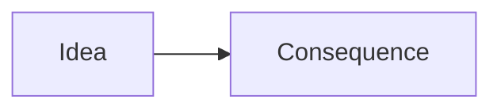

<!--
Template: conceptual explainer (the mental model behind a part of the plugin).
Copy into docs/concepts/<name>.md and fill in. Prefer one mermaid diagram that
captures the idea, then prose. This file is excluded from nav and orphan checks.
-->
# <Concept name>

Lead with the idea in one or two sentences: what it is and why it exists.

## <Aspect>

Explain, linking to the relevant [workflow](../workflows/index.md) or
[reference](../reference/skills.md) page.

!!! warning "Guardrail"
    Call out any invariant or boundary the reader must respect.
