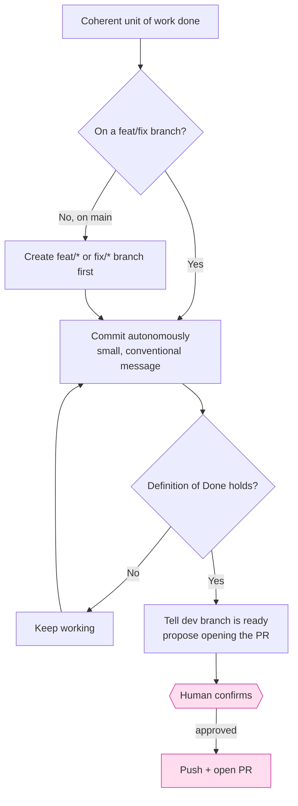

# Authorization model

`steer` draws a deliberate line between actions that are **cheap and reversible**
(done autonomously) and actions that are **outward-facing or hard to reverse**
(gated on a human). This is codified in the always-on rule
`45-commit-autonomy.md` and reinforced by `95-not-the-gate.md`.

## What is autonomous

- **Branching** off `main` onto `feat/*` / `fix/*` — never committing to `main`
  directly.
- **Committing** whenever a coherent unit of work is done (tests pass, lint is
  clean, it builds). Do not pause to ask "should I commit?".

## What is gated

- **Pushing and opening the PR.** This is the one step that waits for the dev.
  Everything before it does not. The **PR review is the gate** — not each commit.

!!! note "The local boundary is advisory — the server enforces it"
    Rule `95-not-the-gate.md` is explicit that this in-session discipline cannot
    *stop* a direct push to `main`; it only governs how the agent behaves. The
    real wall is **GitHub branch protection**, which `/steer:protect` verifies
    against `policy/branch-protection.yml` and (on the dev's explicit
    confirmation) applies via `gh api`. Run it as the final step of init/adopt to
    turn the advisory boundary into an enforced one.

## Why this matters for the plugin's own skills

The skill frontmatter encodes the same boundary:

- **Tier 1 (read-only)** skills set `disallowed-tools: Edit, Write, NotebookEdit,
  EnterWorktree` — e.g. `drift`, `audit`, `next`, `standards`.
- **Tier 2 (side-effecting)** skills may edit and commit but never push to `main`
  without confirmation — e.g. `sync`, `work`, `tidy`.

See the [Skills reference](../reference/skills.md) for each skill's tier, and
[Configuration](../reference/configuration.md) for how tools are constrained.
