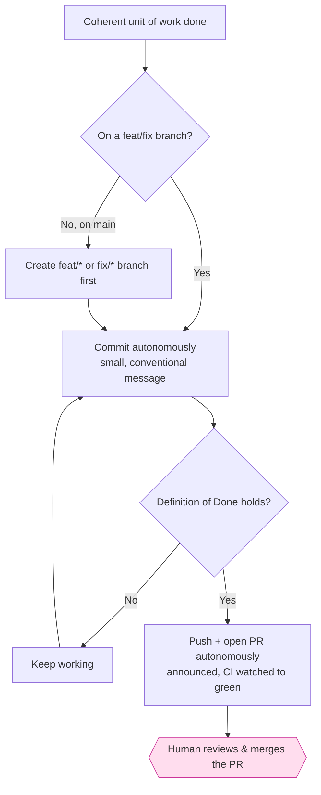

# Authorization model

`steer` draws a deliberate line between actions that are **cheap and reversible**
(done autonomously) and actions that are **outward-facing or hard to reverse**
(gated on a human). This is codified in the always-on rule
`45-commit-autonomy.md` and reinforced by `95-not-the-gate.md`.

Delivery runs in exactly **two modes**, keyed to GitHub branch protection
(rule `45-commit-autonomy`): a **protected** `main` is **pr-flow** — the diagram
above, with the server-enforced **merge review as the one human gate** — and an
**unprotected** `main` is **solo-trunk** (pre-MVP by declared intent), where the
trunk commit + push are the autonomous delivery and there is no PR. There is no
third mode; `/steer:protect` moves a repo between them and reconciles the
`CLAUDE.md` delivery-mode marker (an offline cache of the observed protection).

## What is autonomous

- **Branching** off `main` onto `feat/*` / `fix/*` — never committing to `main`
  directly.
- **Committing** whenever a coherent unit of work is done (tests pass, lint is
  clean, it builds). Do not pause to ask "should I commit?". Commit subjects
  follow [Conventional Commits](https://www.conventionalcommits.org/)
  (`type(scope): summary`, with `feat!:` / a `BREAKING CHANGE:` footer for
  breaking changes) — guidance only, not a lint gate; see `/steer:reference
  conventions` for the full type list and rationale.
- **Creating or reusing the tracking issue** on an explicit implement/capture
  request, in a GitHub-adopted repo (issue-first, rule `36-issue-first.md`). The
  issue and the bounded action set behind it do not need a second confirmation.
- **Pushing the branch and opening the PR** once the Definition of Done holds —
  announced, never asked (rule 00's heads-up pattern). Behind branch protection
  an open PR is inert until a human merges it, so gating its creation protected
  nothing; the delivery skills (`work`, `init`, `adopt`, `sync`, `build`)
  pre-approve `git push` / `gh pr create` / `gh pr edit` in their
  `allowed-tools`, and the scaffold allowlist carries the same grants. In
  solo-trunk, the equivalent autonomous delivery is the trunk commit + push
  (gated by the `check-trunk-push` hook only once graduation signals stand —
  see [Hooks](../reference/hooks.md)).

!!! note "These autonomous moves are pre-authorized too — not just declared"
    Declaring branching autonomous is worthless if switching onto the branch then
    prompts. So the scaffold `.claude/settings.json` `permissions.allow` also
    pre-authorizes the **branch/fetch/move** verbs the skills run on every unit of
    work — `git switch`, `git checkout -b`, `git fetch`, `git mv`,
    `git stash` — and the **PO-flow toolchain** the `build` skill drives itself:
    `mise install`, `mise lock`, and the named `mise run dev` (run the app locally).
    The `build` skill carries the same grants in its frontmatter, so the
    non-technical PO flow is quiet even in a repo that predates the scaffold
    allowlist. `mise run dev` is a **named** task, not the banned `mise run:*`
    wildcard — `mise run deploy` still prompts. Bare `git checkout -- <file>`
    (discards work), destructive `git rm` (an unattended recursive/forced delete —
    moved to `ask`), and every delivery verb stay gated. `check_standards.py`
    asserts this set stays under `allow` so it can't silently regress.

!!! note "Issue creation is autonomous — but a host can still gate it"
    Some Claude Code permission modes classify an unprompted `gh issue create` as
    an external write and block it, even though steer authorizes it. The bundled
    scaffold therefore pre-authorizes the `gh` tracker-metadata write verbs
    (`gh issue create` / `edit` / `comment`) under `.claude/settings.json` →
    `permissions.allow`, so the find-or-create path is reachable in a
    default-permission session. The MCP write tools (`mcp__github__issue_write` /
    `sub_issue_write`) instead sit under `ask` — a bare/ad-hoc MCP issue write is
    an allowlist escape a consumer's security review flags — but the
    `/steer:tracker-sync` and `/steer:report` skills re-grant them in their own
    `allowed-tools`, so the governed find-or-create path stays silent within those
    skills. `git push` and `gh pr create`/`edit` sit under `allow` (autonomous
    delivery — the merge is the gate); `gh pr merge` stays under `ask` and
    force-pushes under `deny`. Where a host still blocks the create, it is a
    *host-permission gate, not a missing issue* — confirm with the user or run
    `!gh issue create` under their identity, rather than looping.

!!! warning "A per-skill grant only applies while that skill is the invoked one"
    A skill's `allowed-tools` grant pre-approves those tools **only while that
    skill is the invoked one** — it does not carry into a skill that merely
    *delegates* to it in prose. The tracker write verbs live in
    `/steer:tracker-sync`'s `allowed-tools`, but the lifecycle reaches that gateway
    **transitively**: a PO runs `/steer:issues capture` (or `/steer:work`,
    `/steer:spec materialize`), which routes through tracker-sync *by description*,
    not by invoking it. So tracker-sync's grants never take effect on that path and
    the `gh issue create/edit/comment` write falls through to
    `.claude/settings.json` — where it is prompted (interactive) or **silently
    auto-denied** (headless), surfacing as "the whole `gh` surface is walled off".
    The scaffold `permissions.allow` list is therefore the **real backstop** for the
    orchestrated path. `/steer:sync`'s `github-issue-permissions` capability
    (see [Repository contract](../reference/repository-contract.md)) detects a repo
    missing that allow-list — `absent` / `mis-wired` (a read-only-era `settings.json`
    with `gh issue list`/`view` but no `create`) / `present-wired` — so the gap is
    named up front rather than discovered mid-workflow.

!!! note "Exception — solo trunk mode (pre-MVP greenfield)"
    When one person is both PO and dev with no MVP yet, `/steer:init` can put the
    repo in **solo trunk mode** (declared in the product `CLAUDE.md` `## Delivery
    mode` section): commits land **directly on `main`** and are pushed
    autonomously, with no `feat/*` branch and
    no per-feature PR — there is no second reviewer yet, so the PR gate has nothing
    behind it. CI still runs on every push, and the spine, tests, and Definition of
    Done are unchanged. The mode ends at **graduation** — run `/steer:protect`, which
    raises the server-side PR wall — once the MVP works, you first deploy, or a second
    contributor joins. Once any of those signals is *visible locally* (a deploy
    workflow, an `infra/` tree, a `prod` branch), the `check-trunk-push` hook
    stops silent trunk pushes — each `git push` surfaces for a human yes until
    the repo graduates.

## What is silent — read-only inspection

The skills reconstruct workspace state constantly: `git status/diff/log/show/
branch`, the read-only `git remote` forms (`-v`/`show`/`get-url` — the mutating
`set-url`/`add`/`remove`/`rename` subcommands are `deny`-listed),
`gh pr view/checks/list/diff`, `gh run view/list/watch`, `gh repo
view`, `gh label list`, `mise tasks`, and the named verify tasks `mise run check`/
`mise run ci`. None of these mutate anything, so the scaffold `.claude/
settings.json` pre-authorizes them all under `permissions.allow` — prompting on
inspection was the bulk of the "asks for approval constantly" friction without
protecting anything. The read-heavy navigators (`/steer:next`, `/steer:audit`,
`/steer:issues`, `/steer:sync`, `/steer:setup`, `/steer:work`) carry
read-only `allowed-tools` grants in their frontmatter, so inspection stays silent
even in a repo that predates the scaffold allowlist. The setup and build flows
(`/steer:init`, `/steer:adopt`, `/steer:intake`, `/steer:build`) likewise declare
scoped grants for the operations they routinely run — git inspection and
branch-creation (`git status`/`diff`/`log`/`switch`/`checkout -b`) and named dev
tasks (`mise run dev:*`, `pnpm dev*`), never a `git`/`gh`/`mise run` wildcard, so
delivery and unknown commands still prompt. Those flows also pre-approve the
bundled plugin helper scripts they execute on every run — `template-reconcile.sh`,
`scaffold_reconcile.py`, `scan-prereqs.sh` — under a matching interpreter
(`Bash(sh *scripts/template-reconcile.sh*)`), since an ungranted helper prompts the
user mid-flow every time. The scaffold's MCP allowlist tracks
the hosted GitHub MCP's consolidated issue verbs: the **read/dedup** tools
(`issue_read`, `list_issues`, `search_issues`, `add_issue_comment`) sit under
`allow` so find-before-create is silent, while the **write** tools (`issue_write`,
`sub_issue_write`) sit under `ask` and are re-granted per-skill (see the note
above). These names are the post-rename verbs (`create_issue`/`update_issue` →
`issue_write`, `get_issue` → `issue_read`, `add_sub_issue` → `sub_issue_write`);
the pre-rename names no longer resolve.

The boundary is deliberate: `mise run` is allowlisted **only** for the named verify
tasks (`check`/`ci`), never the wildcard — an open `mise run:*` would silently
green-light `mise run deploy`. `gh api`/`gh:*` stay prompted by omission (the
mutation vector for repo delete, PR merge, and branch protection). `check_standards.py`
asserts both halves so the split can't regress, and separately asserts every skill
grants the bundled plugin helper scripts its body — including a factored-out
`PROCEDURE.md` — invokes, so the prompt-on-every-run class can't creep back.

!!! warning "Chained commands defeat the allowlist"
    A permission rule matches a *single* command string. `git status && git diff`
    matches no rule even when both are allowlisted, so it prompts anyway. Skills run
    inspection commands as separate invocations — chaining with `&&`/pipes is the
    most common reason a repo that looks allowlisted still asks for approval.

## What is gated

- **Merging the PR.** This is the one step that waits for the dev — everything
  before it (branching, committing, pushing, opening the PR) does not. The
  **merge review is the gate** — not each commit, not the push. `gh pr merge`
  is never pre-approved (it sits under `ask` in the scaffold), and in a
  protected repo the server wall enforces the review regardless.
- **Deploying**, in every mode — including the hotfix lane, where a deploy is
  policy-permitted but never auto-executed.
- **Trunk pushes in a solo-trunk repo that has outgrown pre-MVP** — the
  `check-trunk-push` hook surfaces each `git push` for a human yes once a local
  graduation signal stands, until `/steer:protect` graduates the repo.

!!! note "Watching CI is not crossing the gate"
    After a push, `/steer:work finish` watches CI to conclusion and fixes a red
    build before treating the work as done — that is *finishing* the work, not
    merging. To support this without a prompt per poll, the `work` skill
    pre-approves **read-only** CI status (`gh pr checks`, `gh run view`,
    `gh run watch`) alongside its delivery grants. `gh pr merge`, `gh api`, and
    anything that deploys stay gated exactly as before.

!!! note "The local boundary is advisory — the server enforces it"
    Rule `95-not-the-gate.md` is explicit that this in-session discipline cannot
    *stop* a direct push to `main`; it only governs how the agent behaves. The
    real wall is **GitHub branch protection**, which `/steer:protect` verifies
    against `policy/branch-protection.yml` and (on the dev's explicit
    confirmation) applies via `gh api`. Run it as the final step of init/adopt to
    turn the advisory boundary into an enforced one.

## Why this matters for the plugin's own skills

The skill frontmatter encodes the same boundary:

- **Tier 1 (read-only)** skills set `disallowed-tools: Edit, Write, NotebookEdit,
  EnterWorktree` — e.g. `audit`, `next`, `standards`.
- **Tier 2 (side-effecting)** skills may edit, commit, push their work branch,
  and open the PR — but never merge it or commit to `main` outside solo-trunk —
  e.g. `sync`, `work`, `tidy`.

See the [Skills reference](../reference/skills.md) for each skill's tier, and
[Configuration](../reference/configuration.md) for how tools are constrained.
