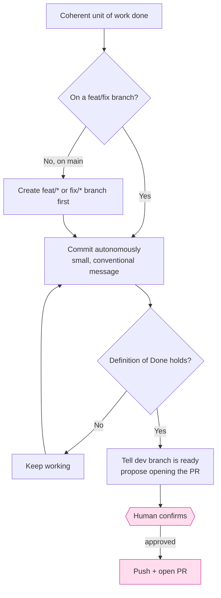

# Authorization model

`steer` draws a deliberate line between actions that are **cheap and reversible**
(done autonomously) and actions that are **outward-facing or hard to reverse**
(gated on a human). This is codified in the always-on rule
`45-commit-autonomy.md` and reinforced by `95-not-the-gate.md`.

## What is autonomous

- **Branching** off `main` onto `feat/*` / `fix/*` — never committing to `main`
  directly.
- **Committing** whenever a coherent unit of work is done (tests pass, lint is
  clean, it builds). Do not pause to ask "should I commit?".
- **Creating or reusing the tracking issue** on an explicit implement/capture
  request, in a GitHub-adopted repo (issue-first, rule `36-issue-first.md`). The
  issue and the bounded action set behind it do not need a second confirmation.

!!! note "These autonomous moves are pre-authorized too — not just declared"
    Declaring branching autonomous is worthless if switching onto the branch then
    prompts. So the scaffold `.claude/settings.json` `permissions.allow` also
    pre-authorizes the **branch/fetch/move** verbs the skills run on every unit of
    work — `git switch`, `git checkout -b`, `git fetch`, `git mv`, `git rm`,
    `git stash` — and the **PO-flow toolchain** the `build` skill drives itself:
    `mise install`, `mise lock`, and the named `mise run dev` (run the app locally).
    The `build` skill carries the same grants in its frontmatter, so the
    non-technical PO flow is quiet even in a repo that predates the scaffold
    allowlist. `mise run dev` is a **named** task, not the banned `mise run:*`
    wildcard — `mise run deploy` still prompts. Bare `git checkout -- <file>`
    (discards work) and every delivery verb stay gated. `check_standards.py`
    asserts this set stays under `allow` so it can't silently regress.

!!! note "Issue creation is autonomous — but a host can still gate it"
    Some Claude Code permission modes classify an unprompted `gh issue create` as
    an external write and block it, even though steer authorizes it. The bundled
    scaffold therefore pre-authorizes the tracker-metadata write verbs
    (`gh issue create` / `edit` / `comment`) under `.claude/settings.json` →
    `permissions.allow`, so the find-or-create path is reachable in a
    default-permission session. Delivery (`git push`, `gh pr create`/`merge`)
    stays under `ask`/`deny`. Where a host still blocks the create, it is a
    *host-permission gate, not a missing issue* — confirm with the user or run
    `!gh issue create` under their identity, rather than looping.

!!! note "Exception — solo trunk mode (pre-MVP greenfield)"
    When one person is both PO and dev with no MVP yet, `/steer:init` can put the
    repo in **solo trunk mode** (declared in the product `CLAUDE.md` `## Delivery
    mode` section): commits land **directly on `main`**, with no `feat/*` branch and
    no per-feature PR — there is no second reviewer yet, so the PR gate has nothing
    behind it. CI still runs on every push, and the spine, tests, and Definition of
    Done are unchanged. The mode ends at **graduation** — run `/steer:protect`, which
    raises the server-side PR wall — once the MVP works, you first deploy, or a second
    contributor joins.

## What is silent — read-only inspection

The skills reconstruct workspace state constantly: `git status/diff/log/show/
branch/remote`, `gh pr view/checks/list/diff`, `gh run view/list/watch`, `gh repo
view`, `gh label list`, `mise tasks`, and the named verify tasks `mise run check`/
`mise run ci`. None of these mutate anything, so the scaffold `.claude/
settings.json` pre-authorizes them all under `permissions.allow` — prompting on
inspection was the bulk of the "asks for approval constantly" friction without
protecting anything. The read-heavy navigators (`/steer:next`, `/steer:audit`,
`/steer:issues`, `/steer:sync`, `/steer:setup`, `/steer:work`) carry
read-only `allowed-tools` grants in their frontmatter, so inspection stays silent
even in a repo that predates the scaffold allowlist. The setup and build flows
(`/steer:init`, `/steer:adopt`, `/steer:intake`, `/steer:build`) likewise declare
scoped grants for the operations they routinely run — git inspection and
branch-creation (`git status`/`diff`/`log`/`switch`/`checkout -b`) and named dev
tasks (`mise run dev:*`, `pnpm dev*`), never a `git`/`gh`/`mise run` wildcard, so
delivery and unknown commands still prompt. The scaffold's MCP allowlist tracks
the hosted GitHub MCP's consolidated issue verbs (`issue_write`, `issue_read`,
`sub_issue_write`); the pre-rename names no longer resolve, so authorizing them
was a silent no-op that still prompted on every mutation.

The boundary is deliberate: `mise run` is allowlisted **only** for the named verify
tasks (`check`/`ci`), never the wildcard — an open `mise run:*` would silently
green-light `mise run deploy`. `gh api`/`gh:*` stay prompted by omission (the
mutation vector for repo delete, PR merge, and branch protection). `check_standards.py`
asserts both halves so the split can't regress.

!!! warning "Chained commands defeat the allowlist"
    A permission rule matches a *single* command string. `git status && git diff`
    matches no rule even when both are allowlisted, so it prompts anyway. Skills run
    inspection commands as separate invocations — chaining with `&&`/pipes is the
    most common reason a repo that looks allowlisted still asks for approval.

## What is gated

- **Pushing and opening the PR.** This is the one step that waits for the dev.
  Everything before it does not. The **PR review is the gate** — not each commit.

!!! note "Watching CI is not crossing the gate"
    After a push, `/steer:work finish` watches CI to conclusion and fixes a red
    build before treating the work as done — that is *finishing* the work, not
    merging. To support this without a prompt per poll, the `work` skill
    pre-approves **read-only** CI status only (`gh pr checks`, `gh run view`,
    `gh run watch`). `git push`, `gh pr create/edit/merge`, `gh api`, and merge
    or deploy stay gated exactly as before.

!!! note "The local boundary is advisory — the server enforces it"
    Rule `95-not-the-gate.md` is explicit that this in-session discipline cannot
    *stop* a direct push to `main`; it only governs how the agent behaves. The
    real wall is **GitHub branch protection**, which `/steer:protect` verifies
    against `policy/branch-protection.yml` and (on the dev's explicit
    confirmation) applies via `gh api`. Run it as the final step of init/adopt to
    turn the advisory boundary into an enforced one.

## Why this matters for the plugin's own skills

The skill frontmatter encodes the same boundary:

- **Tier 1 (read-only)** skills set `disallowed-tools: Edit, Write, NotebookEdit,
  EnterWorktree` — e.g. `audit`, `next`, `standards`.
- **Tier 2 (side-effecting)** skills may edit and commit but never push to `main`
  without confirmation — e.g. `sync`, `work`, `tidy`.

See the [Skills reference](../reference/skills.md) for each skill's tier, and
[Configuration](../reference/configuration.md) for how tools are constrained.
