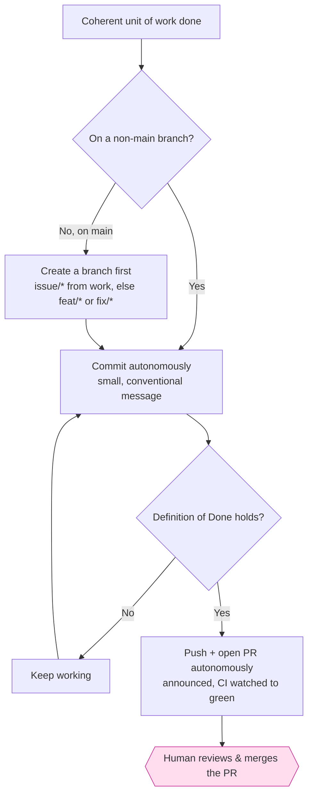

# Authorization model

`steer` draws a deliberate line between actions that are **cheap and reversible**
(done autonomously) and actions that are **outward-facing or hard to reverse**
(gated on a human). This is codified in the always-on rule
`45-commit-autonomy.md` and reinforced by `95-not-the-gate.md`.

```mermaid
flowchart TD
    START[Coherent unit of work done] --> BRANCH{On a non-main branch?}
    BRANCH -->|No, on main| MK[Create a branch first<br/>issue/* from work, else feat/* or fix/*]
    BRANCH -->|Yes| COMMIT
    MK --> COMMIT[Commit autonomously<br/>small, conventional message]
    COMMIT --> DONE{Definition of Done holds?}
    DONE -->|No| MORE[Keep working]
    MORE --> COMMIT
    DONE -->|Yes| PUSH[Push + open PR autonomously<br/>announced, CI watched to green]
    PUSH --> GATE{{Human reviews & merges the PR}}

    classDef gated fill:#fde,stroke:#c39
    class GATE gated
```

Delivery runs in exactly **two modes**, keyed to what the repo **declares**
(rule `45-commit-autonomy`): the `CLAUDE.md` `<!-- steer:delivery-mode=solo-trunk -->`
marker makes a repo **solo-trunk** (pre-MVP by declared intent), where the trunk
commit + push are the autonomous delivery and there is no PR; anything else,
including an absent marker, is **pr-flow** — the diagram above, with the
server-enforced **merge review as the one human gate**. Branch protection
*enforces* pr-flow; it does not define the mode, so a declared-pr-flow repo whose
`main` is unprotected is a **gap to close, not a third mode**. `/steer:protect`
moves a repo between the two and reconciles the marker.

## What is autonomous

- **Branching** off `main` onto the repo's branch convention, else `feat/*` /
  `fix/*` (`/steer:work` defaults to `issue/<number>-<slug>`) — never committing
  to `main` directly.
- **Committing** whenever a coherent unit of work is done (tests pass, lint is
  clean, it builds). Do not pause to ask "should I commit?". Commit subjects
  follow [Conventional Commits](https://www.conventionalcommits.org/)
  (`type(scope): summary`, with `feat!:` / a `BREAKING CHANGE:` footer for
  breaking changes) — guidance only, not a lint gate; see `/steer:reference
  conventions` for the full type list and rationale.
- **Creating or reusing the tracking issue** on an explicit implement/capture
  request, in a GitHub-adopted repo (issue-first, rule `36-issue-first.md`). The
  issue and the bounded action set behind it do not need a second confirmation.
- **Pushing the branch and opening the PR** once the Definition of Done holds —
  announced, never asked (rule 00's heads-up pattern). Behind branch protection
  an open PR is inert until a human merges it, so gating its creation protected
  nothing; the delivery skills (`work`, `init`, `adopt`, `intake`, `sync`,
  `build`, `loop`) pre-approve `git push` / `gh pr create` in their `allowed-tools`
  (`work` additionally grants `gh pr edit`), and the scaffold allowlist carries
  the same grants — `gh pr edit` included. In
  solo-trunk, the equivalent autonomous delivery is the trunk commit + push
  (gated by the `check-bash-actions` trunk-push hook only once graduation signals stand —
  see [Hooks](../reference/hooks.md)).

!!! note "These autonomous moves are pre-authorized too — not just declared"
    Declaring branching autonomous is worthless if switching onto the branch then
    prompts. So the scaffold `.claude/settings.json` `permissions.allow` also
    pre-authorizes the **branch/fetch/move** verbs the skills run on every unit of
    work — `git switch`, `git checkout -b`, `git fetch`, `git mv`,
    `git stash` — and the **PO-flow toolchain** the `build` skill drives itself:
    `mise install`, `mise lock`, and the named `mise run dev` (run the app locally).
    The `build` skill carries the same grants in its frontmatter, so the
    non-technical PO flow is quiet even in a repo that predates the scaffold
    allowlist. `mise run dev` is a **named** task, not the banned `mise run:*`
    wildcard — `mise run deploy` still prompts. Bare `git checkout -- <file>`
    (discards work), destructive `git rm` (an unattended recursive/forced delete —
    moved to `ask`), and every **merge/deploy** verb stay gated — `gh pr merge`
    sits under `ask`. `git push` and `gh pr create`/`edit` are *not* gated: they
    are autonomous delivery (rule `45-commit-autonomy`). `check_standards.py` pins
    two of them — `Bash(git push)` and `Bash(gh pr create:*)` — so those cannot
    silently leave `allow`; the rest of the set (`gh pr edit`, the `git push
    origin`/`-u` variants) sits under `allow` unasserted.

!!! note "Issue creation is autonomous — but a host can still gate it"
    Some Claude Code permission modes classify an unprompted `gh issue create` as
    an external write and block it, even though steer authorizes it. The bundled
    scaffold therefore pre-authorizes the `gh` tracker-metadata write verbs
    (`gh issue create` / `edit` / `comment`) under `.claude/settings.json` →
    `permissions.allow`, so the find-or-create path is reachable in a
    default-permission session. The MCP write tools (`mcp__github__issue_write` /
    `sub_issue_write`) instead sit under `ask` — a bare/ad-hoc MCP issue write is
    an allowlist escape a consumer's security review flags — but the
    `/steer:tracker-sync` skill re-grants both in its own `allowed-tools` (and
    `/steer:report` re-grants `issue_write` alone). `/steer:report` is a direct
    entry point, so its re-grant does take effect; `/steer:tracker-sync` is
    `user-invocable: false` and always reached transitively, so in practice its
    grants never fire — see the warning below. `git push` and `gh pr create`/`edit` sit under `allow` (autonomous
    delivery — the merge is the gate); `gh pr merge` stays under `ask` and
    force-pushes under `deny`. Where a host still blocks the create, it is a
    *host-permission gate, not a missing issue* — confirm with the user or run
    `!gh issue create` under their identity, rather than looping.

!!! warning "A per-skill grant only applies for the turn that invokes that skill"
    A skill's `allowed-tools` grant pre-approves those tools **only for the turn
    that invokes that skill**, and clears at your next message. It grants without
    restricting — every other tool stays callable under your permission settings —
    and it does not carry into a skill that merely *delegates* to it in prose. The tracker write verbs live in
    `/steer:tracker-sync`'s `allowed-tools`, but the lifecycle reaches that gateway
    **transitively**: a PO runs `/steer:issues capture` (or `/steer:work`,
    `/steer:issues materialize`), which routes through tracker-sync *by description*,
    not by invoking it. So tracker-sync's grants never take effect on that path and
    the write falls through to `.claude/settings.json` — and **which tier it lands
    in depends on the transport**. The gateway is MCP-first, so its primary path
    falls back to `ask` and legitimately **does** prompt; that prompt is correct
    behaviour, not a fault. Only the `gh issue create/edit/comment` fallback lands
    in `allow`, where it is silent — and it is silent *because* the scaffold ships
    that allow-list. In a repo **missing** it, that same fallback is instead
    prompted (interactive) or **silently auto-denied** (headless), surfacing as
    "the whole `gh` surface is walled off". The scaffold `permissions.allow` list is
    therefore the **real backstop** for the orchestrated path. `/steer:sync`'s `github-issue-permissions` capability
    (see [Repository contract](../reference/repository-contract.md)) detects a repo
    missing that allow-list — `absent` / `mis-wired` (a read-only-era `settings.json`
    with `gh issue list`/`view` but no `create`) / `present-wired` — so the gap is
    named up front rather than discovered mid-workflow.

!!! note "Exception — solo trunk mode (pre-MVP greenfield)"
    When one person is both PO and dev with no MVP yet, `/steer:init` can put the
    repo in **solo trunk mode** (declared in the product `CLAUDE.md` `## Delivery
    mode` section): commits land **directly on `main`** and are pushed
    autonomously, with no `feat/*` branch and
    no per-feature PR — there is no second reviewer yet, so the PR gate has nothing
    behind it. CI still runs on every push, and the spine, tests, and Definition of
    Done are unchanged. The mode ends at **graduation** — run `/steer:protect apply`,
    which raises the server-side PR wall — once the MVP works, you first deploy, or a
    second contributor joins. Once any of those signals is *visible locally* (a deploy
    workflow, an `infra/` tree, a `prod` branch), the trunk-push gate
    (`check-bash-actions.sh`) stops silent trunk pushes — the first `git push`
    each session surfaces for a human yes (repeats carry a non-blocking
    reminder) until the repo graduates.

## What is silent — read-only inspection

The skills reconstruct workspace state constantly: `git status/diff/log/show/
branch`, the read-only `git remote` forms (`-v`/`show`/`get-url` — the mutating
`set-url`/`add`/`remove`/`rename` subcommands are `deny`-listed),
`gh pr view/checks/list/diff`, `gh run view/list/watch`, `gh repo
view`, `gh label list`, `mise tasks`, and the named verify tasks `mise run check`/
`mise run ci`. None of these mutate anything, so the scaffold `.claude/
settings.json` pre-authorizes them all under `permissions.allow` — prompting on
inspection was the bulk of the "asks for approval constantly" friction without
protecting anything. The read-heavy navigators (`/steer:next`, `/steer:audit`,
`/steer:setup`, `/steer:status`) carry read-only `allowed-tools` grants in their
frontmatter, so inspection stays silent even in a repo that predates the scaffold
allowlist. `/steer:sync`, `/steer:work`, and `/steer:issues` grant an overlapping
subset of those inspection commands, but are **not** read-only overall — `sync` and
`work` also carry `git add`/`commit`/`push` + `gh pr create` (and `work`,
`gh pr edit`), and `issues` carries `gh label create` plus its own
`gh issue list`/`view` and `gh search issues` reads; their delivery grants are
enumerated above. The setup and build flows
(`/steer:init`, `/steer:adopt`, `/steer:intake`, `/steer:build`) likewise declare
scoped grants for the operations they routinely run — git inspection and
branch-creation (`git status`/`diff`/`log`/`switch`/`checkout -b`), the same
`git push` / `gh pr create` delivery grants as the other delivery skills, and — in
`/steer:build`, the flow that actually runs them — named dev tasks
(`mise run dev:*`, `pnpm dev*`), never a `git`/`gh`/`mise run`
wildcard, so `gh pr merge` and unknown commands still prompt. Each flow also
pre-approves the bundled plugin helper scripts it executes **by literal path in its
own files**, under a matching interpreter
(`Bash(sh *scripts/template-reconcile.sh*)`), since an ungranted helper
prompts the user mid-flow every time: `scaffold_reconcile.py` in `/steer:init` and
`/steer:adopt` and `/steer:sync`, `template-reconcile.sh` in `/steer:adopt`,
`/steer:build`, `/steer:spec-scaffold` and `/steer:sync`, `scan-capabilities.sh` +
`scan-invocations.sh` in `/steer:sync`,
`scan-prereqs.sh` in `/steer:doctor`, `workspace-snapshot.sh` in `/steer:next`, and
`scan-spine-state.sh` in `/steer:setup`, `/steer:sync`, `/steer:work`,
`/steer:status` and `/steer:audit`.
`/steer:doctor` carries one grant that is deliberately *not* a helper script:
`Bash(grep -rl *)`, for the §0 plugin-integrity check that greps the installed
`hooks/` and `scripts/` for CR bytes. It is broader than the paths it serves — an
unbounded-path filesystem read — and that is the point: the fault it detects
(a CRLF checkout) is precisely what stops every bundled script from parsing, so a
script-based detector would share the failure it is meant to diagnose. The grant is
read-only (`grep -rl` lists names; it cannot mutate), which is what keeps the
breadth acceptable — and the *repair* is handed over on the same principle: doctor
prints the in-place `sed` unblock for the dev to run rather than running it, the
same way it prints a shell-rc edit instead of making one.
`/steer:protect` likewise declares a scoped grant for what it routinely reads — `gh auth
status`, `gh repo view`, `git remote`, `git rev-parse`, and the read-scoped
`Bash(gh api repos/*)` above —
while the `gh api` write that applies protection stays prompted (see the argument-order
note below). The scaffold's MCP allowlist tracks
the hosted GitHub MCP's consolidated issue verbs: the **read/dedup** tools
(`issue_read`, `list_issues`, `search_issues`, `add_issue_comment`) sit under
`allow` so find-before-create is silent, while the **write** tools (`issue_write`,
`sub_issue_write`) sit under `ask` and are re-granted per-skill (see the note
above). These names are the post-rename verbs (`create_issue`/`update_issue` →
`issue_write`, `get_issue` → `issue_read`, `add_sub_issue` → `sub_issue_write`);
the pre-rename names no longer resolve.

The boundary is deliberate: `mise run` is allowlisted **only** for named tasks —
the verify pair (`check`/`ci`) plus `dev` for running the app locally — never the
wildcard, since an open `mise run:*` would silently green-light `mise run deploy`. `gh api`/`gh:*` stay prompted by omission **from the scaffold allowlist** (the
mutation vector for repo delete, PR merge, and branch protection). **Two skills re-grant a
narrow slice**, each for a different transport:

- `/steer:protect` carries `Bash(gh api repos/*)`, so *reading* live protection settings
  is silent in a `protect` session. Its **writes** stay prompted, but only because the
  grant is a path prefix and every write in the skill puts `-X PUT`/`-X PATCH` **before**
  the endpoint path, so it falls outside the prefix; a write with the flag after the path
  would match the read grant and apply with no prompt. Argument order is load-bearing
  there — the same discipline, inverted, as `/steer:report` keeping `--repo` first to
  *stay inside* its grant. **Nothing enforces either half mechanically.** The discipline
  lives in the skills' own prose — `skills/protect/SKILL.md` ("Keep `-X PUT` / `-X PATCH`
  as the first argument, before the endpoint path") and `skills/report/SKILL.md`
  (`--repo …` "as the **first** flag") — and a reordered write would pass every gate in
  this repo. Treat it as a review obligation, not a guardrail.
- `/steer:tracker-sync` carries `Bash(gh api graphql:*)` as a scoped carve-out, so a
  Projects v2 issue-field read does not prompt on a direct invocation — `field-get`,
  plus the `field-set` / `link-blocked-by` / `bootstrap-fields` operations that sit
  inside the gateway's declared tracker-metadata boundary. GraphQL is the transport to
  reach for on these: the REST equivalents fall outside every granted prefix and so
  prompt, and the MCP github tools are granted but expose issue fields only where the org
  enabled them. **This grant is broader than the boundary it
  serves, and the limit is prose-enforced:** `allowed-tools` matches a command-string
  prefix, so it cannot distinguish a field query from `mergePullRequest` or
  `createBranchProtectionRule`, which GraphQL expresses just as well. The gateway issues
  only the operations its `OPERATIONS.md` enumerates, and nothing checks that
  mechanically. **Nor does anything stop the grant itself from being widened.**
  `check_standards.py` does ban `Bash(gh api:*)` — but only in the scaffold's
  `.claude/settings.json` (the forbidden-form loop runs inside the block scoped to that
  one file); no gate inspects any skill's own `allowed-tools` for a forbidden form. The
  only per-skill assertions are helper-script coverage and the dot-source ban below.
  So "never widen this to
  `Bash(gh api:*)`" is a review obligation exactly like the argument-order rule above it,
  not something the build will catch.

`check_standards.py` separately asserts that every skill
grants the bundled plugin helper scripts its body — including a factored-out
`PROCEDURE.md` — invokes. That reaches only helpers named by **literal path inside
the skill's own directory** (`_SCRIPT_INVOCATION` matches
`${CLAUDE_PLUGIN_ROOT}/scripts/<name>.sh|.py`), so a helper reached through a
cross-referenced convention is outside it. That blind spot has bitten once:
`/steer:sync` step 5 delegates to the Template-reconciliation convention in
`templates/reference/SPEC-FRAMEWORK.md`, whose command is
`template-reconcile.sh`, and `sync` did not grant it — the gate stayed green while
the step prompted. Sync now grants it, and no skill currently reaches a helper it
hasn't pre-approved, but the gap is structural: the next indirectly-reached helper
will be just as invisible. So the prompt-on-every-run class is narrowed by this
assertion, not closed by it.

A second blind spot in the same gate ran deeper. `/steer:setup`, `/steer:sync` and
`/steer:work`'s `CLOSING-REF.md` reached their detection helpers by **`.`-sourcing**
`hooks/lib/*.sh` directly, then calling the sourced functions — a compound snippet,
which the chained-command rule below defeats on its own, and one no skill grants in
any form. `_SCRIPT_INVOCATION` never saw those steps either, because it only
recognises `scripts/` calls. So the onboarding front door prompted on its very
first action from `v3.0.0` until a pre-release audit found it. All three now call
the bundled `scan-spine-state.sh`, and a second assertion,
`check_skill_helper_sourcing`, fails the build on a dot-sourced hook helper
anywhere under `skills/`. That half of the class *is* closed mechanically, because
the fix never varies: wrap the reads in a bundled script and grant that.

!!! warning "Chained commands defeat the allowlist"
    A permission rule matches a *single* command string. `git status && git diff`
    matches no rule even when both are allowlisted, so it prompts anyway. Skills run
    inspection commands as separate invocations — chaining with `&&`/pipes is the
    most common reason a repo that looks allowlisted still asks for approval.

## What is gated

- **Merging the PR.** This is the one step that waits for the dev — everything
  before it (branching, committing, pushing, opening the PR) does not. The
  **merge review is the gate** — not each commit, not the push. `gh pr merge`
  is never pre-approved: rule `45-commit-autonomy` forbids it outright, so its
  `ask` entry in the scaffold is a backstop to decline, not an approval path.
  In a protected repo the server wall enforces the review regardless.
- **Deploying**, in every mode — including the hotfix lane, where a deploy is
  policy-permitted but never auto-executed.
- **Trunk pushes in a solo-trunk repo that has outgrown pre-MVP** — the
  trunk-push gate (`check-bash-actions.sh`) surfaces the first `git push` each
  session for a human yes once a local graduation signal stands, until
  `/steer:protect` graduates the repo.
- **Product and architecture decisions** — ratifying a `Proposed` ADR, approving
  a feature intent, signing off a `--reviewed` plan. Claude proposes; the named
  human decides. Unlike the three above, these are **answerable in-session** (see
  the note below).

!!! note "Answerable in-session — the channel, not the authority"
    A gate requires the deciding *human*, never a particular channel. Rule
    `61-gate-prompts.md` therefore lets Claude collect the answer where that human
    already is: an **Approve · Reject · Decide later** prompt carrying the actual
    tradeoff (an ADR's rejected alternatives and negative consequences, an intent's
    criteria and locked scope, a plan's residual risk). On `Approve` the owning
    skill writes the transition and stamps *who*, *when*, and the **channel**
    (`in-session` vs `offline-review`), plus one `/spec/history/` entry — so
    self-ratification, which is legitimate in a solo repo, stays auditable.
    `Decide later` leaves every field untouched, so the artifact stays
    `Proposed`/`draft` exactly as before.

    **Merge, deploy, real secrets, `/infra`, and protected-branch pushes are never
    promptable** — asking does not authorize them. A merge review in particular
    cannot be an in-session "yes": the reviewer reads the diff on the PR, and that
    diff is not what a prompt showed. These gates became *answerable*, not
    *removable*. Full protocol: `/steer:reference gates`.

!!! note "Watching CI is not crossing the gate"
    After a push, `/steer:work finish` watches CI to conclusion and fixes a red
    build before treating the work as done — that is *finishing* the work, not
    merging. To support this without a prompt per poll, the `work` skill
    pre-approves **read-only** CI status (`gh pr checks`, `gh run view`,
    `gh run watch`) alongside its delivery grants. `gh pr merge`, `gh api`, and
    anything that deploys stay gated exactly as before.

!!! note "The local boundary is advisory — the server enforces it"
    Rule `95-not-the-gate.md` is explicit that this in-session discipline cannot
    *stop* a direct push to `main`; it only governs how the agent behaves. The
    real wall is **GitHub branch protection**, which `/steer:protect` verifies
    against `policy/branch-protection.yml` and (on the dev's explicit
    confirmation) applies via `gh api`. Run it as the final step of init/adopt to
    turn the advisory boundary into an enforced one.

## Why this matters for the plugin's own skills

The skill frontmatter carries the same boundary for the turn that invokes the
skill — upstream clears `disallowed-tools` at your next message, so across a
multi-turn run it is a limit the skill keeps in prose:

- **Tier 1 (read-only)** skills do not modify a file that already exists in the
  repo: they all set `disallowed-tools: Edit, NotebookEdit, EnterWorktree` — e.g.
  `audit`, `next`, `standards`. Read-only is scoped to **tracked repo content**, not
  to side effects generally: `/steer:doctor` is Tier 1 and still offers, on an explicit yes, to **install toolchain software on
  the machine** (`brew install mise`, then the runtimes mise manages) — the largest
  real-world side effect any Tier-1 skill has. Its boundary stops there: `git` and
  Docker Desktop are *handed over* as commands for you to run, never executed.
- **Tier 2 (side-effecting)** skills may edit, commit, push their work branch,
  and open the PR — but never merge it or commit to `main` outside solo-trunk —
  e.g. `sync`, `work`, `tidy`.

A skill's tier is not a separate label — it is readable straight from its
frontmatter: a Tier 1 skill carries `disallowed-tools: Edit, NotebookEdit,
EnterWorktree` (`audit`, `next`, `standards`, `doctor`, `explain`, `help`,
`reference`, `report`, `status`), a Tier 2 skill grants the write and git verbs it
needs. `Write` splits Tier 1 rather than defining it: `next`, `standards`,
`doctor` and `reference` disallow it too, while `audit`, `explain`, `help`,
`status` and `report` keep it for writes bound in prose — a temp path in every
case except `audit`, which may additionally write a confirmed
`/spec/AUDIT-REPORT.md` or `DRIFT-REPORT.md`.

Where `Write` is kept it is bound *in prose* instead — to a temp-dir Artifact
page, the scrubbed issue body `report` builds, or an explicitly confirmed report
file. None of those skills modifies existing repo content — `Edit` is disallowed for the
invoking turn, and the boundary across the run is one the skill keeps; the one
deletion any of them performs is `report` clearing its
own git-ignored `.claude/steer-faults.*` scratch, so the real boundary is nothing
**tracked**. `explain` additionally disallows `Bash`. See the
[Skills reference](../reference/skills.md) for the skill inventory and
[Configuration](../reference/configuration.md) for how tools are constrained.
