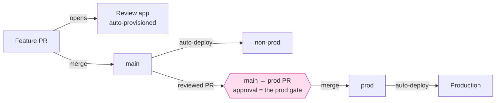

# Deployment & environments

How code reaches users. `steer` codifies a **branch-driven promotion** model in
the always-on rule `52-deployment.md`, enforced at the server edge by
`policy/branch-protection.yml` (applied with [`/steer:protect`](../reference/skills.md)).
Deploy/release logic is a [high-risk area](../reference/configuration.md): validate
in non-prod before prod, and scope pipeline changes with the dev first. The
AWS/Terragrunt specifics live in each product's `/infra/README.md`.

## Environments

- **`non-prod`** — a shared environment for integration and validation.
- **`prod`** — production.
- **Review apps** — every feature PR also gets an isolated, auto-provisioned
  environment, torn down when the PR merges or closes. The review-app mechanism is
  product-specific, so it is recorded in an ADR rather than hard-coded by the
  plugin.

## Promotion

Promotion is driven by branches, never by pushing to an environment directly:

- **Merge to `main` auto-deploys `non-prod`.** Landing on the default branch is
  the trigger; there is no separate "deploy to staging" step.
- **Prod is gated by a reviewed PR from `main` into a long-lived `prod` branch.**
  Merging that PR auto-deploys production. **Never push directly to `prod`.**
- **The branch-protection approval on `prod` *is* the production gate.** It stands
  in for the deployment-environment approvals that GitHub Enterprise would
  otherwise provide, which is why `policy/branch-protection.yml` carries a `prod`
  entry alongside the default branch. See
  [GitHub integration](../reference/github-integration.md#production-promotion-gate)
  for how that protection is configured.

!!! note "This is the graduated end-state, not the solo-trunk start"
    A pre-MVP [solo-trunk](authorization-model.md) repo has no PR wall yet — it
    commits straight to `main`. The promotion model above is what a repo runs once
    [`/steer:protect`](../reference/skills.md) has raised branch protection. Merge
    and deploy stay human-gated in **both** modes.

## Observable by default

A deployed environment is not "done" until it is observable. The standard requires:

- structured **logs**,
- **metrics with alarms**,
- **error tracking** (Sentry),
- **health checks**, and
- **alerting** routed somewhere a human actually sees it.

"Deployed but unobservable" does not count as delivered; the wiring is captured in
the product's `ARCHITECTURE.md`.

## Rollback

Every prod deploy has a **known rollback** before it ships — either revert the
`prod` merge or redeploy the prior SHA. Database migrations follow an
**expand/contract** pattern so the previous version keeps running through a deploy,
which is what makes a clean rollback possible.

## Secrets & config at rest

Secrets and configuration are injected at deploy/runtime — **never baked into
images or CI logs**. See the secrets-handling rule and
[Configuration](../reference/configuration.md) for where this is enforced.

## Related

- [Authorization model](authorization-model.md) — what is autonomous vs. gated,
  including solo-trunk mode and graduation.
- [GitHub integration](../reference/github-integration.md) — branch protection,
  the `prod` promotion gate, and Dependabot auto-merge.
- [First workflow](../getting-started/first-workflow.md) — where productionization
  fits in the lifecycle.
