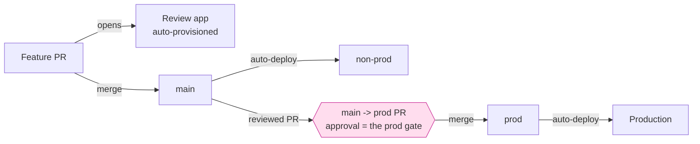

# Deployment & environments

How code reaches users. **The repo declares its own model** in
`policy/delivery.yml` - environments, what merging deploys, how production is
approved (`production_gate`), whether review apps exist, and what it reports to a
human - and the always-on rule `45-delivery.md` § Deployment & environments follows that file rather than
imposing one. `/steer:protect` reads `production_gate` to decide whether a `prod`
branch is expected at all, and enforces the branch side at the server edge via
`policy/branch-protection.yml`.

What the rest of this page describes is the **org default** that file is seeded
with - branch-driven promotion on AWS - and why it has that shape. A repo that
delivers elsewhere, or nowhere, edits the file; only a gate *weaker* than this
default needs an ADR. Merge and deploy stay human decisions in every model.

Deploy/release logic is a [high-risk area](../reference/configuration.md): validate
in non-prod before prod, and scope pipeline changes with the dev first. The
AWS/Terragrunt specifics live in each product's `/infra/README.md`.

## Environments

- **`non-prod`** - a shared environment for integration and validation.
- **`prod`** - production.
- **Review apps** - every feature PR also gets an isolated, auto-provisioned
  environment, torn down when the PR merges or closes. The review-app mechanism is
  product-specific, so it is recorded in an ADR rather than hard-coded by the
  plugin.

## Promotion

Promotion is driven by branches, never by pushing to an environment directly:

```mermaid
flowchart LR
    PR[Feature PR] -->|opens| RA[Review app<br/>auto-provisioned]
    PR -->|merge| MAIN[main]
    MAIN -->|auto-deploy| NONPROD[non-prod]
    MAIN -->|reviewed PR| PRODPR{{main -> prod PR<br/>approval = the prod gate}}
    PRODPR -->|merge| PROD[prod]
    PROD -->|auto-deploy| LIVE[Production]

    classDef gated fill:#fde,stroke:#c39
    class PRODPR gated
```

- **Merge to `main` auto-deploys `non-prod`.** Landing on the default branch is
  the trigger; there is no separate "deploy to staging" step.
- **Prod is gated by a reviewed PR from `main` into a long-lived `prod` branch.**
  Merging that PR auto-deploys production. **Never push directly to `prod`.**
- **The `prod` promotion is also the release moment.** An app or service deploys
  continuously and has no artifact version, so its changelog is cut here, from the
  fragments accumulated since the last promotion - `changie batch $(date
  +%Y.%-m.%-d)` then `changie merge` (a CalVer ship date; `library`/`cli` repos cut
  semver with `changie batch auto` instead). See
  [Repository contract](../reference/repository-contract.md#what-a-managed-repo-carries).
- **The branch-protection approval on `prod` *is* the production gate.** It stands
  in for the deployment-environment approvals that GitHub Enterprise would
  otherwise provide, which is why `policy/branch-protection.yml` carries a `prod`
  entry alongside the default branch. See
  [GitHub integration](../reference/github-integration.md#production-promotion-gate)
  for how that protection is configured.

!!! note "This is the graduated end-state, not the solo-trunk start"
    A pre-MVP [solo-trunk](authorization-model.md) repo has no PR wall yet - it
    commits straight to `main`. The promotion model above is what a repo runs once
    [`/steer:protect`](../reference/skills.md) has raised branch protection. Merge
    and deploy stay human-gated in **both** modes.

## Container images

Deployable apps ship as **container images** (default target: AWS ECS). Each
`apps/<app>` that deploys as a container carries its own `Dockerfile`, instantiated
from the plugin's `templates/docker/` reference when the app is first created - by
[`/steer:build`](../workflows/build.md) or [`/steer:setup adopt`](../workflows/adopt.md),
which copy-and-adapt it and never clobber an existing one. A Node/Next.js template
and a Python/uv template are provided; the base-image major must satisfy
`policy/versions.yml` (enforced by the version-pin scanner).

The template is **not** installed at bootstrap - a Dockerfile with no app to build
would ship broken - and `library`, `cli`, and `infra` repos do not deploy as
containers, so they get none. The scaffold CI **builds every `apps/*/Dockerfile`
(and a root `Dockerfile`) when present** - build-only, no registry push - so an
image that stops building fails the PR; when none exists the step is skipped with a
notice, so a green build never falsely implies an image was produced. Pushing and
deploying the image is product-specific and lives in each product's `/infra`.

## Observable by default

A deployed environment is not "done" until it is observable. The standard requires:

- structured **logs**,
- **metrics with alarms**,
- **error tracking** (Sentry),
- **health checks**, and
- **alerting** routed somewhere a human actually sees it.

"Deployed but unobservable" does not count as delivered; the wiring is captured in
the product's `ARCHITECTURE.md`.

## Rollback

Every prod deploy has a **known rollback** before it ships - either revert the
`prod` merge or redeploy the prior SHA. Database migrations follow an
**expand/contract** pattern so the previous version keeps running through a deploy,
which is what makes a clean rollback possible.

## Secrets & config at rest

Secrets and configuration are injected at deploy/runtime - **never baked into
images or CI logs**. See rule `60-high-risk` § Secrets handling and
[Configuration](../reference/configuration.md) for where this is enforced.

## Related

- [Authorization model](authorization-model.md) - what is autonomous vs. gated,
  including solo-trunk mode and graduation.
- [GitHub integration](../reference/github-integration.md) - branch protection,
  the `prod` promotion gate, and Dependabot auto-merge.
- [First workflow](../getting-started/first-workflow.md) - where productionization
  fits in the lifecycle.
