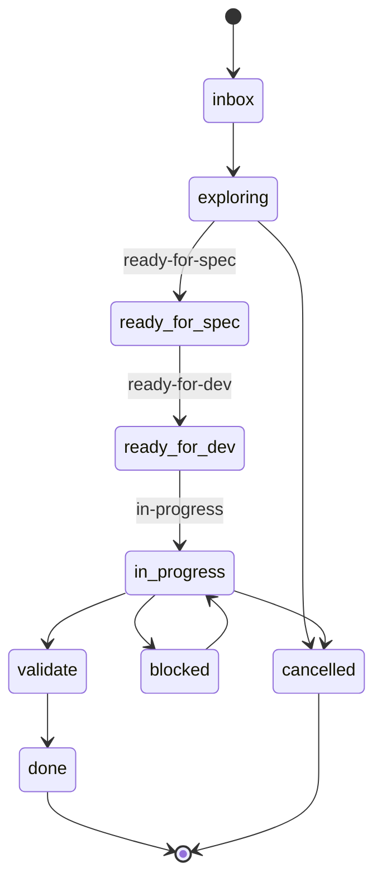

# The work lifecycle

When the tracker is GitHub Issues, work moves through a defined set of states.
The canonical set lives in `plugins/steer/templates/reference/enums.registry`
(`issue_state`) and is enforced by the fixture checks:

```text
inbox · exploring · ready-for-spec · ready-for-dev · in-progress · validate · blocked · done · cancelled
```



## Which skill drives each phase

| Phase | Skill |
| --- | --- |
| Capture / triage / decompose | [`/steer:issues`](../workflows/issues.md) |
| Shape & approve the spec | [`/steer:spec`](../workflows/spec.md) |
| Implement & finish | [`/steer:work`](../workflows/work.md) |
| Read/write the tracker | `/steer:tracker-sync` (gateway, called by the above) |
| "What should I do next?" | `/steer:next` |

## Issue-first

In a GitHub-adopted repo, the **first mutation** of a unit of work presupposes an
active issue (the *issue-first* rule). `/steer:work` will find-or-create the issue
before the first change. Commit autonomy is unchanged once that issue exists — see
the [Authorization model](authorization-model.md).

`done` and `cancelled` are terminal. Both must always be present in the state set;
the fixture suite asserts this so the lifecycle can't silently lose a terminal
state.
