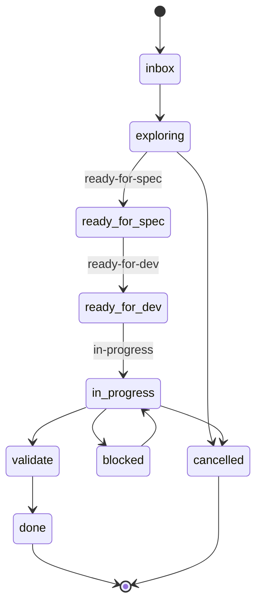

# The work lifecycle

When the tracker is GitHub Issues, work moves through a defined set of states.
The canonical set lives in `plugins/steer/templates/reference/enums.registry`
(`issue_state`) and is enforced by the fixture checks:

```text
inbox · exploring · ready-for-spec · ready-for-dev · in-progress · validate · blocked · done · cancelled
```



## Which skill drives each phase

| Phase | Skill |
| --- | --- |
| Capture / triage / decompose | [`/steer:issues`](../workflows/issues.md) |
| Shape & approve the spec | [`/steer:spec`](../workflows/spec.md) |
| Implement & finish | [`/steer:work`](../workflows/work.md) |
| Implement, review-gated | [`/steer:work --reviewed`](../workflows/work.md) (plan → independent plan-gate review → implement → independent `/code-review` → bounded fix loop) |
| Respond to a production incident | [`/steer:work --hotfix`](../workflows/work.md) (fast-path: issue after-the-fact on a `hotfix/<n>` branch, single-reviewer, human gates intact; mandatory post-incident follow-up) |
| Read/write the tracker | `/steer:tracker-sync` (gateway, called by the above) |
| "What should I do next?" | `/steer:next` |

## Issue-first

In a GitHub-adopted repo, the **first mutation** of a unit of work presupposes an
active issue (the *issue-first* rule). `/steer:work` will find-or-create the issue
before the first change. Commit autonomy is unchanged once that issue exists — see
the [Authorization model](authorization-model.md).

**Solo-trunk mode keeps the issue, drops the PR.** In
[solo-trunk mode](authorization-model.md) — a pre-MVP greenfield repo whose
`CLAUDE.md` `## Delivery mode` section carries the machine-readable marker
`<!-- steer:delivery-mode=solo-trunk -->`, committing straight to `main` with no
per-feature branch or PR — issue-first **still holds**: the issue remains the
audit-evidence anchor, so the change keeps an issue and closes it from the trunk
commit (a `Closes #N` trailer). Only the branch/PR ceremony relaxes: the
issue-first hooks read the marker and reword their advice (reference the issue in
the commit, *not* "open a PR" or "create an `issue/<N>` branch"). `/steer:protect`
flips the marker to `pr-flow` at graduation, after which the per-feature PR flow
resumes. Calling work a "prototype" does not waive issue-first — declaring
solo-trunk mode is the only durable opt-out, and it drops the PR, not the issue.

Plugin-maintenance flows are exempt, just as editing the `/spec` spine is:
`/steer:sync` reconciles the materialized spine and scaffold against the plugin's
own templates on its own `feat/sync` branch — structural, not feature work — so the
issue-first hooks stay silent there (unless app source changes, which sync's
contract forbids).

`done` and `cancelled` are terminal. Both must always be present in the state set;
the fixture suite asserts this so the lifecycle can't silently lose a terminal
state.
