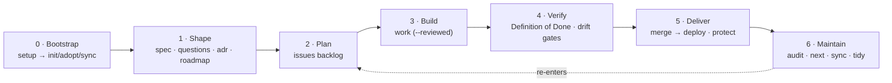

# The SDLC, end to end

steer is an opinionated **software development life cycle**. Every managed repo
inherits the same path from "rough idea" to "validated, shipped, traceable work",
and the same set of gates along the way. This page is the **map**; the other
Concepts pages zoom into one region of it.

One invariant holds the whole thing together:

!!! abstract "The spine"
    **[`/spec`](product-spine.md) is durable product truth. The issue tracker is
    the work/decision layer. The human PR review is the gate.** Everything below
    hangs off that split — neither layer silently overwrites the other, and steer
    never auto-crosses the review gate.



## The six phases

| Phase | Skills | Produces | Gate that closes it |
| --- | --- | --- | --- |
| **0 · Bootstrap** | [`/steer:setup`](../workflows/index.md) → `init` (greenfield) / [`adopt`](../workflows/adopt.md) (brownfield) / `sync` (steady-state); `doctor` for prerequisites | `/spec` spine + bundled scaffold (mise, compose, CI, PR template, policy) + pinned toolchain | — (enablement, not a gate) |
| **1 · Shape** | [`/steer:spec`](../workflows/spec.md), `questions`, `adr`, `roadmap` | `intent.md`, `contract.md`, ADRs, a release timeline | `/steer:spec approve` — blocked while any **blocking** open question is unresolved |
| **2 · Plan** | [`/steer:issues`](../workflows/issues.md) | A triaged, decomposed backlog of issues | Issue-first: every implementation-affecting mutation has an issue **before** the first change |
| **3 · Build** | [`/steer:work`](../workflows/work.md) (and `work --reviewed`) | A branch, the implementation, tests, progress on the issue, a PR | Commit autonomy + change-size + high-risk scoping; **merge/deploy never implied** |
| **4 · Verify** | Definition of Done + [drift gates](#drift-gates) | A reviewed, drift-flagged PR with CI green | A **human dev approves the PR** — "review *is* productionization" |
| **5 · Deliver** | merge → [deploy](deployment.md); [`/steer:protect`](../reference/skills.md) | A deployed change; an enforced branch-protection gate | Branch protection + (at graduation) the PR flow |
| **6 · Maintain** | [`/steer:audit`](../reference/skills.md) (`code`/`spec`), `next`, `sync`, `tidy`, `report` | Findings routed back into the backlog; plugin kept current | — (re-enters Plan) |

Non-technical owners enter through [`/steer:build`](../workflows/build.md), which
folds Bootstrap + Shape into one guided interview and hands a working local app to
a dev for review.

## Two state machines

The lifecycle tracks progress in **two** places that describe overlapping reality.

The **spec** records where a feature's *intent* stands:

```text
draft → approved → implemented → validated → live
```

`approved` is the owner's sign-off on **intent**, not a technical guarantee —
the build is vetted by a human dev at PR review (the Verify gate), which is what
moves the spec to `implemented`. See
[Spec approval](../workflows/spec.md#approval-evidence) for why an `approved`
spec is a vetted *target*, not a vetted build.

The **issue** records where a *unit of work* stands (the canonical set; see
[Lifecycle](lifecycle.md) for the full state diagram and per-kind paths):

```text
inbox → exploring → ready-for-spec → ready-for-dev → in-progress → validate → done
```

They are reconciled by an explicit `reconcile` operation and by
[`/steer:audit spec`](../reference/skills.md), which surfaces divergence between
the as-built spec and the intended spec.

!!! warning "Two machines, one reality"
    Keeping the spec `Status:` and the issue `steer:state` aligned is a recurring
    job, not an automatic one. When in doubt, the spine is product truth and the
    issue is the workflow that got there.

## Drift gates

Whenever a change crosses one of these classes, it is **flagged in the PR
description** and the flag blocks merge until the reviewer explicitly resolves it
(you may not waive your own flag):

> intent drift · contract drift · undocumented behavior change · security-sensitive
> · compliance-impacting · operational (deploy/CI/infra) · local setup changed ·
> app docs invalidated · architecture/stack drift

Periodic sweeps with [`/steer:audit`](../reference/skills.md) catch what slips
past the per-PR flag.

The shipped CI scaffold also carries an **advisory `spec-drift` job** as a machine
backstop for the *undocumented behavior change* class: pure shell + git (no stack,
no Python), it *warns* — never blocks — when a change touches application behavior
(`apps/`, `packages/`, `src/`, …) without updating a feature `contract.md` /
`intent.md` or `spec/HISTORY.md`. It runs on PRs and on push to `main`, so it is
the only spec-drift signal in **solo-trunk** mode, which has no PR. The warning
prompts you to update the spec or confirm "no behavior change" via the PR
template — it does not replace the human-resolved flag.

## What steer never decides for you

steer is **advisory in the local session** — it proposes, surfaces, and flags, but
the hard gates are human. These are never auto-crossed by routing:

- Creating an issue beyond an explicit capture/implement request
- Ratifying an ADR (it stays *Proposed* until a human ratifies)
- `git push`, opening/updating a PR, **merge**, and **deploy**
- Writing real secrets or repo settings

See the [Authorization model](authorization-model.md) for the full authority
table, and [Known limitations](../reference/known-limitations.md) for where the
advisory boundary means a control is *not* machine-enforced.
