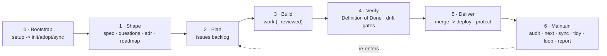

# The SDLC, end to end

steer is an opinionated **software development life cycle**. Every managed repo
inherits the same path from "rough idea" to "validated, shipped, traceable work",
and the same set of gates along the way. This page is the **map**; the other
Concepts pages zoom into one region of it.

One invariant holds the whole thing together:

!!! abstract "The spine"
    **[`/spec`](product-spine.md) is durable product truth. The issue tracker is
    the work/decision layer. The human PR review is the gate.** Everything below
    hangs off that split - neither layer silently overwrites the other, and steer
    never auto-crosses the review gate.


```mermaid
flowchart LR
    B["0 · Bootstrap<br/>setup -> init/adopt/sync"] --> S["1 · Shape<br/>spec · questions · adr · roadmap"]
    S --> P["2 · Plan<br/>issues backlog"]
    P --> W["3 · Build<br/>work (--reviewed)"]
    W --> V["4 · Verify<br/>Definition of Done · drift gates"]
    V --> D["5 · Deliver<br/>merge -> deploy · protect"]
    D --> M["6 · Maintain<br/>audit · next · sync · tidy · loop · report"]
    M -.re-enters.-> P
```

## The seven phases

| Phase | Skills | Produces | Gate that closes it |
| --- | --- | --- | --- |
| **0 · Bootstrap** | [`/steer:setup`](../workflows/index.md) -> `init` (greenfield) / [`adopt`](../workflows/adopt.md) (brownfield) / `sync` (steady-state); `doctor` for prerequisites | `/spec` spine + bundled scaffold (mise, compose, CI, PR template, policy) + pinned toolchain | - (enablement, not a gate) |
| **1 · Shape** | [`/steer:spec`](../workflows/spec.md), `questions`, `adr`, `roadmap` | `intent.md`, `contract.md`, ADRs, a release timeline | `/steer:spec approve` - blocked while a **blocking** question gated at intent-approval is unresolved (later-gated questions block their own gate) |
| **2 · Plan** | [`/steer:issues`](../workflows/issues.md) | A triaged, decomposed backlog of issues | Issue-first: [High-risk](#change-classification) work and the six value cases have an issue **before** the first change; a Trivial change, an untracked fix, `/spec` edits, docs, generated output, lockfiles and `/steer:sync` let the PR be the record |
| **3 · Build** | [`/steer:work`](../workflows/work.md) (and `work --reviewed`) | A branch, the implementation, tests, progress on the issue, a PR | Commit autonomy + change classification + high-risk scoping; **merge/deploy never implied** |
| **4 · Verify** | Definition of Done + [drift gates](#drift-gates) | A reviewed, drift-flagged PR with CI green | A **human dev approves the PR** - "review *is* productionization" |
| **5 · Deliver** | merge -> [deploy](deployment.md); [`/steer:protect`](../reference/skills.md) | A deployed change; an enforced branch-protection gate | Branch protection + (at graduation) the PR flow |
| **6 · Maintain** | [`/steer:audit`](../reference/skills.md) (`code`/`spec`), `next`, `sync`, `tidy`, `loop`, `report` | Findings routed back into the backlog; plugin kept current | - (re-enters Plan) |

Non-technical owners enter through [`/steer:build`](../workflows/build.md), which
folds Bootstrap + Shape into one guided interview and hands a working local app to
a dev for review.

### The incident fast-path

A production incident is high-risk *and* time-critical at once - the one case where
the phases above genuinely conflict with the clock. [`/steer:work --hotfix`](../workflows/work.md)
is the **only sanctioned speed lever** (rule `61-gates` § Hotfix): it opens only for a real
incident on a deployed system, relaxes *ceremony and ordering* (issue filed
after-the-fact on a `hotfix/<n>-slug` branch, single-reviewer) while keeping every human
authority gate, and requires a **mandatory post-incident follow-up** - backfill the
issue, write the spec/ADR, add a `/spec/history/` entry - so the phases skipped under
fire are restored, not waived.

## Change classification

The phases above describe the full path. **How much of it a given change actually
walks is set by its class** - rule `80-change-class` is authoritative for
per-change ceremony, and both Issue-first and the Definition of Done take their
thresholds from it. A change is classified by **what it does**, never by how many
lines it touches; when two readings are arguable, it takes the **heavier** class.

| Class | What it is | Ceremony it earns |
| --- | --- | --- |
| **Trivial** | No observable behavior change - copy, formatting, comments, a behavior-preserving refactor, generated output, lockfiles | Open a PR and stop: **no issue, no spec, no ADR, no plan**. The PR is the work record. |
| **Behavioral** | Observable behavior changes, for a user, a caller, or an operator | Tests in the same PR, and the owning `contract.md` updated. A planned feature writes `intent.md` first and gets PO approval. Plan mode (or a posted plan) whenever the approach is worth reviewing before it is written. |
| **High-risk** | Anything in the [high-risk areas](../reference/configuration.md) list, **at any size** | Scope with the dev before any code, contract or ADR first, smaller PRs, line-by-line review. Never Trivial, and never treated as merely Behavioral. |

Line count was the previous model's axis - Tiny under ~20 lines, then Small,
Medium and Large - and it is the one property that says nothing about what a
change can break: a 12-line auth edit read as Tiny, a 400-line rename read as
Large. Classifying by effect closes that gap from both sides. Trivial requires
*zero* observable behavior change, so a bug fix is never Trivial (it corrects
behavior, which is the definition of Behavioral), and anything in a high-risk
area is High-risk however small the diff.

One consumer takes its threshold from here: **Issue-first** requires a GitHub
issue for High-risk work and for the six value cases, which
[Issue-first](lifecycle.md#issue-first) enumerates; everything else lets the PR be
the work record. The **Definition of Done** is five items for every class - what
changes with the class is the ceremony around the change, not what "done"
means. Orthogonal to all three: a choice **costly to reverse** - stack, data
model, tenancy, deployment - takes an ADR before the code, in any class.

## One lifecycle store, two questions

Progress lives in **one** place. The spec stores only what the tracker cannot say.

The **issue** is the single record of where a *unit of work* stands (the canonical
set; see [Lifecycle](lifecycle.md) for the full state diagram and per-kind paths):

```text
inbox -> exploring -> ready-for-spec -> ready-for-dev -> in-progress -> validate -> done
```

The **spec** records two facts about the *product* that no issue state implies:

```text
draft -> approved -> live
```

`approved` is the owner's sign-off on **intent**, not a technical guarantee - the
build is vetted by a human dev at PR review (the Verify gate). `live` means
released to users, which an accepted close (`done`) does not imply. See
[Spec approval](../workflows/spec.md#approval-evidence) for why an `approved`
spec is a vetted *target*, not a vetted build.

So the two answer different questions, and neither mirrors the other:

| Question | Read |
|---|---|
| Is it built? Being worked on? Merged? | the issue `steer:state` |
| Did the owner approve this scope? | the spec `Status:` |
| Can users see it? | the spec `Status: live` |

A feature whose spec says `approved` while its issue says `done` is **correct**,
not drift - the spec is not tracking delivery. `Status:` moves at exactly two human
events, approval and release, so a merge, close, or reopen cannot leave it stale
and there is no derived value to reconcile.

This is deliberate. The spec used to carry `implemented` and `validated` too,
mirroring the issue's `validate`/`done` - a derived value stored in a second file
and updated by hand, so every merge had to be replayed into the spec and `reconcile`
existed largely to repair what that missed. Those two values were retired; what
remains of reconciliation is pointer and question consistency, plus
[`/steer:audit spec`](../reference/skills.md), which compares the **as-built
`/spec` spine** (reverse-engineered from the code by `/steer:adopt`, standing in
for it) against the tracker spec - a genuinely different comparison from syncing
two status fields.

!!! warning "The two pairings that *are* worth a look"
    Because there is no derived value to keep in step, almost every spec/issue
    combination is legitimate - including `approved` + `done`. Only two pairings
    still need a human: a **`live` intent whose issue never went terminal**, and an
    **`approved` feature with no tracker ref**. When in doubt, the spine is product
    truth and the issue is the workflow that got there.

## Drift gates

Whenever a change crosses one of these classes, it is **flagged in the PR
description** and the flag blocks merge until the reviewer explicitly resolves it
(you may not waive your own flag):

> intent drift · contract drift · undocumented behavior change · security-sensitive
> · compliance-impacting · operational (deploy/CI/infra) · local setup or
> deployment changed ·
> app docs invalidated · architecture/stack drift

Periodic sweeps with [`/steer:audit`](../reference/skills.md) catch what slips
past the per-PR flag.

The shipped CI scaffold also carries an **advisory `spec-drift` job** as a machine
backstop for the *undocumented behavior change* class: pure shell + git (no stack,
no Python), it *warns* - never blocks - when a change touches application behavior
(`apps/`, `packages/`, `src/`, ...) without updating the owning feature
`contract.md` / `intent.md`. (A dated `spec/history/` entry also clears the job's
filter, and `spec/HISTORY.md` still does so for a repo mid-migration - but
updating the owning `contract.md` / `intent.md` is the routine path for a behavior
change, and an ordinary change writes no history entry at all.) It runs on PRs and on push to `main`, so it is
the only spec-drift signal in **solo-trunk** mode, which has no PR. The warning
prompts you to update the spec or confirm "no behavior change" via the PR
template - it does not replace the human-resolved flag.

Solo-trunk has no reviewer, so the scaffold also runs a thin **Definition-of-Done
floor** on push to `main`: the changed-line coverage gate self-gates on the
delivery-mode marker and enforces "cover what you touch" against the previous
commit (it skips post-merge pushes in pr-flow, where the PR already gated those
lines). A returning session is also nudged to *graduate* out of solo-trunk once a
`prod` branch, a deploy target, or an `infra/` tree appears - or to record a
**graduation waiver** (`/steer:protect waive`) when the repo deliberately stays
single-dev on trunk with those in place; a waived repo gets neither the nudge nor
the push prompt. All three are
**local, offline** signals - a second contributor joining is equally a reason to
graduate (and voids a waiver), but no hook can see it, so that one is caught on demand by
[`/steer:protect`](../reference/skills.md) or `/steer:audit`, never at push time.

## What steer never decides for you

steer is **advisory in the local session** - it proposes, surfaces, and flags, but
the hard gates are human. These are never auto-crossed by routing:

- Creating an issue beyond an explicit capture/implement request
- Ratifying an ADR (it stays *Proposed* until a human ratifies)
- **Merge** and **deploy** (pushing a branch and opening the PR are autonomous
  delivery steps - the merge review is the gate)
- Writing real secrets or repo settings

See the [Authorization model](authorization-model.md) for the full authority
table, and [Known limitations](../reference/known-limitations.md) for where the
advisory boundary means a control is *not* machine-enforced.
