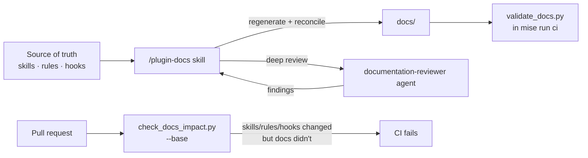

# Documentation

This site is **auto-maintained**: a repo-local Claude skill keeps it in sync with
the plugin's source of truth, and a CI gate fails PRs when it drifts.

## Editing locally

```bash
mise run docs:serve     # live-reload preview at http://127.0.0.1:8000
mise run docs:build     # strict build (fails on broken links/nav)
mise run docs:check     # structural + sync validation (no docs deps)
```

The Zensical toolchain lives in the `docs` dependency-group (`pyproject.toml`), so
`serve`/`build` pull it in via `uv run --group docs`. The lightweight
`docs:check` uses only stdlib + pyyaml and runs as part of `mise run ci`.

## How auto-maintenance works



- **`/plugin-docs`** (repo-local, *does not ship*) reconciles
  `reference/skills.md` against the skills on disk, refreshes generated reference
  pages, flags stale prose, and runs the validator. It can dispatch the
  **`documentation-reviewer`** subagent for a deeper accuracy pass against the
  code.
- **`validate_docs.py`** (`mise run docs:check`, in `ci`) asserts: every shipped
  skill appears in `reference/skills.md`; every `mkdocs.yml` nav entry resolves;
  no orphan pages; internal links resolve; `/steer:` refs
  are valid and no stale `/e22-*` references remain.
- **`check_docs_impact.py`** (PR-only, `--base`) fails a PR that changes
  `skills/`, `rules/`, or `hooks/` without touching `docs/`.

## Page templates

New pages start from the repo-root `docs-templates/` directory:

| Template | For |
| --- | --- |
| `workflow.md` | A `/steer:<skill>` workflow page. |
| `reference.md` | A reference/catalog page. |
| `concept.md` | A conceptual explainer. |

The scaffolds live outside `docs/` because Zensical builds every file under
`docs_dir` (it has no `exclude_docs` setting), so keeping them out of the tree is
what stops them from becoming pages.

## Authoring the plugin itself

Docs about *building* the plugin (skill frontmatter schema, rule numbering, hook
rules, the "what I touched → what to run" matrix) live in
[`AUTHORING.md`](https://github.com/element22llc/e22-plugins/blob/main/AUTHORING.md),
not on this site. One authoring constraint worth flagging here: a skill's
`description` + `when_to_use` frontmatter is concatenated into the routing listing
Claude Code truncates at 1,536 characters (`skillListingMaxDescChars`), so
`check_plugin.py` fails any skill whose combined length exceeds that cap — keep
the description to purpose + primary trigger. Changes confined to `docs/`,
`.claude/`, or `CLAUDE.md` ship nothing and need no `CHANGELOG.md` entry.
