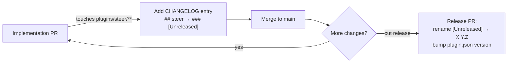

# Release process

Changes to the plugin go through `feat/*` / `fix/*` branches off `main` and land
via PR. Releases are cut from accumulated `[Unreleased]` changelog entries.

## The two-stage changelog gate



1. **Every behavior change** under `plugins/steer/` (skills, rules, hooks,
   templates, scripts, policy) needs a `CHANGELOG.md` entry under `## steer` →
   `### [Unreleased]`. `check_changelog.py --base` enforces this on PRs;
   `tests/` are exempt.
2. **Implementation PRs do not bump** `plugins/steer/.claude-plugin/plugin.json`.
   The `version` bump happens **once**, in the release PR that renames
   `[Unreleased]` to the new `X.Y.Z` — so a stream of PRs cuts one coherent
   release instead of a bump per PR.

`check_changelog.py` also validates that `plugin.json`'s version equals the newest
released heading and that released headings are in descending semver order.

## What does NOT need a changelog entry

Changes confined to `CLAUDE.md`, `docs/`, or `.claude/` ship nothing in the
plugin and need no entry — this includes the documentation site itself.

## Before you push

```bash
mise run check   # fast gate: lint, plugin-check, actions (pre-commit equivalent)
mise run ci      # full gate: adds fixtures, test, shell, hooktests, version-scan, docs:check
```

`mise run ci` is exactly what CI runs. See [`docs/AUTHORING.md`](https://github.com/element22llc/e22-plugins/blob/main/docs/AUTHORING.md)
for the per-change "what to run" matrix, or use the repo-local `/preflight`
helper.
