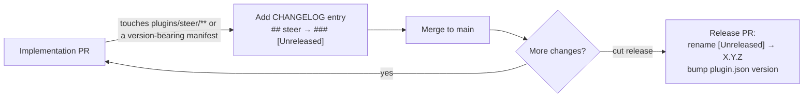

# Release process

Changes to the plugin go through `feat/*` / `fix/*` branches off `main` and land
via PR. Releases are cut from accumulated `[Unreleased]` changelog entries.

## The two-stage changelog gate


```mermaid
flowchart LR
    PR[Implementation PR] -->|touches plugins/steer/** or a version-bearing manifest| ENTRY["Add CHANGELOG entry<br/>## steer → ### [Unreleased]"]
    ENTRY --> MERGE[Merge to main]
    MERGE --> REPEAT{More changes?}
    REPEAT -->|yes| PR
    REPEAT -->|cut release| RELEASE["Release PR:<br/>rename [Unreleased] → X.Y.Z<br/>bump plugin.json version"]
```

1. **Every change** under `plugins/steer/` — or to the root
   `.github/plugin/marketplace.json`, the one version-bearing manifest that sits
   outside it — needs a `CHANGELOG.md` entry under `## steer` →
   `### [Unreleased]`. `check_changelog.py --base` enforces this on PRs, and it is
   **deny-by-default**: everything the plugin ships counts, and the exemptions are
   enumerated in the script with a reason each (`tests/` anywhere, `evals/`, the
   plugin's maintainer `README.md`, and `plugins/steer/.claude/`).
2. **Implementation PRs do not bump** `plugins/steer/.claude-plugin/plugin.json`.
   The `version` bump happens **once**, in the release PR that renames
   `[Unreleased]` to the new `X.Y.Z` — so a stream of PRs cuts one coherent
   release instead of a bump per PR.

3. **Never write a next-version number in an implementation PR.** It merges before
   the release that names it, so the number is always a guess. This bites hardest in
   the spec-spine [migration ledger](../reference/repository-contract.md)
   (`templates/reference/MIGRATIONS.md`), whose entries are *keyed* by the version
   that introduced them: `/steer:sync` skips every entry at or below a repo's
   `spec/.version` stamp, so an entry keyed **below** the release it actually shipped
   in is silently skipped by every repo stamped in between — the migration never runs
   and nothing reports it. Author ledger entries as `### [Unreleased] — <what>`, the
   same convention the changelog uses; the release PR renames the heading alongside
   the manifest bump. `check_plugin.py` fails the build on any ledger heading ahead
   of `plugin.json`, and `check_migrations.py` (wired into `plugin-check`) enforces the
rest of the ledger's shape — entry structure, the required fields, newest-first
ordering, and a deep pass over `[Unreleased]` entries — so a guess cannot reach
`main`.

`check_changelog.py` also validates that `plugin.json`'s version equals the newest
released heading and that released headings are in descending semver order.

## Before the cut: drive the audit to convergence

The release skills run a deep pre-release audit and **block** on any
release-stopping finding. Because each fix changes the tree the audit reads, a
single pass rarely settles it. The repo-local `/audit-loop` helper runs that same
audit in a loop — audit, fix in-tree, re-gate, re-audit — until a round comes back
clean, accumulating every round as a commit on one branch and one PR. Merge that
PR, then cut the release; its audit should pass in a single pass.

The audit's mechanical parts are machinery, not prose, so they cannot be
misremembered:

- `scripts/release_preflight.py` computes the preconditions — clean tree, base
  current with `origin/main`, `[Unreleased]` bullets present, manifests in
  agreement, the `vX.Y.Z` anchor tag for the last release, deployed-docs
  freshness, and the upstream `validator-compat` job — and prints
  `[ok]/[blocker]/[high]/[warn]` markers. The skills inject its output at
  invocation via dynamic context, so the facts arrive with the skill body.
- The saved `pre-release-audit` workflow (`.claude/workflows/`) runs the judgment
  review: one read-only reviewer per coherence dimension plus the documentation
  reviewer, scoped to the release delta, with a failed dispatch retried once,
  cross-dimension dedupe, and one verifier per finding before anything becomes a
  ledger candidate. It also re-verifies every open ledger row whose file has
  changed since the row was confirmed, so a finding the tree already repaired is
  closed by `scripts/audit_ledger.py reconcile` instead of lingering as open.
- `scripts/release_cut.py` performs the cut itself: it renames the changelog
  heading and re-seeds `[Unreleased]`, renames migration-ledger entries inside
  `## Entries` (never the authoring stub), bumps the three version-bearing
  manifests, and re-validates the release invariant — refusing to start when a
  precondition does not hold.

All three release skills are user-invoked only (`disable-model-invocation`), so a
release is always a human's timing decision.

## Publication is automatic

Cutting the release PR is the last manual step. When a release PR (the
`plugin.json` version bump) merges to `main`,
`.github/workflows/release-publish.yml` fires — it triggers only on pushes that
touch `plugin.json` and acts only when the parsed `version` field changed — and
creates the `vX.Y.Z` git tag plus the GitHub Release. The body is that version's
CHANGELOG bullets, extracted by `scripts/changelog_release_notes.py`, followed by
GitHub's auto-generated "What's Changed" (merged-PR list, contributors, compare
link) via `--generate-notes`. Runs are serialised under one concurrency group and
never cancelled, a pre-existing tag that points at a different commit fails the
run instead of being reused, and every publish ends by asserting that the tag
resolves to the intended commit. It is idempotent and re-runnable through
`workflow_dispatch`, so a failed run can simply be re-run:

```bash
gh workflow run release-publish.yml -f version=X.Y.Z
```

Re-publishing an **older** version this way tags the commit that introduced that
version on `main`, not today's head, and does not take the "Latest" badge.

Two other post-merge runs are worth watching: `docs-deploy.yml` publishes the
documentation site from `main` (a red run leaves the live site stale), and the
e2e suite is **local-only** — run `mise run e2e` before a substantive cut if you
want the skill-level signal. The model-graded routing evals are local-only for the
same reason: `mise run evals` is deliberately outside `ci` and off the PR path, and
the release path is where it is meant to run.

Because the tag is created here, `git describe --tags` stays an accurate anchor
for the next release's diff — nothing about tagging is manual.

## What does NOT need a changelog entry

Changes confined to `CLAUDE.md`, `docs/`, or `.claude/` ship nothing in the
plugin and need no entry — this includes the documentation site itself.

## Before you push

```bash
mise run check   # fast gate: lint, typecheck, plugin-check, actions, actions-security, shell, docs:check (pre-commit superset)
mise run ci      # full gate: adds fixtures, test, hooktests, version-scan, delivery-gates
```

`mise run ci` is exactly what CI runs. See [`AUTHORING.md`](https://github.com/element22llc/e22-plugins/blob/main/AUTHORING.md)
for the per-change "what to run" matrix, or use the repo-local `/preflight`
helper.
