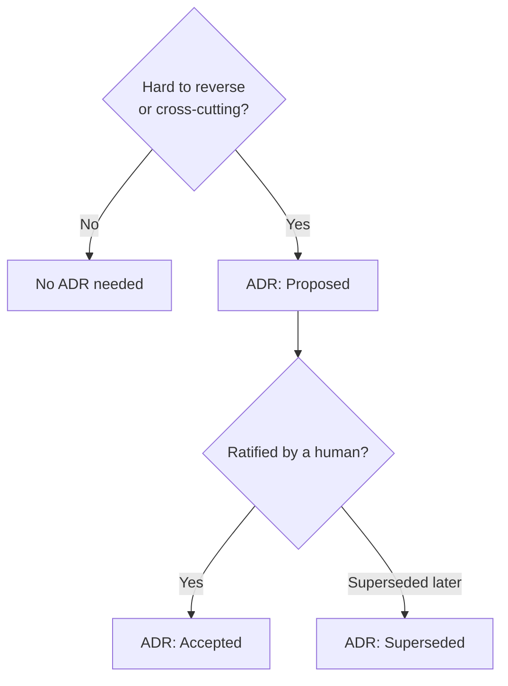

# Decisions (ADRs)

Hard-to-reverse or cross-cutting choices are recorded as **Architecture Decision
Records (ADRs)**. In a managed product repo, ADRs live in the `/spec` spine; for
the plugin itself, decisions are captured in `CHANGELOG.md` and PRs.

## When to write an ADR

Use [`/steer:adr`](../reference/skills.md) for any hard-to-reverse or
cross-cutting choice — stack, database, auth, deployment, a new pattern — or when
asked to record a decision.

## ADR status

New ADRs default to **Proposed** — the fixture suite asserts this. An ADR becomes
**Accepted** only on an explicit human decision.

!!! warning "No ADR from inference"
    Reverse-engineering skills (`/steer:adopt`) must **never infer a ratified ADR
    from code**. An ADR records a decision a human made; the as-built spine
    records what exists. See [Product spine](../concepts/product-spine.md).

## Plugin-level decisions

Changes to the plugin's own behavior are recorded in `CHANGELOG.md` under
`## steer` → `### [Unreleased]`, and the rationale lives in the PR. See
[Release process](../contributing/release-process.md).
