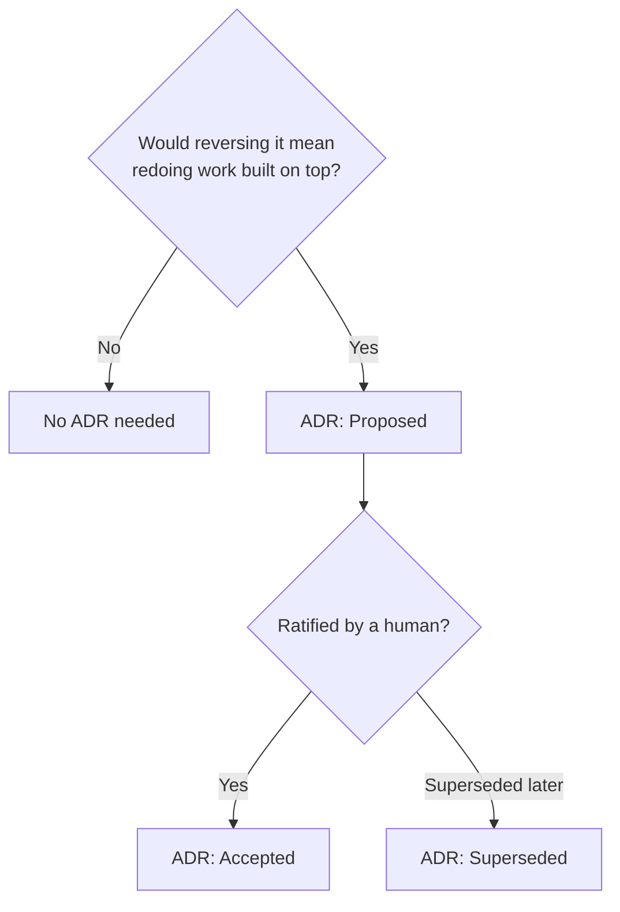

# Decisions (ADRs)

Hard-to-reverse or cross-cutting choices are recorded as **Architecture Decision
Records (ADRs)**. In a managed product repo, ADRs live in the `/spec` spine; for
the plugin itself, decisions are captured in `CHANGELOG.md` and PRs.

## When to write an ADR

**The bar is reversal cost, not novelty.** Use [`/steer:adr`](../reference/skills.md)
when undoing the choice later would mean changing work built on top of it — stack,
database, auth, deployment, tenancy model — or when asked to record a decision.

The skill needs the spine to exist first: called directly on a repo with no
`spec/.version`, it stops and routes to [`/steer:setup`](../reference/skills.md)
rather than writing an ADR with nowhere to put it. A bootstrap that invokes it
mid-run is exempt — the spine is being installed around it.

A **first-time pattern is not an ADR**. Used in one place it is a `contract.md`
line; it earns an ADR when a third use makes it the house style. In a young
codebase almost every pattern is new, so treating novelty as the trigger turns
ordinary work into a decision record nobody reads. The practical test: if you
cannot name the work a reversal would force you to redo, it is not an ADR yet.

```mermaid
flowchart TD
    Q{"Would reversing it mean
    redoing work built on top?"} -->|No| SKIP[No ADR needed]
    Q -->|Yes| PROPOSED[ADR: Proposed]
    PROPOSED --> REVIEW{Ratified by a human?}
    REVIEW -->|Yes| ACCEPTED[ADR: Accepted]
    REVIEW -->|Superseded later| SUPERSEDED[ADR: Superseded]
```

## ADR status

New ADRs default to **Proposed** — the fixture suite asserts this. An ADR becomes
**Accepted** only on an explicit human decision.

That decision is **answerable in-session**. `/steer:adr accept <n>` is the single
writer of `Proposed → Accepted`: it offers the three-option gate prompt
(**Approve · Reject · Decide later**) carrying the ADR's rejected alternatives and
negative consequences, then stamps `> Ratified by:` / `> Ratified at:` /
`> Ratified via:` (`in-session` or `offline-review`) and writes one
`/spec/history/` entry file. `Decide later` changes nothing, so an undecided ADR is
never worse off. Self-ratification is legitimate — in a solo repo the author and
decider are the same person, and the channel stamp is what keeps it auditable.
See rule `61-gate-prompts` and `/steer:reference gates`.

!!! warning "No ADR from inference"
    Reverse-engineering skills (`/steer:adopt`) must **never infer a ratified ADR
    from code**. An ADR records a decision a human made; the as-built spine
    records what exists. See [Product spine](../concepts/product-spine.md).

## Plugin-level decisions

ADRs are an artifact of the **`/spec` spine in a managed product repo**. The
`e22-plugins` repo itself keeps **no ADR log**: changes to the plugin's own
behavior are recorded in `CHANGELOG.md` under `## steer` → `### [Unreleased]`,
with the rationale — alternatives, consequences, what was rejected — in the PR
description. See [Release process](../contributing/release-process.md).

A decision too large for a PR description is a signal to split the PR, not to
introduce a record type. Adding a decision log for the plugin would be a change to
how the repo works, so it goes through a convention-only PR first — see
[`CONTRIBUTING.md`](https://github.com/element22llc/e22-plugins/blob/main/CONTRIBUTING.md)
→ "Working in this repo".
