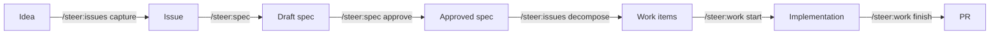

# Your first workflow

This walks an idea from nothing to merged code using `steer` skills. Each step
links to its full reference.

!!! tip "The commands are optional"
    You don't have to type the `/steer:*` commands below. Just tell Claude what
    you want in plain language ("set up this repo", "capture this idea", "let's
    build it") and the router rule has Claude pick and run the right skill,
    announcing each step. The explicit commands are shown so you can see what's
    happening — and reach for one directly when you already know it.



## 1. Set up the repo

For a brand-new repo, run [`/steer:init`](../workflows/index.md); for an existing
app, run [`/steer:adopt`](../workflows/adopt.md). Either way you end up with a
`/spec` spine and the bundled scaffold (CI, `mise.toml`, `compose.yaml`, PR
template).

## 2. Capture the idea

```text
/steer:issues capture
```

Captures a product idea as an issue without losing open questions. See
[Workflows → Issues](../workflows/issues.md).

## 3. Shape and approve a spec

```text
/steer:spec
/steer:spec approve <feature-id>
```

Think the feature through, shape acceptance criteria, and record the approval
evidence. See [Workflows → Spec](../workflows/spec.md).

## 4. Decompose into work

```text
/steer:issues decompose
```

Breaks the approved spec into tracked work items.

## 5. Implement and finish

```text
/steer:work start #123
/steer:work finish #123
```

Implements the issue and lands a PR. Commits happen autonomously, but **pushing
is gated** — see the [Authorization model](../concepts/authorization-model.md).

## What's next

- Understand the artifacts you just created: [Concepts → Product spine](../concepts/product-spine.md).
- Browse every command: [Skills reference](../reference/skills.md).
