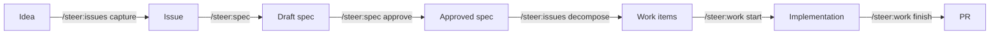

# Your first workflow

This walks an idea from nothing to merged code using `steer` skills. Each step
links to its full reference.

!!! tip "The commands are optional"
    You don't have to type the `/steer:*` commands below. Just tell Claude what
    you want in plain language ("set up this repo", "capture this idea", "let's
    build it") and the router rule has Claude pick and run the right skill,
    announcing each step. The explicit commands are shown so you can see what's
    happening — and reach for one directly when you already know it.



## 1. Set up the repo

Run [`/steer:setup`](../workflows/index.md) — it detects whether this is a
brand-new repo or an existing app and routes accordingly (to `/steer:init` or
[`/steer:adopt`](../workflows/adopt.md)). Either way you end up with a `/spec`
spine and the bundled scaffold (CI, `mise.toml`, `compose.yaml`, PR template).

The bootstrap PR is the **bootstrap gate** — it brings the repo under the
standards and opens spec-first work on `main`. It is *not* productionization:
a greenfield bootstrap ships scaffold and an empty spec spine, with no app to
harden yet. Productionization is a later, per-app event — the
[`/steer:build`](../workflows/build.md) v0 handoff or `/steer:adopt`, where real
code is triaged into `/spec/PRODUCTIONIZATION.md` before a
[production deploy](../concepts/deployment.md).

For a **solo greenfield** repo (one person is both PO and dev, no MVP yet),
`/steer:init` can instead start in [**solo trunk mode**](../concepts/authorization-model.md):
the bootstrap and early features land directly on `main` with no PR, until you
graduate to the PR flow with `/steer:protect`.

## 2. Capture the idea

```text
/steer:issues capture
```

Captures a product idea as an issue without losing open questions. *Expected:* a
new GitHub issue with the idea and any open questions recorded. See
[Workflows → Issues](../workflows/issues.md).

## 3. Shape and approve a spec

```text
/steer:spec
/steer:spec approve <feature-id>
```

Think the feature through, shape acceptance criteria, and record the approval
evidence. *Expected:* an `intent.md` you review, with its `Status:` flipped to
`approved` once you sign off. See [Workflows → Spec](../workflows/spec.md).

## 4. Decompose into work

```text
/steer:issues decompose
```

Breaks the approved spec into tracked work items. *Expected:* one issue per work
item, each printed with its issue number (e.g. `#123`) — that number is what you
pass to `/steer:work` in the next step.

## 5. Implement and finish

```text
/steer:work start #123
/steer:work finish #123
```

Use the issue number from step 4's decompose output in place of `#123`. Implements
the issue and lands a PR. Commits, the push, and opening the PR happen
autonomously, but **merging is gated** — the reviewed merge is the human gate.
See the [Authorization model](../concepts/authorization-model.md).

## What's next

- Understand the artifacts you just created: [Concepts → Product spine](../concepts/product-spine.md).
- Browse every command: [Skills reference](../reference/skills.md).
