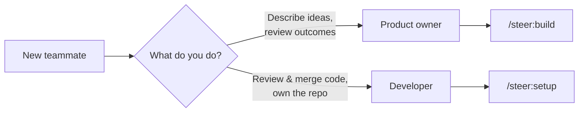

# Team onboarding

New to a `steer`-managed repo? This page gets you oriented in one read — what you
are, what to install, what to run first, and where the guardrails are. It assumes
nothing; follow the branch that matches your role.



## Am I a PO or a dev?

- **You're a product owner (PO)** if you bring *ideas* and judge *outcomes*: you
  describe what you want, answer Claude's questions, preview the result, and ask a
  developer to review before anything ships. You don't need to know skill names or
  touch the tracker.
- **You're a developer** if you *own the repo and the code*: you set repos up,
  review and merge PRs, resolve specs and work items, and are the human at every
  approval gate.

The rest of this page is split along that line. Read your branch; skim the other.

## What do I install?

Both roles install the plugin the same way, once, in Claude Code:

```text
/plugin marketplace add element22llc/e22-plugins
/plugin install steer@e22-plugins
```

Full details and the surface caveat live in [Installation](installation.md).

If you're a **PO** planning to use [`/steer:build`](../workflows/build.md), you
also need **Docker Desktop** installed and a supported machine — **macOS, Linux,
or Windows**. On Windows, the **Claude Desktop Code tab** needs only
[Git for Windows](windows-setup.md) (builds run there too — no WSL2); CLI/IDE
users develop in WSL2. See [Windows setup](windows-setup.md). Claude drives every
other tool for you — you don't install anything else.

!!! warning "Rules may not load automatically"
    On **Claude Cowork and the desktop app** the `SessionStart` hook does not
    fire, so the always-on rules are **not** auto-injected. On those surfaces,
    run `/steer:standards` at the start of every session before doing anything
    else. See [Known limitations](../reference/known-limitations.md).

## What do I run first?

### If you're a PO

Just describe your idea in plain language, or run [`/steer:build`](../workflows/build.md):

```text
/steer:build I want an app that …
```

Claude interviews you, shapes a spec, builds a working local app, and opens a PR
for a developer to review. You never touch issues, specs, or work commands
directly — Claude routes everything. Walk the full path in
[The PO happy path](../workflows/build.md#the-po-happy-path).

### If you're a dev

Set the repo up first with [`/steer:setup`](../workflows/index.md) — it detects
the repo state and routes:

- **New repo:** → `/steer:init`
- **Existing app:** → [`/steer:adopt`](../workflows/adopt.md)

Then walk the [first workflow](first-workflow.md) end to end
(capture → spec → decompose → work → PR). On a hookless surface, run
`/steer:standards` first. Keep the
["I want to … → run …" cheat sheet](../workflows/index.md#i-want-to-run) handy —
it maps everyday intents to the skill that handles them.

## What should I never do?

- **Never push or merge without a developer's review.** Claude commits
  autonomously but pushes and PRs are **gated on a human** — that boundary is
  deliberate. See the [Authorization model](../concepts/authorization-model.md).
- **Never assume the rules loaded on Cowork/Desktop.** If you didn't run
  `/steer:standards` there, the standards aren't in context and Claude is running
  without them.
- **Never hand-edit the generated reference docs** (`docs/reference/skills.md`,
  `docs/reference/hooks.md`) — they're reconciled from source by `/plugin-docs`.
- **(PO) Never edit code or the tracker directly** — let Claude drive the tooling
  so the spec spine and issue-first bookkeeping stay coherent.

## What does Claude do automatically?

- **Injects the always-on rules** every session via the `SessionStart` hook
  (where hooks fire) — this is what makes Claude follow the standards.
- **Reminds itself at the point of action** via `PreToolUse` hooks: a one-per-
  session nudge if it's about to write code before a spec exists, and another if
  it's about to mutate a GitHub-tracked repo without an issue. These are
  **advisory nudges, not hard blocks** — the write still proceeds; the guarantee
  comes from Claude following the rules, not from the hook stopping it.
- **Hard-blocks disallowed version pins** — the one deterministic `PreToolUse`
  gate denies image/runtime pins below the supported floor (`policy/versions.yml`).
- **Commits autonomously** on a `feat/*` / `fix/*` branch, then **stops before
  pushing or opening a PR** — that pause is a rule Claude follows, not a technical
  lock, so a human is still the backstop.

See the [Hooks reference](../reference/hooks.md) and
[Authorization model](../concepts/authorization-model.md) for the full picture.

## When do I ask a dev to review?

At every decision gate — these are the points where Claude deliberately pauses:

- **Spec approval** — before any code is written.
- **Push / open PR** — Claude commits on its own but never pushes unprompted.
- **Merge & deploy** — always a human call.

If you're a PO, your build ends at a **PR for dev review** by design — that's the
hand-off, not a failure. If you're a dev, you *are* that reviewer.

## Where to go next

- [Installation](installation.md) — the full install + surface caveats.
- [The PO happy path](../workflows/build.md#the-po-happy-path) — the non-technical flow.
- [First workflow](first-workflow.md) — the developer flow end to end.
- [Known limitations](../reference/known-limitations.md) — what to watch for before you rely on the plugin.
- [Launch checklist](../team-rollout/launch-checklist.md) — for whoever is rolling this out to the team.
