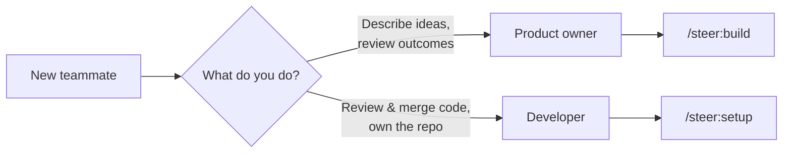

# Team onboarding

New to a `steer`-managed repo? This page gets you oriented in one read — what you
are, what to install, what to run first, and where the guardrails are. It assumes
nothing; follow the branch that matches your role.


```mermaid
flowchart LR
    YOU[New teammate] --> Q{What do you do?}
    Q -->|Describe ideas,<br/>review outcomes| PO[Product owner]
    Q -->|Review & merge code,<br/>own the repo| DEV[Developer]
    PO --> BUILD["/steer:build"]
    DEV --> SETUP["/steer:setup"]
```

## Before you start

Everything below happens **inside Claude Code**, so get that far first:

1. **Install Claude** — the desktop app (macOS/Windows) or the CLI. See
   [Anthropic's install docs](https://docs.claude.com/en/docs/claude-code/overview).
2. **Open the Code surface** — the Claude Code CLI, a VS Code / JetBrains
   extension, or the Claude Desktop **Code** tab. (The Desktop *Chat* tab and
   claude.ai web chat don't run the plugin's hooks — see the caveat below.)
3. **Open a folder** — for `/steer:build` or `/steer:init`, open or create an
   **empty folder**; the bootstrap turns it into the repo. Adopting an existing
   app? Open that repo's folder instead.
4. **Windows?** Do the [Windows setup](windows-setup.md) first.

## Am I a PO or a dev?

- **You're a product owner (PO)** if you bring *ideas* and judge *outcomes*: you
  describe what you want, answer Claude's questions, preview the result, and ask a
  developer to review before anything ships. You don't need to know skill names or
  touch the tracker.
- **You're a developer** if you *own the repo and the code*: you set repos up,
  review and merge PRs, resolve specs and work items, and are the human at every
  approval gate.

The rest of this page is split along that line. Read your branch; skim the other.

## What do I install?

Both roles install the plugin the same way, once, in Claude Code:

```text
/plugin marketplace add element22llc/e22-plugins
/plugin install steer@e22-plugins
```

Full details and the surface caveat live in [Installation](installation.md).

If you're a **PO** planning to use [`/steer:build`](../workflows/build.md), you
also need **Docker Desktop** installed and a supported machine — **macOS, Linux,
or Windows**. On Windows, the **Claude Desktop Code tab** needs only
[Git for Windows](windows-setup.md) (builds run there too — no WSL2); CLI/IDE
users develop in WSL2. See [Windows setup](windows-setup.md). Claude drives every
other tool for you — you don't install anything else.

!!! warning "Rules may not load automatically"
    On the **Claude Desktop *Chat* tab and claude.ai web chat** the `SessionStart`
    hook does not fire, so the always-on rules are **not** auto-injected. (Cowork
    runs hooks best-effort — reconfirm on your build.) On those surfaces, run
    `/steer:standards` at the start of every session before doing anything else.
    Engineering work belongs in Claude Code — the CLI, the IDE extensions, or the
    Desktop **Code** tab — where hooks run fully. See
    [Known limitations](../reference/known-limitations.md).

## What do I run first?

### If you're a PO

Just describe your idea in plain language, or run [`/steer:build`](../workflows/build.md):

```text
/steer:build I want an app that …
```

Claude interviews you, shapes a spec, builds a working local app, and hands off
for developer review. Claude asks at the start which shape applies: if a
developer will review it, the hand-off is a **PR**; if you're the sole
contributor with no developer yet, it recommends **solo trunk** instead — the
work lives on the main line with no PR, and review comes later, when a developer
joins. You never touch issues, specs, or work commands directly — Claude routes
everything. Walk the full path in
[The PO happy path](../workflows/build.md#the-po-happy-path).

### If you're a dev

Set the repo up first with [`/steer:setup`](../workflows/index.md) — it detects
the repo state and routes:

- **New repo:** → `/steer:init`
- **Existing app:** → [`/steer:adopt`](../workflows/adopt.md)

Then walk the [first workflow](first-workflow.md) end to end
(capture → spec → decompose → work → PR). On a hookless surface, run
`/steer:standards` first. Keep the
["I want to … → run …" cheat sheet](../workflows/index.md#i-want-to-run) handy —
it maps everyday intents to the skill that handles them.

## What should I never do?

- **Never merge without a developer's review.** Claude commits, pushes the
  branch, and opens the PR autonomously; **the merge review is the one human
  gate** — an open PR is inert behind branch protection, so the review happens
  there, not before the push. (Merge and deploy are never pre-approved.) See the
  [Authorization model](../concepts/authorization-model.md).
- **Never assume the rules loaded on the Desktop *Chat* tab or web chat.** If you
  didn't run `/steer:standards` there, the standards aren't in context and Claude
  is running without them. (Claude Code — the CLI, IDE extensions, and the Desktop
  **Code** tab — loads them automatically.)
- **(PO) Never edit code or the tracker directly** — let Claude drive the tooling
  so the spec spine and issue-first bookkeeping stay coherent.

## What does Claude do automatically?

- **Injects the always-on core rules** every session via the `SessionStart` hook (the rest arrive as path-scoped `.claude/rules/` in the managed repo — see [Configuration & rules](../reference/configuration.md))
  (where hooks fire) — this is what makes Claude follow the standards.
- **Reminds itself at the point of action** via `PreToolUse` hooks: a one-per-
  session nudge if it's about to write code before a spec exists, and another if
  it's about to mutate a GitHub-tracked repo without an issue. These are
  **advisory nudges, not hard blocks** — the write still proceeds; the guarantee
  comes from Claude following the rules, not from the hook stopping it.
- **Hard-blocks disallowed version pins** — the one deterministic `PreToolUse`
  gate denies image/runtime pins below the supported floor (`policy/versions.yml`).
- **Asks before a trunk push once a repo shows graduation signals** — in a
  solo-trunk repo that has grown a deploy workflow, an `infra/` tree, or a
  `prod`/`production` branch, the session's **first** `git push` surfaces as a
  `PreToolUse` **ask** (never a hard deny) pointing at `/steer:protect`; later
  pushes in that session carry a non-blocking reminder instead — or, on the Copilot
  CLI, pass silently, since that envelope carries decisions only. pr-flow repos are
  untouched.
- **Commits, pushes, and opens the PR autonomously** on a non-`main` branch
  (`/steer:work` defaults to `issue/<number>-<slug>`; otherwise the repo's
  convention, else `feat/*` / `fix/*`), then **stops before merging** — everything up to the merge is
  autonomous; the merge review is the backstop, enforced by branch protection.

See the [Hooks reference](../reference/hooks.md) and
[Authorization model](../concepts/authorization-model.md) for the full picture.

## When something breaks

- **A tool is missing** (`command not found`, mise/Docker errors) — run
  **`/steer:doctor`**; it detects what's absent and, with your yes, installs mise
  and the runtimes it manages. `git` and Docker Desktop it hands back to you: a
  command to run yourself, or a GUI app to launch.
- **Every steer command fails at once** (`syntax error near unexpected token`) —
  that is not a missing tool, it is a corrupt install: on Windows the plugin can
  check out with CRLF line endings, and a CRLF shell script fails to *parse*.
  **`/steer:doctor`** detects it first thing (§0) and tells you how to repair it;
  see [Windows setup → line endings](windows-setup.md#line-endings).
- **steer itself misbehaves** (a skill does the wrong thing, a hook misfires) —
  run **`/steer:report`**, which files a bug about the plugin upstream so it gets
  fixed for everyone.

## When do I ask a dev to review?

At every decision gate — these are the points where Claude deliberately pauses:

- **Spec approval** — before any code is written.
- **Merge & deploy** — always a human call.

Pushing the branch and opening the PR are **not** gates — Claude does both
autonomously; the review happens on the open PR, which is inert behind branch
protection until a human merges.

If you're a PO, your build ends at a **hand-off for dev review** by design —
that's the point, not a failure. In PR flow that hand-off is the v0 PR; in solo
trunk it's graduation off the trunk via `/steer:protect` when a developer joins.
If you're a dev, you *are* that reviewer.

## Where to go next

- [Installation](installation.md) — the full install + surface caveats.
- [The PO happy path](../workflows/build.md#the-po-happy-path) — the non-technical flow.
- [First workflow](first-workflow.md) — the developer flow end to end.
- [Known limitations](../reference/known-limitations.md) — what to watch for before you rely on the plugin.
- [Launch checklist](../team-rollout/launch-checklist.md) — for whoever is rolling this out to the team.
