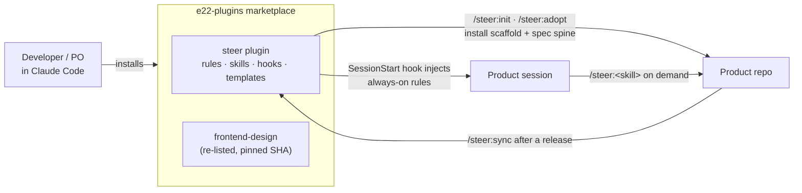

# e22-plugins — the `steer` plugin

`e22-plugins` is an **engineering-standards plugin marketplace** for
[Claude Code](https://claude.com/claude-code). It is not a product; it hosts one
plugin of its own — **`steer`** — which injects org-wide engineering standards
into every product Claude session and carries the bundled repo scaffold that
bootstraps a new repository spec-first.

The marketplace also **re-lists** Anthropic's upstream `frontend-design` plugin
via a `git-subdir` source pinned to a SHA. That plugin is *referenced, not
vendored* — its content is never copied here.

## How the pieces fit together

## What `steer` ships

| Component | Where | What it does |
| --- | --- | --- |
| **Always-on rules** | `plugins/steer/rules/` | Injected every session by the `SessionStart` hook (lexical order by numeric prefix). |
| **Skills** | `plugins/steer/skills/` | On-demand, invoked as `/steer:<skill>` (e.g. `/steer:spec`). |
| **Hooks** | `plugins/steer/hooks/` | POSIX-sh; inject rules and gate risky actions. |
| **Templates** | `plugins/steer/templates/` | Spec spine, reference prose, and the bundled repo scaffold. |

## Where to go next

- **New to the plugin?** Start with [Installation](getting-started/installation.md)
  and the [First workflow](getting-started/first-workflow.md).
- **Joining a team that uses it?** Read [Team onboarding](getting-started/team-onboarding.md).
- **Rolling it out to a team?** See [Known limitations](reference/known-limitations.md)
  and the [Launch checklist](team-rollout/launch-checklist.md).
- **Want the mental model?** Read [Concepts](concepts/product-spine.md).
- **Looking for a specific command?** See the [Skills reference](reference/skills.md).
- **Contributing to the plugin itself?** See
  [Contributing → Documentation](contributing/documentation.md) and
  [`AUTHORING.md`](https://github.com/element22llc/e22-plugins/blob/main/AUTHORING.md).

!!! note "Docs are auto-maintained"
    This site is kept in sync with the plugin's source of truth by the repo-local
    `/plugin-docs` skill and a CI drift gate. See
    [Contributing → Documentation](contributing/documentation.md).
