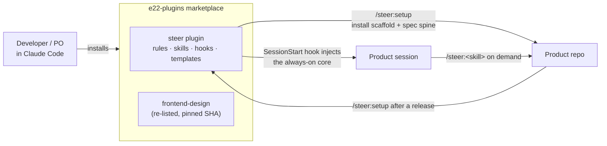

# e22-plugins — the `steer` plugin

`e22-plugins` is an **engineering-standards plugin marketplace** for
[Claude Code](https://claude.com/claude-code). It is not a product; it hosts one
plugin of its own — **`steer`** — which injects org-wide engineering standards
into every product Claude session and carries the bundled repo scaffold that
bootstraps a new repository spec-first.

The marketplace also **re-lists** Anthropic's upstream `frontend-design` plugin
via a `git-subdir` source pinned to a SHA. That plugin is *referenced, not
vendored* — its content is never copied here.

## How the pieces fit together

```mermaid
flowchart LR
    subgraph MP["e22-plugins marketplace"]
      STEER["steer plugin<br/>rules · skills · hooks · templates"]
      FD["frontend-design<br/>(re-listed, pinned SHA)"]
    end
    DEV["Developer / PO<br/>in Claude Code"] -->|installs| MP
    STEER -->|SessionStart hook injects<br/>the always-on core| SESSION["Product session"]
    STEER -->|/steer:setup<br/>install scaffold + spec spine| REPO["Product repo"]
    SESSION -->|/steer:&lt;skill&gt; on demand| REPO
    REPO -->|/steer:setup after a release| STEER
```

## What `steer` ships

| Component | Where | What it does |
| --- | --- | --- |
| **Always-on rules** | `plugins/steer/rules/` | Injected every session by the `SessionStart` hook (lexical order by numeric prefix). |
| **Skills** | `plugins/steer/skills/` | On-demand, invoked as `/steer:<skill>` (e.g. `/steer:spec`). |
| **Hooks** | `plugins/steer/hooks/` | POSIX-sh; inject rules and gate risky actions. |
| **Templates** | `plugins/steer/templates/` | Spec spine, reference prose, and the bundled repo scaffold. |

## Where to go next

-   **New to the plugin?**

    ---

    Add the marketplace, install `steer`, and run it end to end once.

    [Installation](getting-started/installation.md) ·
    [First workflow](getting-started/first-workflow.md)

-   **Joining a team that uses it?**

    ---

    What the plugin does to a session you didn't set up, and what it expects of you.

    [Team onboarding](getting-started/team-onboarding.md)

-   **Rolling it out to a team?**

    ---

    Which surfaces run hooks, which only run skills, and what to verify before you announce it.

    [Known limitations](reference/known-limitations.md) ·
    [Launch checklist](team-rollout/launch-checklist.md)

-   **Want the mental model?**

    ---

    The spec spine, the lifecycle it drives, and how authorization is decided.

    [Product spine](concepts/product-spine.md) ·
    [SDLC overview](concepts/sdlc.md)

-   **Looking for a specific command?**

    ---

    Every `/steer:<skill>`, every hook, and the repository contract they assume.

    [Skills reference](reference/skills.md) ·
    [Hooks](reference/hooks.md)

-   **Contributing to the plugin itself?**

    ---

    The docs contract, the release flow, and the authoring guide for rules and skills.

    [Contributing → Documentation](contributing/documentation.md) ·
    [`AUTHORING.md`](https://github.com/element22llc/e22-plugins/blob/main/AUTHORING.md)

!!! note "Docs are auto-maintained"
    This site is kept in sync with the plugin's source of truth by the repo-local
    `/plugin-docs` skill and a CI drift gate. See
    [Contributing → Documentation](contributing/documentation.md).
