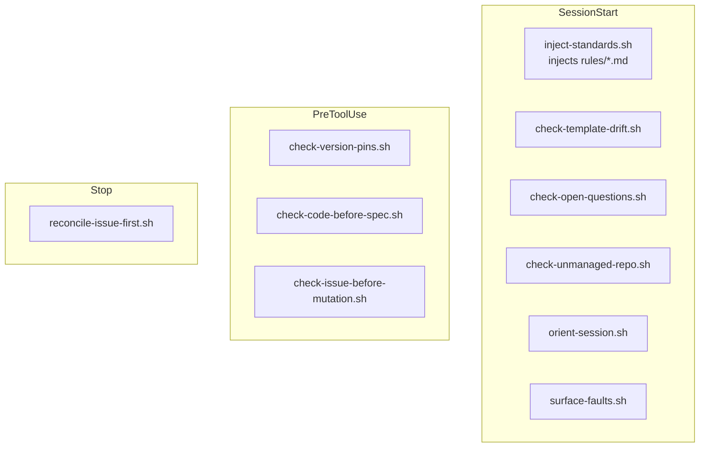

# Hooks reference

`steer`'s hooks are POSIX-`sh` scripts under `plugins/steer/hooks/`, wired in
`hooks.json`. They inject the always-on rules and gate risky actions. All hook
commands are invoked with an explicit `sh` prefix, so the executable bit is
irrelevant (marketplace install does not `chmod`). No `jq` dependency.

!!! warning "Hooks are a Claude Code lifecycle feature — don't assume they ran"
    Everything below hangs off Claude Code's hook lifecycle (`SessionStart`,
    `PreToolUse`, `Stop`). Note what each tier actually does: the `SessionStart`
    hook **injects** the rules; most `PreToolUse` hooks are **advisory nudges**
    that fire once and let the write proceed (`check-code-before-spec`,
    `check-issue-before-mutation`); only `check-version-pins` issues a hard
    `deny`. On surfaces where hooks don't fire — **Claude Cowork and the desktop
    app** — none of this runs, so load the rules manually with `/steer:standards`
    and lean on human review. See [Surfaces without hooks](#surfaces-without-hooks)
    below and [Known limitations](known-limitations.md).

## SessionStart

| Hook | Matcher | Role |
| --- | --- | --- |
| `inject-standards.sh` | `startup\|resume\|clear\|compact` | Concatenates `rules/*.md` (lexical order) into session context. Records a self-fault (for `/steer:report`) if its rules directory is missing. |
| `check-template-drift.sh` | `startup\|resume\|clear` | Warns when the materialized spine/scaffold lags the plugin templates. |
| `check-open-questions.sh` | `startup\|resume\|clear` | Surfaces unresolved spec open questions, and **escalates stale ones** — a blocking, un-promoted question open more than 14 days (from its `created:` date, or `git blame` when absent) gets a loud line naming the feature, question, owner, and age. |
| `check-unmanaged-repo.sh` | `startup\|resume\|clear` | Flags a repo that has no `/spec` spine yet. |
| `orient-session.sh` | `startup` | On a fully managed spine only, reminds the model to surface the "describe what you want in plain language" affordance — so a non-technical user need not know skill names. Silent on unmanaged/foreign/damaged spines (owned by `check-unmanaged-repo.sh`). |
| `surface-faults.sh` | `startup\|resume\|clear` | Raises any *unreported* steer self-faults recorded by other hooks (via `lib/report-fault.sh`) into session context, once each, so `/steer:report` can file them upstream. Silent when there are none and inside the plugin's own tree. |

## PreToolUse

| Hook | Matcher | Role |
| --- | --- | --- |
| `check-version-pins.sh` | `Write\|Edit\|MultiEdit\|NotebookEdit\|Bash` | Blocks version pins that violate `policy/versions.yml`. |
| `check-code-before-spec.sh` | `Write\|Edit\|MultiEdit\|NotebookEdit` | Advisory nudge (not a gate): a one-per-session reminder when code is about to be written before a `/spec` spine exists. Non-blocking — the write proceeds. |
| `check-issue-before-mutation.sh` | `Write\|Edit\|MultiEdit\|NotebookEdit` | Advisory nudge (not a gate): a one-per-session reminder to work issue-first, only in GitHub-tracked repos. Non-blocking — it cannot know whether an issue exists. |

## Stop

| Hook | Role |
| --- | --- |
| `reconcile-issue-first.sh` | End-of-turn reconciliation of issue-first bookkeeping. |

## Surfaces without hooks

On Claude Cowork and the desktop app, plugin hooks do not currently fire — load
the rules manually with `/steer:standards`. See [Installation](../getting-started/installation.md).
