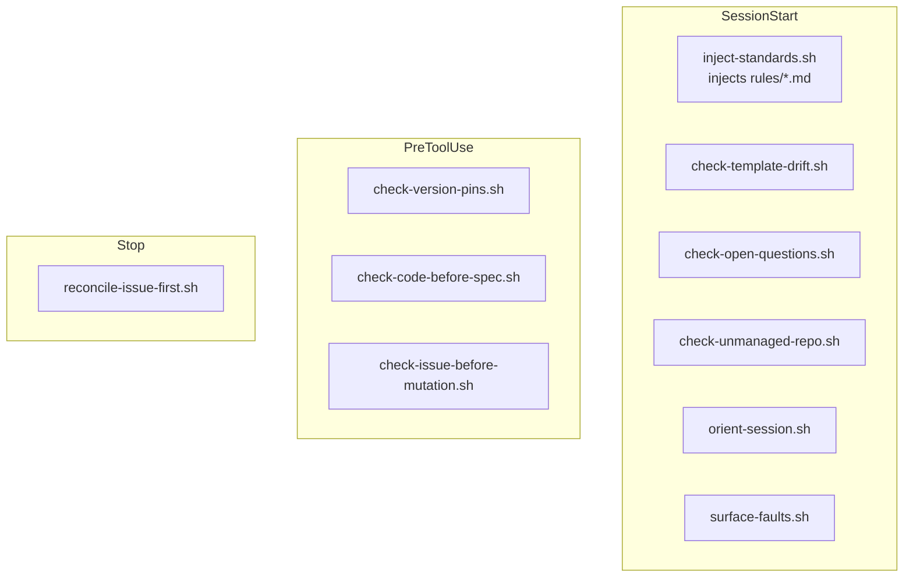

# Hooks reference

`steer`'s hooks are POSIX-`sh` scripts under `plugins/steer/hooks/`, wired in
`hooks.json`. They inject the always-on rules and gate risky actions. All hook
commands are invoked with an explicit `sh` prefix, so the executable bit is
irrelevant (marketplace install does not `chmod`). No `jq` dependency.

!!! warning "Hooks are a Claude Code lifecycle feature — don't assume they ran"
    Everything below hangs off Claude Code's hook lifecycle (`SessionStart`,
    `PreToolUse`, `Stop`). Note what each tier actually does: the `SessionStart`
    hook **injects** the rules; most `PreToolUse` hooks are **advisory nudges**
    that let the write proceed (`check-code-before-spec`,
    `check-issue-before-mutation`); only `check-version-pins` issues a hard
    `deny`. On surfaces where hooks don't fire — **the Desktop *Chat* tab and
    claude.ai web chat** — none of this runs, so load the rules manually with
    `/steer:standards` and lean on human review. See
    [Surfaces without hooks](#surfaces-without-hooks) below and
    [Known limitations](known-limitations.md).

## SessionStart

| Hook | Matcher | Role |
| --- | --- | --- |
| `inject-standards.sh` | `startup\|resume\|clear\|compact` | Concatenates `rules/*.md` (lexical order) into session context. A rule carrying a first-line `<!-- steer:inject-when=… -->` marker is injected only when its scope applies — `code-project` for the code-loop rules (a git work tree, or any code/config marker within `maxdepth 2`), issue-first on GitHub-tracked repos, deployment when the repo deploys (an `/infra` dir **or** an app/service repo) — and the marker line is stripped. In **knowledge-work mode** (a confidently non-code folder — the typical Cowork product-owner case), it injects only the lean always-on PO core and **skips every `inject-when`-marked rule** (see [Knowledge-work mode](known-limitations.md)). Records a self-fault (for `/steer:report`) if its rules directory is missing. |
| `check-template-drift.sh` | `startup\|resume\|clear` | Warns when the materialized spine/scaffold lags the plugin templates. |
| `check-open-questions.sh` | `startup\|resume\|clear` | Surfaces unresolved spec open questions, and **escalates stale ones** — a blocking, un-promoted question open more than 14 days (from its `created:` date, or `git blame` when absent) gets a loud line naming the feature, question, owner, and age. |
| `check-unmanaged-repo.sh` | `startup\|resume\|clear` | Flags a repo that has no `/spec` spine yet and offers the bootstrap routes — leading with `/steer:build` for a non-technical owner (it runs `/steer:init` itself), with `/steer:init`/`/steer:adopt` framed as the developer / existing-code paths. |
| `orient-session.sh` | `startup` | On a fully managed spine only. If an in-progress PO build exists (a `spec/BUILD-STATUS.md` with an open handoff gate), steers deterministically back into `/steer:build` to resume from its current step; once the build is handed off (every gate box checked) it falls back to reminding the model to surface the "describe what you want in plain language" affordance — so a non-technical user need not know skill names. Silent on unmanaged/foreign/damaged spines (owned by `check-unmanaged-repo.sh`). |
| `surface-faults.sh` | `startup\|resume\|clear` | Raises any *unreported* steer self-faults recorded by other hooks (via `lib/report-fault.sh`) into session context, once each, so `/steer:report` can file them upstream. Silent when there are none and inside the plugin's own tree. |

## PreToolUse

| Hook | Matcher | Role |
| --- | --- | --- |
| `check-version-pins.sh` | `Write\|Edit\|MultiEdit\|NotebookEdit\|Bash` | Enforces the **EOL floor** in `policy/versions.yml` (deterministic, no network, no `jq`): a pin below `minimum_supported` or in the `denied` list is denied; anything at or above the floor is silent. It is a floor, not a chooser — there is no advisory "behind the target" tier; **what** to pin (current stable) is decided live per the versioning rule (`/steer:reference conventions`). A scheduled workflow (`version-policy-refresh.yml`) keeps the floor current by opening a human-reviewed PR when it falls behind upstream end-of-life — the only place endoflife.date is consulted. |
| `check-code-before-spec.sh` | `Write\|Edit\|MultiEdit\|NotebookEdit` | Advisory nudge (not a gate) with two dimensions. The **spine** reminder fires once per session+repo when code is about to be written before a `/spec` spine exists. The **scaffold** reminder is sticky — it re-fires on each new feature file while the repo has no root `mise.toml` (dedups per file, self-clears once a `mise.toml` lands or the spine is managed). Non-blocking — the write always proceeds. |
| `check-issue-before-mutation.sh` | `Write\|Edit\|MultiEdit\|NotebookEdit` | Advisory nudge (not a gate): a one-per-session reminder to work issue-first, only in GitHub-tracked repos. Non-blocking — it cannot know whether an issue exists. In solo-trunk mode (the `steer:delivery-mode=solo-trunk` marker in `CLAUDE.md`) it still nudges — issue-first holds — but rewords to "close the issue from the trunk commit," not "open a PR / branch." Stays silent on the `/steer:sync` plugin-maintenance branch (`feat/sync`), whose scaffold reconciliation is structural, not feature work — unless the write is app source, which sync must not touch. |

## Stop

| Hook | Role |
| --- | --- |
| `reconcile-issue-first.sh` | End-of-turn reconciliation of issue-first bookkeeping. In solo-trunk mode it skips the branch-name check (`main` is expected) and rewords its advisory to "reference the issue in the trunk commit" rather than steering to an `issue/<N>` branch — issue-first still holds. Exempts the `/steer:sync` branch (`feat/sync`) the same way the point-of-action nudge does — silent unless app source also changed. |

## Shared input extraction (`lib/json.sh`)

The `PreToolUse`/`Stop` hooks read their JSON payload from stdin through one
shared helper, `hooks/lib/json.sh` — deterministic, dependency-free, and with
**no `jq` requirement** (it uses `jq` only as a fast path when present, and falls
back to a narrow POSIX `grep`/`sed` extractor otherwise). The two paths agree on
the same contract:

- A field resolves to `tool_input.<name>` in preference to a top-level `.<name>`,
  so a same-named field elsewhere in the payload cannot be mistaken for the tool's
  real argument (e.g. the `file_path` a `Write` is about).
- Within that scope the **first** match wins, so a repeated key buried in a later
  `content` value cannot shadow the real field, and escaped quotes/backslashes in
  values are tolerated.

This is best-effort extraction for the exact PreToolUse shapes — not a general
JSON parser — and every consuming hook is fail-open, so an unparseable payload
degrades to a missed nudge, never a wrongful block.

## Surfaces without hooks

Claude Code (CLI, IDE extensions, Desktop **Code** tab) and **Cowork** run hooks;
the Desktop **Chat** tab and claude.ai web chat do **not**. On those chat-only
surfaces, load the rules manually with `/steer:standards`. See
[Installation](../getting-started/installation.md) and
[Known limitations](known-limitations.md).
