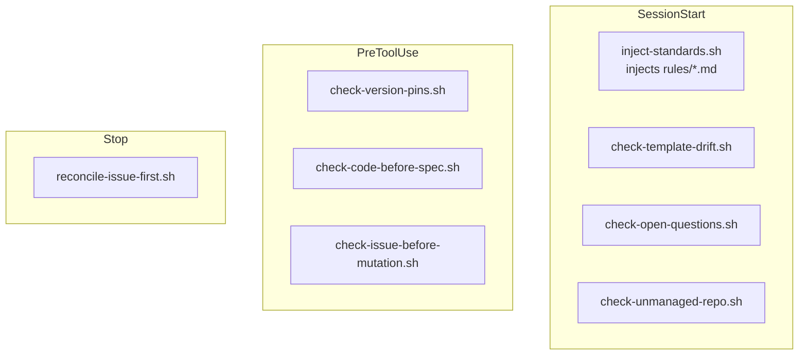

# Hooks reference

`steer`'s hooks are POSIX-`sh` scripts under `plugins/steer/hooks/`, wired in
`hooks.json`. They inject the always-on rules and gate risky actions. All hook
commands are invoked with an explicit `sh` prefix, so the executable bit is
irrelevant (marketplace install does not `chmod`). No `jq` dependency.

## SessionStart

| Hook | Matcher | Role |
| --- | --- | --- |
| `inject-standards.sh` | `startup\|resume\|clear\|compact` | Concatenates `rules/*.md` (lexical order) into session context. |
| `check-template-drift.sh` | `startup\|resume\|clear` | Warns when the materialized spine/scaffold lags the plugin templates. |
| `check-open-questions.sh` | `startup\|resume\|clear` | Surfaces unresolved spec open questions. |
| `check-unmanaged-repo.sh` | `startup\|resume\|clear` | Flags a repo that has no `/spec` spine yet. |

## PreToolUse

| Hook | Matcher | Role |
| --- | --- | --- |
| `check-version-pins.sh` | `Write\|Edit\|MultiEdit\|NotebookEdit\|Bash` | Blocks version pins that violate `policy/versions.yml`. |
| `check-code-before-spec.sh` | `Write\|Edit\|MultiEdit\|NotebookEdit` | Guards against writing code ahead of an approved spec. |
| `check-issue-before-mutation.sh` | `Write\|Edit\|MultiEdit\|NotebookEdit` | Enforces issue-first: a mutation presupposes an active issue. |

## Stop

| Hook | Role |
| --- | --- |
| `reconcile-issue-first.sh` | End-of-turn reconciliation of issue-first bookkeeping. |

## Surfaces without hooks

On Claude Cowork and the desktop app, plugin hooks do not currently fire — load
the rules manually with `/steer:standards`. See [Installation](../getting-started/installation.md).
