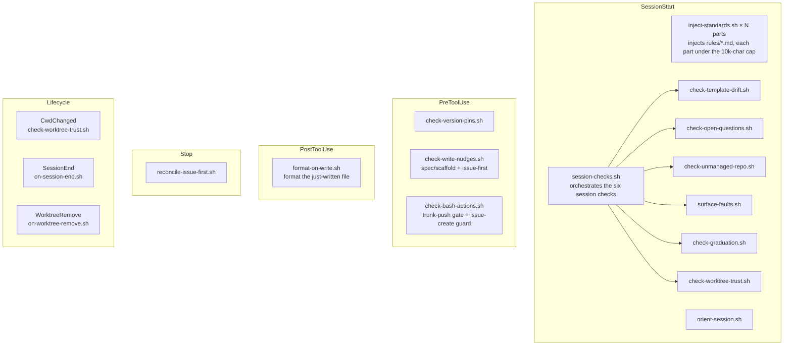

# Hooks reference

`steer`'s hooks are POSIX-`sh` scripts under `plugins/steer/hooks/`, wired in
`hooks.json`. They inject the always-on rules and gate risky actions. All hook
commands are invoked with an explicit `sh` prefix, so the executable bit is
irrelevant (marketplace install does not `chmod`). No `jq` dependency. Every hook
declares an explicit `timeout` in `hooks.json`, so a slow hook cannot stall a
session — with one carve-out that is not steer's to set:

!!! warning "A plugin cannot raise the `SessionEnd` budget"
    `SessionEnd` hooks share a **1.5-second** budget, and *"Timeouts set on
    plugin-provided hooks don't raise the budget"* — only a timeout in a user's
    own settings file does, to at most 60s. The `"timeout": 60` steer declares on
    its `SessionEnd` registration is therefore **inert**, and a hook cancelled at
    the budget has its output discarded and its work unfinished. That makes the
    `SessionEnd` teardown below **best-effort**, not a guarantee. A dev who wants
    it to fit can raise the budget themselves:
    `CLAUDE_CODE_SESSIONEND_HOOKS_TIMEOUT_MS=5000 claude`. `WorktreeRemove` is
    unaffected — it takes the ordinary command-hook timeout, so its 60s is real.
    ([upstream reference](https://docs.claude.com/en/docs/claude-code/hooks.md))

!!! danger "Hook scripts must check out as LF — a CRLF copy breaks all of them at once"
    Every hook here is a POSIX `sh` script, and **a CRLF shell script does not
    warn, it fails to parse**: the shell reads the trailing `\r` as part of the
    token, so `steer_repo_root() {` becomes
    `syntax error near unexpected token $'{\r'` and the script never runs. Because
    the hooks share `hooks/lib/*.sh`, one CRLF checkout takes out the whole set
    simultaneously — this was the v5.0.0 fault. The plugin therefore ships a
    `.gitattributes` pinning `* text=auto eol=lf`, so the bundled scripts check
    out as LF regardless of the host's `core.autocrlf` (the Git for Windows
    default is `true`). If you see every hook broken at once, run
    [`/steer:doctor`](skills.md) — its **§0 plugin-integrity check** greps the
    installed `hooks/` and `scripts/` for CR before anything else and reports it
    as an install fault rather than a missing prerequisite. See
    [Windows setup → Line endings](../getting-started/windows-setup.md#line-endings).

!!! warning "Hooks are a Claude Code lifecycle feature — don't assume they ran"
    Everything below hangs off Claude Code's hook lifecycle (`SessionStart`,
    `PreToolUse`, `PostToolUse`, `Stop`, plus the lifecycle events `CwdChanged`,
    `SessionEnd` and `WorktreeRemove`). Note what each tier actually does: the
    `SessionStart` hook **injects** the rules (and one session check, `check-worktree-trust`, also **writes** — it marks this worktree's path trusted in mise's local trust store); most `PreToolUse` checks are
    **advisory nudges** that let the write proceed (the two dimensions of
    `check-write-nudges`, the issue-create contract guard in `check-bash-actions`);
    only `check-version-pins` issues a hard `deny`, and the trunk-push gate in
    `check-bash-actions` surfaces a permission **ask** (the human can
    approve and continue); the `PostToolUse` formatter runs **after** a write and
    only reformats it. On surfaces where hooks don't fire — **the Desktop *Chat* tab and
    claude.ai web chat** — none of this runs, so load the rules manually with
    `/steer:standards` and lean on human review. See
    [Surfaces without hooks](#surfaces-without-hooks) below and
    [Known limitations](known-limitations.md).

```mermaid
flowchart TD
    subgraph SessionStart
      inject[inject-standards.sh × N parts<br/>injects rules/*.md, each part under the 10k-char cap]
      checks[session-checks.sh<br/>orchestrates the six session checks]
      orient[orient-session.sh]
      checks --> drift[check-template-drift.sh]
      checks --> oq[check-open-questions.sh]
      checks --> unmanaged[check-unmanaged-repo.sh]
      checks --> faults[surface-faults.sh]
      checks --> grad[check-graduation.sh]
      checks --> wt[check-worktree-trust.sh]
    end
    subgraph PreToolUse
      pins[check-version-pins.sh]
      wn[check-write-nudges.sh<br/>spec/scaffold + issue-first]
      ba[check-bash-actions.sh<br/>trunk-push gate + issue-create guard]
    end
    subgraph PostToolUse
      fmt[format-on-write.sh<br/>format the just-written file]
    end
    subgraph Stop
      reconcile[reconcile-issue-first.sh]
    end
    subgraph Lifecycle
      cwd[CwdChanged<br/>check-worktree-trust.sh]
      send[SessionEnd<br/>on-session-end.sh]
      wtr[WorktreeRemove<br/>on-worktree-remove.sh]
    end
```

## SessionStart

Since the session-checks consolidation, `hooks.json` carries **three**
`SessionStart` registrations: the rule injection, one `session-checks.sh`
orchestrator, and the orientation hook. The session checks are no longer
registered individually — `session-checks.sh` runs them in the order below,
failure-isolated (a crashing check never blocks the rest) and always exiting
`0`; each check keeps its own contract (read the payload from stdin, print a
notice or nothing) and stays individually testable.

| Hook | Matcher | Role |
| --- | --- | --- |
| `inject-standards.sh` | `startup\|resume\|clear\|compact` | Delivers `rules/*.md` (lexical order) into session context **in parts**: Claude Code caps one hook command's stdout at 10,000 characters and silently replaces anything longer with an "Output too large" pointer, so `hooks.json` registers the script N times (`inject-standards.sh <k> <N>`), every invocation computes the same deterministic partition of the eligible rules and emits only part *k* — each under the cap, arriving as its own SessionStart block in any order (the headers say so; the numeric rule prefixes give the sequence). An unused part emits nothing. If the eligible rules do not fit the registered parts, whole rules are dropped from the tail and the last part carries an in-band `RULESET INCOMPLETE` notice naming them; `check_context_budget.py` runs every part of every profile pre-merge and fails on any drop or any part over the cap. It is **not** once-per-session: there is no guard, and `compact` can fire repeatedly within one session — deliberately, since a compaction can drop the injected rules and re-injecting is what puts them back. A rule carrying a first-line `<!-- steer:inject-when=… -->` marker is injected only when its scope applies — `code-project` for the code-loop rules (a git work tree, or any code/config marker within `maxdepth 2`), issue-first on GitHub-tracked repos, deployment when the repo deploys (`has-iac` **or** `has-apps` — IaC meaning an `/infra` dir, root `*.tf`/`*.hcl`, `ansible.cfg`, `site.yml`, `Pulumi.yaml`, or `roles/` + `playbooks/`; apps meaning an `apps/` dir, a `package.json`, or a `pnpm-workspace.yaml`) — and the marker line is stripped. In **knowledge-work mode** (a confidently non-code folder — the typical Cowork product-owner case), it injects only the lean always-on PO core and **skips every `inject-when`-marked rule** (see [Knowledge-work mode](known-limitations.md)). Fail-soft: if its rules directory is missing it still emits a fallback banner (the hook always exits `0`, so the notice reaches the session) and records a self-fault for `/steer:report`. **Host-aware** (`steer_hook_host` in `lib/json.sh`): on a GitHub Copilot surface — `STEER_HOOK_TARGET=copilot` from the generated `copilot-hooks.json` (Copilot CLI), or the payload shape Copilot Chat in VS Code sends when it runs this `hooks.json` directly (snake_case `SessionStart` with `model` and `timestamp`, no `permission_mode`) — part 1 emits the **whole** eligible ruleset as **one JSON object** carrying both `additionalContext` (the key the CLI reads) and `hookSpecificOutput.additionalContext` (the key VS Code reads), encoded losslessly by `steer_json_string`, and every other part stays silent, because Copilot has no per-command cap but keeps only the *last* hook's context. A Claude Code payload (`permission_mode`) or any unrecognised shape keeps the raw parted output. |
| `session-checks.sh` | `startup\|resume\|clear` | Consolidated orchestrator for the six session checks below (one `hooks.json` registration; five of them were once registered individually, and `check-worktree-trust.sh` was added inside the roster). Captures the SessionStart payload once and re-feeds it to each check unchanged, in registration order; failure-isolated; always exits `0`. Contains no check logic of its own. |
| `check-template-drift.sh` | via `session-checks.sh` | Warns when the materialized spine/scaffold lags the plugin templates — diffs the `##`/`###` headings of each instantiated spec file (`PRODUCTIONIZATION.md`, `BUILD-STATUS.md`, feature `intent.md`/`contract.md`) against the current bundled template and names any section the template adds that the file lacks. Headings carrying `<!-- steer:placeholder -->` (the seed `### Q-001 — …` open-question block) are skipped, since those are rewritten or deleted as a feature is specced — matching `check-open-questions.sh`, which ignores the same marker — so a correctly-completed file is never falsely flagged. Resolves the work-tree root from the session `cwd`, so it still finds drift when Claude Code starts in a subdirectory (e.g. `apps/web`). |
| `check-open-questions.sh` | via `session-checks.sh` | Surfaces unresolved spec open questions as a **four-bucket count** — *block work now* vs *block a later transition* (split by comparing each question's `required_before:` gate against the feature's cleared Status, via `lib/lifecycle.sh`), plus *non-blocking* backlog and *malformed* (a `Q-NNN` block missing `status`/`impact`, surfaced rather than dropped). Only `status: open` and `status: investigating` count; `<!-- steer:placeholder -->` seeds are skipped and legacy `- [ ]` items count as backlog only where they sit inside `## Open questions` **and outside** any `### Q-NNN` block, with a bracketed `[placeholder]` rest skipped. It also warns when a **retired `spec/SPEC-QUESTIONS.md`** is still present — the standalone file v1.25.0 replaced; `/steer:questions` heals it as a hard gate before its sweep. It also **escalates stale ones** — a blocking, un-promoted question open more than 14 days (from its `created:` date, or `git blame` when absent) gets a loud line naming the feature, question, owner, and age. |
| `check-unmanaged-repo.sh` | via `session-checks.sh` | On a repo whose spine is not yet `managed`, prints a compact plain-language **onboarding card** (a `foreign` spine gets a shorter adopt offer instead, and a `damaged` one a repair notice — so creating `/spec` swaps the message rather than clearing it; only a complete, version-stamped spine is silent): the user can just say what they want — think an idea through (`/steer:spec` **lite mode**, works with no bootstrap), build an app (`/steer:build`, non-technical owner), or set the repo up (**`/steer:setup`** — the one front door; it detects the repo state and routes to `/steer:init` for a greenfield repo or `/steer:adopt` for substantial existing code). Feature *code* still requires the bootstrap first — spec-only work is the one sanctioned exception. Resolves the work-tree root from the session `cwd` in the hook payload, so it anchors correctly from a subdirectory. |
| `surface-faults.sh` | via `session-checks.sh` | Raises any *unreported* steer self-faults recorded by other hooks (via `lib/report-fault.sh`) into session context, once each, so `/steer:report` can file them upstream. Silent when there are none and inside the plugin's own tree. |
| `check-graduation.sh` | via `session-checks.sh` | Only in **solo-trunk** mode: when a local graduation signal is present (a `prod`/`production` branch, a deploy workflow, or an `infra/` tree — detected by the shared `lib/graduation.sh`, the same detector the `check-bash-actions.sh` trunk-push gate uses), nudges the owner to graduate to PR flow via `/steer:protect` and notes that trunk pushes are gated until then. Offline (the collaborator-count signal is left to `/steer:audit`/`/steer:protect`); silent in pr-flow, with no signal, or once graduated. |
| `check-worktree-trust.sh` | via `session-checks.sh` | Only in a **linked worktree**: inherits the primary checkout's `mise trust` so `mise run …` works there immediately. `mise trust` is path-based, so a new worktree is untrusted and the whole scaffolded dev loop fails on *trust* rather than on the task — triggered by the scaffold's own `[env] _.source = "scripts/worktree-env.sh"`, which mise refuses to load untrusted. Inheriting grants nothing new: mise keys trust by **path**, not by content, so the primary checkout already trusts every future edit of that config. It never *creates* trust: an **untrusted** primary checkout means the repo was never set up (it names `mise trust && mise install`), and a primary checkout with **no mise config at all** means the worktree's branch introduced one, so no prior decision exists anywhere (it names `mise trust` here) — either way it changes nothing and leaves the call to the user. It also reports `mise trust` itself failing, and confirms when it did inherit the trust. Silent in a plain checkout (gated before `mise` is ever invoked), outside any work tree, without mise on `PATH`, when the worktree is already trusted, and when it has no mise config. |
| `orient-session.sh` | `startup\|resume\|clear\|compact` | Two audiences. In a **non-code knowledge-work folder** (no git work tree) it emits a one-time, plain-language confirmation that the lean standards are loaded and that the user need not learn any `/steer:*` names — gated to `source: startup` so it does not re-greet after a `/clear`, resume or compaction. Otherwise, on a fully managed spine only: if an in-progress PO build exists (a `spec/BUILD-STATUS.md` with an open handoff gate), steers deterministically back into `/steer:build` to resume from its current step; once the build is handed off (every gate box checked) it falls back to reminding the model to surface the "describe what you want in plain language" affordance — so a non-technical user need not know skill names. Also emits a short **polyrepo topology note** in a repo carrying `spec/workspace.yml` (workspace host) or `spec/PRODUCT.md` (member), role-specific — this hook is the sole *automatic* delivery path for the topology, which is deliberately not an always-on rule (`/steer:reference polyrepo` is the on-demand path). The topology note is emitted **before** the PO-build branch, which exits early, so a workspace or member with an open handoff gate still receives it; and it carries the same `startup|resume|clear|compact` matcher as the ruleset it substitutes for, so a `/clear`, a resume or auto-compaction does not silently drop it. Silent on unmanaged/foreign/damaged spines (owned by `check-unmanaged-repo.sh`). |

## PreToolUse

| Hook | Matcher | Role |
| --- | --- | --- |
| `check-version-pins.sh` | `Write\|Edit\|MultiEdit\|NotebookEdit` | Enforces the **EOL floor** in `policy/versions.yml` (deterministic, no network, no `jq`): a pin below `minimum_supported` or in the `denied` list is denied; anything at or above the floor is silent. It is a floor, not a chooser — there is no advisory "behind the target" tier; **what** to pin (current stable) is decided live per the versioning rule (`/steer:reference conventions`). A scheduled workflow (`version-policy-refresh.yml`) keeps the floor current by opening a human-reviewed PR when it falls behind upstream end-of-life — the only place endoflife.date is consulted. A deliberately older pin (deploy-target parity, vendor LTS) bypasses the deny by appending `# steer:allow-pin <reason>` on the same line plus an ADR (legacy alias: `# pin-ok:`). |
| `check-write-nudges.sh` | `Write\|Edit\|MultiEdit\|NotebookEdit` | The two write-path advisory nudges (not gates) in one process — they share the same matcher, root resolution, and path classification, so they run as one hook. **Spec/scaffold dimension:** the **spine** reminder fires once per session+repo when code is about to be written before a `/spec` spine exists; the **scaffold** reminder is sticky — it re-fires on each new feature file while the repo has no root `mise.toml` (dedups per file, self-clears once a `mise.toml` lands or the spine is managed). **Issue-first dimension:** a one-per-session reminder to work issue-first **above [Tiny](../concepts/sdlc.md#change-size)** (the message names the carve-out: not spec, docs, lockfiles, or a change under ~20 lines with no behavior change, where the PR is the evidence anchor), only in GitHub-tracked repos — it cannot know whether an issue exists. In solo-trunk mode (the `steer:delivery-mode=solo-trunk` marker in `CLAUDE.md`) it still nudges — issue-first holds — but rewords to "close the issue from the trunk commit," not "open a PR / branch." Stays silent on the `/steer:sync` plugin-maintenance branch (`feat/sync`), whose scaffold reconciliation is structural, not feature work — unless the write is app source, which sync must not touch. Non-blocking — the write always proceeds; when both dimensions are due on one write their messages are emitted together. |
| `check-bash-actions.sh` | `Bash\|mcp__.*[Ii]ssue.*` | The two Bash-path checks in one process (this is the hottest PreToolUse path — every Bash call matches). **Trunk-push graduation gate** (Bash only): in a **solo-trunk** repo that shows a local graduation signal (a deploy workflow, an `infra/` tree, or a `prod`/`production` branch — the shared `lib/graduation.sh` detector), a Bash `git push` surfaces as a permission **ask** naming `/steer:protect` — never a hard deny, so the human can approve the push and keep working. The ask fires **once per session+repo**; repeat pushes in the same session downgrade to a non-blocking reminder (still not silent), so an autonomous run is not stalled on every push. Silent everywhere else: pr-flow repos (branch pushes are autonomous; the server-side merge review is the gate), signal-free solo-trunk repos (trunk autonomy holds), non-push commands, and anything outside a work tree. The gate judges **the repo being pushed**: a `git -C <dir> push` resolves its root from `<dir>` (`steer_action_root`), not from the session `cwd`, so a nested work tree is never judged by its parent's delivery mode. Registered for Copilot CLI too (flat `ask` envelope; repeats are silent there — the Copilot envelope carries decisions only). **Issue-create contract guard** (Bash + MCP): a one-per-session advisory nudge, only in GitHub-tracked repos, when an agent opens an issue with a **raw create** that bypasses the machine-readable contract — `gh issue create`, `gh api … POST …/issues`, a `gh api graphql` `createIssue` mutation, or an MCP create-issue tool (including the hosted GitHub MCP's renamed `issue_write` method; sub-issue linkers like `add_sub_issue`/`sub_issue_write` are excluded — they attach a relationship to an existing issue and carry no body). Points at `/steer:tracker-sync create`, which renders the steer markers, the derived `source:*` label, the GitHub Issue Type, and native relationship edges (with find-before-create dedup). Stays silent when the payload already carries `steer:` markers (the contract-render path) and in the plugin's own source repo. The complementary after-the-fact recovery path is `/steer:issues reconcile --all`, which flags contract-less issues. |

## PostToolUse

| Hook | Matcher | Role |
| --- | --- | --- |
| `format-on-write.sh` | `Write\|Edit\|MultiEdit` | Formats the **single file** a write just touched with the repo's **own** formatter, removing the formatting-only CI round-trip. Strictly opt-in: it runs only when the repo has declared a formatter this hook knows — a root `biome.json`/`biome.jsonc` (biome, for `.ts`/`.tsx`/`.js`/`.jsx`/`.mjs`/`.cjs`/`.json`/`.jsonc`/`.css`) or a root `pyproject.toml` (ruff, for `.py`) — and the formatter binary is already on `PATH`. No config, an unknown extension, or a missing binary → silent no-op; it never installs a tool, introduces a formatter, or sweeps the tree. Best-effort and always exits `0` (a formatter error on mid-refactor, unparseable code never fails the hook), and the write has already happened, so there is no decision to influence. Exempt in the plugin's own source repo, whose pre-commit owns formatting. Not ported to Copilot — Copilot ports only the blocking `PreToolUse` gates. |

## Stop

| Hook | Role |
| --- | --- |
| `reconcile-issue-first.sh` | End-of-turn reconciliation of issue-first bookkeeping — it ties every implementation-affecting mutation **above [Tiny](../concepts/sdlc.md#change-size)** (under ~20 lines with no behavior change) to a GitHub issue. In solo-trunk mode it skips the branch-name check (`main` is expected) and rewords its advisory to "reference the issue in the trunk commit" rather than steering to an `issue/<N>` branch — issue-first still holds. Exempts the `/steer:sync` branch (`feat/sync`) the same way the point-of-action nudge does — silent unless app source also changed. Caps its per-file change classification scan (fail-soft — nothing governed found by the cap → silent), so a huge first-turn dirty tree cannot approach the 30s `Stop` timeout. |

## Lifecycle events

Three registrations that are not gates and not context injection: they run
because the harness has told steer that something in the session's *environment*
changed. **None of the three carries decision control**, so none of them can
block what it observes — a session ending, a worktree being removed, a directory
change. `SessionEnd` and `WorktreeRemove` discard their JSON output fields;
`CwdChanged` does not — it discards only `continue`.

What they can *report* differs:

| Event | On `exit 2` | JSON output | So |
| --- | --- | --- | --- |
| `SessionEnd` | Shows stderr to the user | Discarded | A channel exists; a teardown is not worth interrupting a shutdown for, so steer exits `0` |
| `WorktreeRemove` | Failures are logged in debug mode only | Discarded | Genuinely no user-facing channel |
| `CwdChanged` | Shows stderr to the user | `systemMessage` is honoured — shown as a brief terminal notification **in interactive sessions**; it does not reach the SDK message stream | Channels exist; steer's notices go to **stdout**, which on this event goes to the debug log — see the trust-hook row below |

| Hook | Event | Role |
| --- | --- | --- |
| `check-worktree-trust.sh` | `CwdChanged` | The same script the `SessionStart` roster runs, registered a second time. At `SessionStart` it can only cover a session that *started* in a worktree; any move of the session's working directory into a worktree fires no `SessionStart`, so the trust step was silently skipped there — upstream's example is Claude running `cd`, and the `EnterWorktree` tool is the worktree-specific form. (Scoped deliberately: a subagent with `isolation: worktree` does **not** move the *session's* cwd, so it is not covered by this registration.) Re-running is free: the first `cd` into a worktree inherits the trust and every later one finds it already trusted and exits before changing anything; a plain checkout never reaches `mise` at all. Deliberately **not** `WorktreeCreate`, which looks like the precise event but runs *before* the worktree exists on disk — and `mise trust -C <dir>` refuses a directory that is not there yet. **Caveat on this registration:** the `mise trust` side effect works on both paths, but the script writes its human-facing notices to **stdout**, and `CwdChanged` is not one of the four events whose stdout the harness surfaces — so mid-session they land in the debug log. Surfacing them is an open change, not shipped. |
| `on-session-end.sh` | `SessionEnd` (`logout\|prompt_input_exit\|other`) | Only in a **linked worktree**: attempts that worktree's `docker:down` (`ws:docker:down` in a workspace root) to stop its containers and free its ports when the session really ends. **Best-effort — see the 1.5s budget above**: `mise tasks ls` plus `mise run … docker:down` will often not finish inside it, so do not rely on this to have stopped anything; `WorktreeRemove` is the dependable half. **Volumes are kept** — a session ending is not the worktree ending, and the dev may still be in that checkout from a plain terminal. Never matches `clear` or `resume`: those continue the same working session, which is why the rules are re-injected for them. Silent in a plain checkout, without a compose file, without `mise`/`docker` on `PATH`, in a repo that pruned the `docker:*` tasks, and when `STEER_NO_WORKTREE_TEARDOWN` is set to any non-empty value. |
| `on-worktree-remove.sh` | `WorktreeRemove` | The **full** teardown — `docker:clean` (down + volumes + orphans, `ws:docker:clean` in a workspace root) — because the checkout itself is about to be deleted and its per-worktree volumes become unreachable regardless. Acts on the payload's `worktree_path`, never on `cwd`: the tree being removed is often not where the session is sitting. `WorktreeRemove` carries no decision control, so the hook cannot stop the removal or report a problem; it exits `0` whatever happens — steer is not the gate, least of all on someone else's cleanup. Same gating and same opt-out as `on-session-end.sh`. |

The two teardown modes are the same distinction rules `24-worktrees` and
`99-end-of-session` draw, now attempted automatically rather than requested: stop
what is running when a session ends, remove the data only when the thing that
owned it is being deleted. Both share `hooks/lib/worktree-lifecycle.sh`. Only the
`WorktreeRemove` half is dependable; the `SessionEnd` half is opportunistic, so
the rules still ask the agent to stop what it started.

## Shared input extraction (`lib/json.sh`)

The `PreToolUse`/`Stop` hooks read their JSON payload from stdin through one
shared helper, `hooks/lib/json.sh` — deterministic, dependency-free, and with
**no `jq` requirement** (it uses `jq` only as a fast path when present, and falls
back to a narrow POSIX `grep`/`sed` extractor otherwise). The two paths agree on
the same contract:

- A field resolves to `tool_input.<name>` in preference to a top-level `.<name>`,
  so a same-named field elsewhere in the payload cannot be mistaken for the tool's
  real argument (e.g. the `file_path` a `Write` is about).
- Within that scope the **first** match wins, so a repeated key buried in a later
  `content` value cannot shadow the real field, and escaped quotes/backslashes in
  values are tolerated.

This is best-effort extraction for the exact PreToolUse shapes — not a general
JSON parser — and every consuming hook is fail-open, so an unparseable payload
degrades to a missed nudge, never a wrongful block.

## Which repo a hook is judging (`lib/repo-root.sh`)

Hooks receive the session `cwd`, but the thing being acted on is not always in
the same repository. When a git repo is **nested inside another work tree** — a
vendored or gitignored clone, a `tools/` checkout, a polyrepo member cloned
inside its workspace — an upward `.git` walk from `cwd` stops at the *outer*
repo while the tool writes to, or pushes from, the *inner* one. Every marker read
off that root (delivery mode, profile, graduation signals, tracker) then
describes the wrong repository.

`steer_action_root <cwd> [action_path]` resolves from the **acted-on path**
instead, falling back to `cwd`'s root when there is none:

- editor writes pass `tool_input.file_path` / `.notebook_path`
  (`check-write-nudges`, `check-version-pins`, `format-on-write`);
- the trunk-push gate passes the `-C <dir>` target of the git command
  (`steer_git_c_target`, used by `check-bash-actions`).

A path that does not exist yet resolves via its nearest existing ancestor, so a
`Write` creating a new file — or a new directory — is attributed to the repo that
will contain it. No path, an unresolvable path, or a path outside any work tree
all fall back to `cwd`, leaving the single-repo case (the overwhelmingly common
one) exactly as it was.

There is no equivalent handling for `cd <dir> && git push`: only `-C` states its
target in the command line. That case still resolves from `cwd`.

`steer_primary_worktree <root>` answers a different question: which checkout a
**relative marker path** should be resolved against. A linked worktree
(`.claude/worktrees/<name>`) is a different work-tree root than the checkout the
marker was written in, so a relative path resolved against it silently points
somewhere else. It returns `<root>` unchanged for a primary checkout and the
primary's root for a linked worktree, reading the `gitdir:` pointer out of the
worktree's `.git` **file** rather than shelling out to `git` (this file is sourced
on the PreToolUse hot path). Anything it cannot read with certainty — an
unparseable `.git`, a relative `gitdir:`, a `--separate-git-dir` layout — returns
`<root>` unchanged. Two consumers: `steer_workspace_root` (below) anchors relative
marker paths with it, and `check-worktree-trust.sh` uses it as the linked-worktree
**detector** — a returned root that differs from the session's root *is* the signal
that this checkout is a linked worktree.

## Is this repo spine-managed, and is the spine intact (`lib/spine.sh`)

Three hooks need to know whether the repo in front of them has a steer-managed
`/spec` spine before they say anything: `check-unmanaged-repo.sh` (the bootstrap
nudge), `orient-session.sh` (the `SessionStart` orientation line) and
`check-write-nudges.sh`. They all get the answer from one helper,
`hooks/lib/spine.sh` — also sourced by the bundled `scripts/scan-spine-state.sh`
and `scripts/workspace-snapshot.sh`, which is how the skills that need the state
(`/steer:setup`, `/steer:sync`, `/steer:next`, …) reach it: a skill dot-sourcing
this file directly cannot pre-approve the call, and `check_skill_helper_sourcing`
now fails the build on it. Its only dependency is `lib/repo-root.sh`, so it stays
usable on the hook hot path.

`steer_spine_state <repo_root>` prints exactly one of four words:

| State | Means | Consequence |
| --- | --- | --- |
| `unmanaged` | no `spec/` directory | nudge toward `/steer:setup`, which routes to `/steer:init` / `/steer:adopt` |
| `foreign` | `spec/` exists but no `spec/.version` | not a recognized steer spine — a shorter `/steer:adopt` offer instead of the full card, **not** silence |
| `damaged` | `spec/.version` present, a required artifact missing | nudge toward repair / `/steer:sync` |
| `managed` | `spec/.version` + every required artifact present | silent |

Two things about that classification are load-bearing:

- **`spec/.version`, not `spec/`, is the ownership marker.** A bare `spec/`
  directory proves nothing — an empty folder, or a foreign OpenAPI `spec/`, would
  otherwise silence the bootstrap nudges in a repo that was never bootstrapped.
- **A polyrepo member's spine is partial by design.** Product-level artifacts live
  once in the workspace repo, so a member (detected by `spec/PRODUCT.md`) is checked
  against `STEER_SPINE_REQUIRED_MEMBER` — just the pointer — instead of the full
  `STEER_SPINE_REQUIRED`. Without that split every member would report `damaged` and
  `/steer:sync` would "repair" it by reinstalling the very product-level files the
  topology exists to de-duplicate, recreating the split-brain spine.

The **action history is deliberately absent from `STEER_SPINE_REQUIRED`**. It is a
directory (`spec/history/`) whose legacy single-file shape is still valid, so it needs
an either-or presence test rather than a file-existence check: a repo that predates
that migration is structurally fine, just older, and reporting `damaged` would fire
the repair nudge on every such repo. A migrated repo has both — the directory plus the
frozen archive — which also passes. The migration itself is carried by the
`MIGRATIONS.md` ledger, not by the spine check.

Version drift — a spine *older* or *newer* than the installed plugin — is
intentionally **not** decided here. `/steer:sync` and `/steer:next` own that semver
comparison; this helper answers only the structural question so the always-on hooks
stay fast and dependency-free.

## Which rules apply, and to which repo (`lib/scope.sh`)

Every scope decision a hook makes — which always-on rules to inject, whether the
issue-first nudges apply, which repo a tracker write belongs to — comes from
`hooks/lib/scope.sh`. It is sourced by every `SessionStart` and `PreToolUse` hook,
so it stays POSIX `sh` with no `jq` and no network.

`steer_inject_when_ok <token> <root>` is the entry point for rule scoping: a rule
whose first line is `<!-- steer:inject-when=<token> -->` is injected only when the
predicate holds. Tokens compose with `|` for OR — the rule injects when **any**
listed predicate holds (the one shipped composite is `52-deployment`'s
`has-iac|has-apps`). The predicates are
`tracker-github`, `has-infra`, `has-iac`, `has-apps`, `has-compose`,
`code-project`, `polyrepo`, `has-workspace-manifest` and `has-product-pointer`.
**An unknown token fails open (injects)**, so a typo'd marker can never silently
drop a rule from the always-on context.

Four helpers resolve polyrepo topology:

- `steer_polyrepo_role <root>` — prints `workspace` when `spec/workspace.yml` is
  present, `member` when `spec/PRODUCT.md` is, and nothing in a single repo.
- `steer_workspace_path <root>` — prints the *optional* relative path to a local
  workspace checkout, read from `spec/PRODUCT.md`'s `workspace.path`. It is scoped
  to the `workspace:` block, so an unrelated `path:` elsewhere in the pointer is
  never mistaken for it, and an unresolved `[...]` placeholder counts as absent.
  This is the raw reader; callers wanting a usable checkout use the next one.
- `steer_workspace_root <root>` — the local workspace checkout a member can
  actually read the spine from, or non-zero meaning "use the GitHub gateway". It
  adds the two tests the raw path lacks, both of which were silent failures: a
  relative path is anchored on `steer_primary_worktree` (so it survives a linked
  worktree), and `spec/workspace.yml` must be **present** at the resolved path — a
  directory that merely exists is not a workspace. Without the second test the
  `path: ..` the member template recommends resolved, inside a worktree, to a real
  but empty `.claude/worktrees` directory, which satisfied an existence check and
  made every product-level spec read as absent.
- `steer_tracker_repo <root>` — the tracker's declared `repository:` value. In a
  member this is deliberately **never that member's own repo**, which is why
  closing refs across repos need the cross-repo form.

A fifth helper, `steer_tracker_is_github`, is the behaviourally largest — it decides
whether the issue-first rules and nudges apply. In a member there is no local
`spec/tracker.md`, so it resolves the workspace's through `steer_workspace_root` —
and when no local checkout is declared it **fails open to inject**. That fail-open is
what turns issue-first on in a polyrepo member (rule `36-issue-first`, plus
`check-write-nudges.sh`, `check-bash-actions.sh` and `reconcile-issue-first.sh`):
the alternative, treating an unreachable tracker as "no tracker", silently
disabled the tracker discipline in exactly the repos where all the code lives.

`steer_work_mode <root>` separates a code project from a **knowledge-work** folder;
in knowledge mode `inject-standards.sh` skips every conditional rule and keeps only
the unmarked always-on core.

!!! note "`hooks/lib/` is exempt from the docs-impact gate"
    `check_docs_impact.py` does not flag changes under `hooks/lib/`, so the four
    `lib/*.sh` sections above (`json.sh`, `repo-root.sh`, `spine.sh`, `scope.sh`) are
    maintained by hand — a behavioural change to any of them will not be caught by a
    gate. The same applies to the libs this page does not section: `classify.sh`,
    `version-policy.sh`, `graduation.sh`, `lifecycle.sh`, `report-fault.sh` and
    `worktree-lifecycle.sh`. Update them in the same PR as the change; see
    [Documentation](../contributing/documentation.md).

## Surfaces without hooks

Claude Code (CLI, IDE extensions, Desktop **Code** tab) and **Cowork** run hooks;
the Desktop **Chat** tab and claude.ai web chat do **not**. On those chat-only
surfaces, load the rules manually with `/steer:standards`. See
[Installation](../getting-started/installation.md) and
[Known limitations](known-limitations.md).

GitHub Copilot CLI has its own hook harness; the plugin ships a parallel
`hooks/copilot-hooks.json` for it (the ruleset injector under `sessionStart` plus
the two `PreToolUse` gates). Copilot Chat in VS Code instead runs this
`hooks.json` directly, as a Claude-format plugin — see
[Copilot support](../concepts/copilot-support.md).
