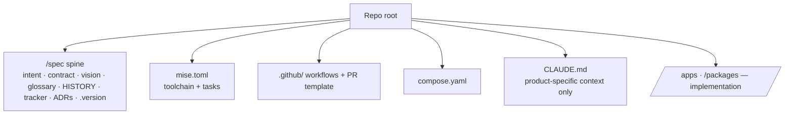

# Repository contract

When `steer` manages a repo, it expects a known shape. `/steer:init` and
`/steer:adopt` install it; `/steer:sync` keeps it current. The scaffold is bundled
in `plugins/steer/templates/scaffold/` and mapped to install paths by its
`MANIFEST.md`.

## What a managed repo carries

| Element | Source | Notes |
| --- | --- | --- |
| `/spec` spine | `templates/spec/` | Product truth. See [Product spine](../concepts/product-spine.md). |
| `mise.toml` | scaffold | Toolchain pins + dev-loop tasks. |
| CI workflows + PR template | scaffold | Quality gates and review template. |
| `compose.yaml`, README quickstart | scaffold | Local run + onboarding. |
| `CLAUDE.md` | product | **Only** product-specific context — standards prose is never duplicated here. |

## Scaffold storage convention

Scaffold dotfiles are stored in the plugin **without the leading dot**
(`gitignore`, `env.example`, `github/`, `claude/`, …) so they don't act on the
plugin repo itself. `MANIFEST.md` maps each stored file to its installed path
(adding the dot back). When a standard implies concrete scaffolding, the scaffold
bundle is updated in the **same change** as the rule.

When `/steer:init`, `/steer:adopt`, or `/steer:sync` install a scaffold file that
already exists in the target repo, they **merge additively and never clobber**:
Markdown spec files reconcile on heading/checklist anchors (`template-reconcile.sh`),
and the structured-config files — `.gitignore` and the JSON configs
(`.claude/settings.json`, `.mcp.json`, `biome.json`, `tsconfig`) — reconcile with
`scaffold-reconcile.py`, which unions JSON arrays and adds missing keys/lines
without overwriting, reordering, or removing any existing value.

## Versioning the contract

`/spec/.version` records the plugin version the spine was last reconciled
against. After a plugin release, `/steer:sync` applies pending structural
migrations from the ledger, reconciles additively, and re-stamps `.version`.
