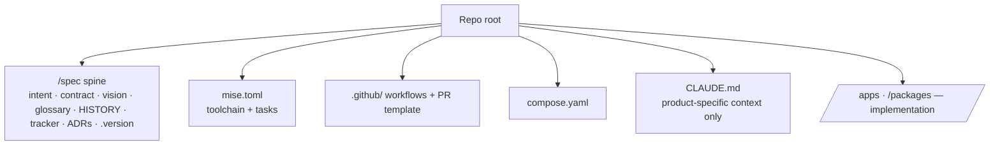

# Repository contract

When `steer` manages a repo, it expects a known shape. `/steer:init` and
`/steer:adopt` install it; `/steer:sync` keeps it current. The scaffold is bundled
in `plugins/steer/templates/scaffold/` and mapped to install paths by its
`MANIFEST.md`.

## What a managed repo carries

| Element | Source | Notes |
| --- | --- | --- |
| `/spec` spine | `templates/spec/` | Product truth. See [Product spine](../concepts/product-spine.md). |
| `mise.toml` | scaffold | Toolchain pins + dev-loop tasks. |
| CI workflows + PR template | scaffold | Quality gates and review template. |
| `compose.yaml`, README quickstart | scaffold | Local run + onboarding. |
| `.worktreeinclude` | scaffold | Carries git-ignored local config (`.env`, `.mise.local.toml`, `.claude/settings.local.json`) into each `claude --worktree` — worktrees start from git refs only, so without it the app can't boot there. |
| `CLAUDE.md` | product | **Only** product-specific context — standards prose is never duplicated here. |

## Scaffold storage convention

Scaffold dotfiles are stored in the plugin **without the leading dot**
(`gitignore`, `env.example`, `github/`, `claude/`, …) so they don't act on the
plugin repo itself. `MANIFEST.md` maps each stored file to its installed path
(adding the dot back). When a standard implies concrete scaffolding, the scaffold
bundle is updated in the **same change** as the rule.

When `/steer:init`, `/steer:adopt`, or `/steer:sync` install a scaffold file that
already exists in the target repo, they **merge additively and never clobber**:
Markdown spec files reconcile on heading/checklist anchors (`template-reconcile.sh`),
and the structured-config files — the line-based `.gitignore` / `.worktreeinclude`
and the JSON configs (`.claude/settings.json`, `.mcp.json`, `biome.json`,
`tsconfig`) — reconcile with `scaffold_reconcile.py`, which unions JSON arrays and
adds missing keys/lines without overwriting, reordering, or removing any existing
value.

The one exception is the `.claude/settings.json` `permissions` block, which
Claude Code evaluates by precedence **deny > ask > allow**. There, the same
pattern in two tiers is a contradiction rather than a choice (the
lower-precedence copy never governs), so after merging, the reconcile keeps each
permission pattern only in its most-restrictive tier and drops the others —
preventing a sync from leaving, say, `Bash(git push)` in both `allow` and `ask`,
and healing a repo already in that state. Because the surviving tier is the one
that already governed, effective behavior is unchanged.

## Versioning the contract

`/spec/.version` records the plugin version the spine was last reconciled
against. After a plugin release, `/steer:sync` applies pending structural
migrations from the ledger, reconciles additively, and re-stamps `.version`.
Ledger migrations cover the non-additive changes reconciliation cannot express
— renames and moves (`git mv`), deletions (`git rm`), and **in-file token
rewrites** (replacing a string that already exists in a materialized file, e.g.
the `e22-standards` → `steer` rebrand) — each applied read-then-propose,
never clobbering filled-in content.
