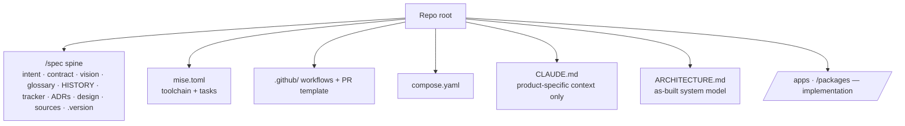

# Repository contract

When `steer` manages a repo, it expects a known shape. `/steer:init` and
`/steer:adopt` install it; `/steer:sync` keeps it current. The scaffold is bundled
in `plugins/steer/templates/scaffold/` and mapped to install paths by its
`MANIFEST.md`.

## What a managed repo carries

```mermaid
flowchart TD
    ROOT[Repo root] --> SPEC["/spec spine<br/>intent · contract · vision · glossary · HISTORY · tracker · ADRs · design · sources · .version"]
    ROOT --> MISE[mise.toml<br/>toolchain + tasks]
    ROOT --> CI[.github/ workflows + PR template]
    ROOT --> COMPOSE[compose.yaml]
    ROOT --> CLAUDE[CLAUDE.md<br/>product-specific context only]
    ROOT --> ARCH[ARCHITECTURE.md<br/>as-built system model]
    ROOT --> CODE[/apps · /packages — implementation/]
```

| Element | Source | Notes |
| --- | --- | --- |
| `/spec` spine | `templates/spec/` | Product truth. See [Product spine](../concepts/product-spine.md). |
| `mise.toml` | scaffold | Toolchain pins + dev-loop tasks. mise is the single task entry surface: tasks declare ordering with `depends` (never `run = ["mise run …"]` chains), and `[deps.pnpm]`/`[deps.uv]` (`auto = true`, gated by `[settings] experimental`) auto-install workspace deps on lockfile change — no hand-rolled install task (so never run a bare `pnpm install`; route a manual one through `mise exec -- pnpm install`). Because that runs non-interactively, the bundled `pnpm-workspace.yaml` sets `confirmModulesPurge: false`; and for the **pinned** pnpm to win, `mise activate` must be sourced after any nvm/asdf/volta in your shell rc — otherwise a global copy shadows it (`/steer:doctor` flags this). App-level Node scripts stay in `package.json`; a mise task may delegate to them, but delegation is **one-way** — a `package.json` script never shells out to `uv`/Python nor re-defines a mise task, and no task lives in both files. A polyglot app's Python backend (e.g. `apps/api`) is a mise/`uv run` task, composed with a `[tasks.dev]` `depends = ["dev:*"]` fan-out so mise stays the single entry point. Run `/steer:reference conventions` for the full task model. |
| `mise.lock` | created at pin time | The real version pin. The scaffold ships **no** lock — `/steer:init`/`/steer:adopt` create it when they pin the toolchain (`touch mise.lock`, `mise install`, then `mise lock --platform linux-x64,macos-arm64` so the lock carries per-platform URLs + checksums — CI runs `mise install --locked` on `linux-x64`, which fails on a host-only lock). Until a populated lock is committed, CI runs a plain unlocked install; never commit an empty / comment-only lock. Run `/steer:reference conventions` for the full toolchain rationale. |
| CI workflows + PR template | scaffold | Quality gates and review template. |
| `.gitattributes` | scaffold | Marks `CHANGELOG.md merge=union` so concurrent PRs appending bullets under `### [Unreleased]` auto-resolve — git's built-in union driver keeps both sides' added lines instead of raising a conflict. |
| `compose.yaml`, README quickstart | scaffold | Local run + onboarding. Host ports are env-overridable so they don't collide across products or worktrees. |
| `.worktreeinclude` | scaffold | Carries git-ignored local config (`.env`, `.mise.local.toml`, `.claude/settings.local.json`) into each `claude --worktree` — worktrees start from git refs only, so without it the app can't boot there. Its header also documents worktree **`mise trust`**: trust is path-keyed, so a new worktree starts untrusted and every `mise run …` there fails on trust until someone trusts it. A Claude Code session started in a worktree inherits the primary checkout's trust automatically (the `check-worktree-trust` session check — see [Hooks](hooks.md)); a plain terminal, or a worktree created mid-session with `git worktree add`, needs one `mise trust` there. |
| `scripts/worktree-env.sh` | scaffold | Sourced by `mise.toml` (`[env]._.source`) so parallel Claude Code worktrees of the same repo don't collide at runtime: it gives each worktree a unique `COMPOSE_PROJECT_NAME` and a stable per-worktree host-port offset (`POSTGRES_PORT`, `WEB_PORT`, `DATABASE_URL`). The primary checkout gets offset 0 (ports unchanged) and keeps its bare directory name; a linked worktree's project name is `<repo>-<worktree>`, because a worktree basename alone is not unique across repos. **Re-taking this file renames an existing linked worktree's stack**, so tear a running one down first — under the new project name Compose no longer sees the old containers or volumes (recover with `docker compose -p <old-name> down -v`) — in a polyrepo the same feature branch runs in several members, and a shared project name meant one member's `docker:clean` tore down another's containers and volumes. `mise run docker:clean` tears down a worktree's services + volumes before it is removed, scoped to that worktree — spelled `mise run ws:docker:clean` in a **workspace** repo, whose profile replaces core `mise.toml` and prefixes every whole-product task. This `[env]._.source` line is also what makes a new worktree need `mise trust`: mise loads a data-only config untrusted but refuses one that executes code at load time (see the `.worktreeinclude` row above). See the always-on **Parallel worktrees** rule. |
| `CLAUDE.md` | product | **Only** product-specific context — standards prose is never duplicated here. Carries the `<!-- steer:profile=… -->` marker (see Repo profiles). |
| `ARCHITECTURE.md` | scaffold | The **as-built** system model at the repo root — narrative and tables only, linking rather than inlining the rendered diagram at `spec/design/architecture-diagram.md`. Keeping it apart from `/spec` (which holds **intent**) is what lets `/steer:audit spec` compare the two. Required at the root by rules `20-layout` and `32-living-docs`, and allowlisted there by `22-housekeeping` so `/steer:tidy` never proposes relocating it. |

## Repo profiles

Not every managed repo is an app monorepo. A repo carries a **profile** —
`app` (default), `infra`, `service`, `library`, `cli`, or `workspace` — recorded
as a `<!-- steer:profile=… -->` marker on the `CLAUDE.md` `## Profile` section (a
sibling of the delivery-mode marker; **absent ⇒ `app`**, for back-compat).

`workspace` is the odd one out: it hosts a [polyrepo](../concepts/product-spine.md)
product's `/spec` spine and owns **no application code**. Its topology is derived
from disk (`spec/workspace.yml` at the host, `spec/PRODUCT.md` at each member),
never from this marker — so the marker follows the topology rather than declaring
it.

The profile is a **bootstrap-time** choice that selects an **additive** set of
scaffold layers `/steer:init` / `/steer:adopt` lay down (later layers only *add*):

- **Layer 0 — Core** (every profile): `mise.toml` toolchain pinning
  (`node`/`python`/`uv` mandatory — agent tooling needs them), the `/spec` spine,
  stack-agnostic CI hygiene, dotfiles, `policy/`, the version-pin scripts, and —
  deliberately for every profile — `compose.yaml` + `scripts/worktree-env.sh` (the
  containerize-by-default surface, so devs run backing services in Docker rather
  than on the host).
- **Layer 1 — Node baseline** (`profiles/_node/`, Node-stack profiles only):
  `package.json`, `pnpm-workspace.yaml`, `biome.json`, `configs/`, `packages/`.
  Every Node profile is a pnpm workspace (monorepo-by-default). The root
  `package.json` ships a `packageManager` placeholder that `/steer:init` stamps
  with the mise-pinned pnpm version, so corepack (e.g. in a Docker build) uses
  the same pnpm that wrote `pnpm-lock.yaml`. Skipped for
  `infra`, and replaced by `pyproject.toml`/Ruff for a Python-only product.
- **Layer 2 — Profile extras** (`profiles/<profile>/`): `app` adds `apps/` +
  `DESIGN.md`; `service` adds `apps/`; `library`/`cli` add nothing (the skill
  adapts `package.json`); `infra` substitutes a tofu/terragrunt/ansible-flavored
  **root** `mise.toml` (which still pins `node`, sources `worktree-env.sh`, and
  defines the core `docker:up`/`docker:down`/`docker:clean` tasks the always-on
  worktree rules mandate — it keeps the core `compose.yaml`) and
  gets CI that auto-detects `*.tf`/Ansible and runs `tofu fmt` / `ansible-lint`;
  `workspace` **replaces** the core `README.md`, `mise.toml` and `compose.yaml`
  and adds `scripts/ws.sh` plus a `.gitignore` fragment. Its `mise.toml` drops
  pnpm/biome (no code here), keeps the agent-runtime baseline and `convert:doc`
  (PO documents land at the spine host), and adds the `ws:*` member tasks —
  including `ws:dev`, which as shipped boots the members' backing **services**
  via Compose `include:`; the *app* half (each member's own dev server) needs
  mise monorepo mode enabled plus one `depends` entry per member with a `dev`
  task, which `/steer:init` resolves from the manifest. Every task the workspace
  profile defines is `ws:`-prefixed (bar `convert:doc`) so that it cannot shadow
  a member's own task; its `compose.yaml` declares **no services**
  and `include:`s each member's file. The member checkouts are git-ignored
  clones, not submodules, so nothing pins a member SHA.

So a non-app repo is never skipped at bootstrap — it shares all of Core, and an
`infra`, `library` or `cli` repo that genuinely runs no local services simply
deletes the core `compose.yaml`. That deletion is what licenses pruning the
`docker:*`/`db:*` tasks: keep the compose file and you keep the tasks, because the
always-on worktree and end-of-session rules mandate `mise run docker:clean`. The **installed** repo layout is unchanged by this organization;
only the plugin's bundle and the init/adopt composition differ.

Always-on **rules** do not read the marker — they self-gate on filesystem
**traits** via the `inject-when` mechanism, so the injected rule context always
matches what is on disk. Only four expressions actually gate a
shipped rule: `code-project` (19 rules), `has-iac` (`12-stack-infra`),
`tracker-github` (`36-issue-first`) and the composite `has-iac|has-apps`
(`52-deployment`) — so `has-apps` appears only inside that composite.
`lib/scope.sh` also defines `has-compose`, `has-infra`, `polyrepo`,
`has-workspace-manifest` and `has-product-pointer`, all of which are
**available but carry no rule today** — the polyrepo topology is deliberately
delivered by a SessionStart note rather than an always-on rule, so the existence
of the `polyrepo` token is not evidence that a `21-polyrepo` rule exists. A monorepo that *also* has a nested `/infra` dir stays profile `app` and
still gets the infra-stack rule automatically because `/infra` exists. The
deployment rule reaches it either way: it gates on `has-iac` **or** `has-apps`,
since any app/service repo deploys — with or without an `/infra` dir. The
profile is read by `/steer:sync` and `scripts/scan-capabilities.sh`
(an informational `profile` fingerprint) for reporting and overlay decisions.

## Root housekeeping

The root holds scaffolding, config, and the four standing documents the rules
require there — `README.md`, `CLAUDE.md`, `ARCHITECTURE.md` and `DESIGN.md` — not
the spreadsheets, decks,
diagrams, and **specification / requirements documents** (`.pdf`, `.docx`, decks
— specs, briefs, RFP/SOW) that feed the spec. Those are **source material**:
their home is `/spec/reference/`; architecture and flow diagrams go to
`/spec/design/`.

Steer keeps the root clean as it works. When a session notices a loose root file
it can **confidently classify**, it **moves it to the right home immediately**
(`git mv`, filename preserved) — no confirmation for a move that was never in
doubt. Confirmation is reserved for where judgment or loss is at stake:
**renaming** a cryptic name to a cleaner one is *proposed* (the file still moves
now, under its existing name); a file whose purpose or correct home is
**ambiguous** — or a `Copy of …` / look-alike pair — is **asked about** before
anything happens; and **deletion** is never automatic (only true OS junk like
`.DS_Store`, on confirmation, with a `.gitignore` pattern added). Run
[`/steer:tidy`](skills.md) for a full sweep of an accumulated pile.

## Scaffold storage convention

Scaffold dotfiles are stored in the plugin **without the leading dot**
(`gitignore`, `env.example`, `github/`, `claude/`, …) so they don't act on the
plugin repo itself. `MANIFEST.md` maps each stored file to its installed path
(adding the dot back). When a standard implies concrete scaffolding, the scaffold
bundle is updated in the **same change** as the rule.

When `/steer:init`, `/steer:adopt`, or `/steer:sync` install a scaffold file that
already exists in the target repo, they **merge additively and never clobber**:
Markdown spec files reconcile on heading/checklist anchors (`template-reconcile.sh`),
and the structured-config files — the line-based `.gitignore` / `.worktreeinclude`
and the JSON configs (`.claude/settings.json`, `biome.json`,
`tsconfig`, and the committed editor config `.vscode/extensions.json` /
`.vscode/settings.json` / `.vscode/mcp.json`, the last being how Copilot/VS Code
teammates get the same MCP servers) — reconcile with `scaffold_reconcile.py`, which unions
JSON arrays and adds missing keys/lines without overwriting, reordering, or
removing any existing value. The array union is what lets a repo's existing
`.vscode/extensions.json` recommendations gain the scaffold's (VS Code is the
default editor; see the Stack rule / `/steer:reference conventions`) without losing local
additions.

The one exception is the `.claude/settings.json` `permissions` block, which
Claude Code evaluates by precedence **deny > ask > allow**. There, the same
pattern in two tiers is a contradiction rather than a choice (the
lower-precedence copy never governs), so after merging, the reconcile keeps each
permission pattern only in its most-restrictive tier and drops the others —
preventing a sync from leaving, say, `Bash(git push)` in both `allow` and `ask`,
and healing a repo already in that state. Because the surviving tier is the one
that already governed, effective behavior is unchanged.

## Versioning the contract

`/spec/.version` records the plugin version the spine was last reconciled
against. After a plugin release, `/steer:sync` applies pending structural
migrations from the ledger, reconciles additively, and re-stamps `.version`.
Ledger migrations cover the non-additive changes reconciliation cannot express
— renames and moves (`git mv`), deletions (`git rm`), **in-file token
rewrites** (replacing a string that already exists in a materialized file, e.g.
the `e22-standards` → `steer` rebrand), and **whole-file or whole-section
re-takes** (the file's content, or one bounded region of it, has moved past any
enumerable set of old→new pairs, so the current template replaces it; a section
re-take states its region boundaries) — each applied read-then-propose,
never clobbering filled-in content, and each carrying the consumer's own edits
forward rather than discarding them.

Two ledger entries landed in **3.23.0**, so a repo syncing up to it should expect
both: the living global architecture diagram is renamed
`spec/design/architecture.md` → **`spec/design/architecture-diagram.md`** (a
`git mv` plus an enumerated in-file token rewrite, so history follows the file
and the links to it are updated), and the retired `markitdown` MCP server is
cleared from `.mcp.json` / `.vscode/mcp.json` (harmless until the migration
runs — the converter is now the on-demand `mise run convert:doc` task). Neither
requires manual work; `/steer:sync` proposes both.

Three further entries are accumulating for the next release. Two are non-additive
edits to materialized files that reconciliation cannot carry: `scripts/worktree-env.sh`
gains a repo prefix on `COMPOSE_PROJECT_NAME` in a linked worktree (a whole-section
re-take — and **tear any running linked-worktree stack down first**, or its containers
and volumes are orphaned under the new project name), and `spec/tracker.md`'s promoted-
question rule is reversed (the `### Q-NNN` block now *stays*, with the ref in its
`tracker:` field). The third covers the workspace task rename. The workspace profile's
whole-product tasks are now `ws:`-prefixed (`ws:dev`, `ws:docker:up` / `down` /
`clean`), because an unprefixed name in the workspace's `mise.toml` is an ancestor
config in every member cloned inside it and shadows any member that does not define
that name. `mise.toml` is materialized and product-owned, so additive
reconciliation cannot carry a *rename* — it splices in what is missing and would
leave both the old and the new names in place. That is exactly the case a ledger
entry exists for, so the rename ships as one: `/steer:sync` proposes the four task
headers, repoints every reference to a renamed task (including the live `ws:dev`
`depends`, which resolves in the *caller's* task set and would otherwise bind to a
member's `docker:up`), **re-takes `scripts/ws.sh`** whole — the new script carries
the `preflight` subcommand the rename points a task at, plus its own stale `mise run
dev` header comment and `ws:`-prefixed failure messages, so no enumerable pair set
describes it; a consumer's added `ws:` subcommands carry forward —
replaces `ws:docker:up`'s first `run` element with that `preflight` guard while
leaving the line that boots the stack alone, and relocates the whole commented
monorepo section above `[settings]` where mise will actually accept the key. The entry is precondition-gated to `workspace`-profile
repos, so member repos and non-workspace profiles are untouched.
