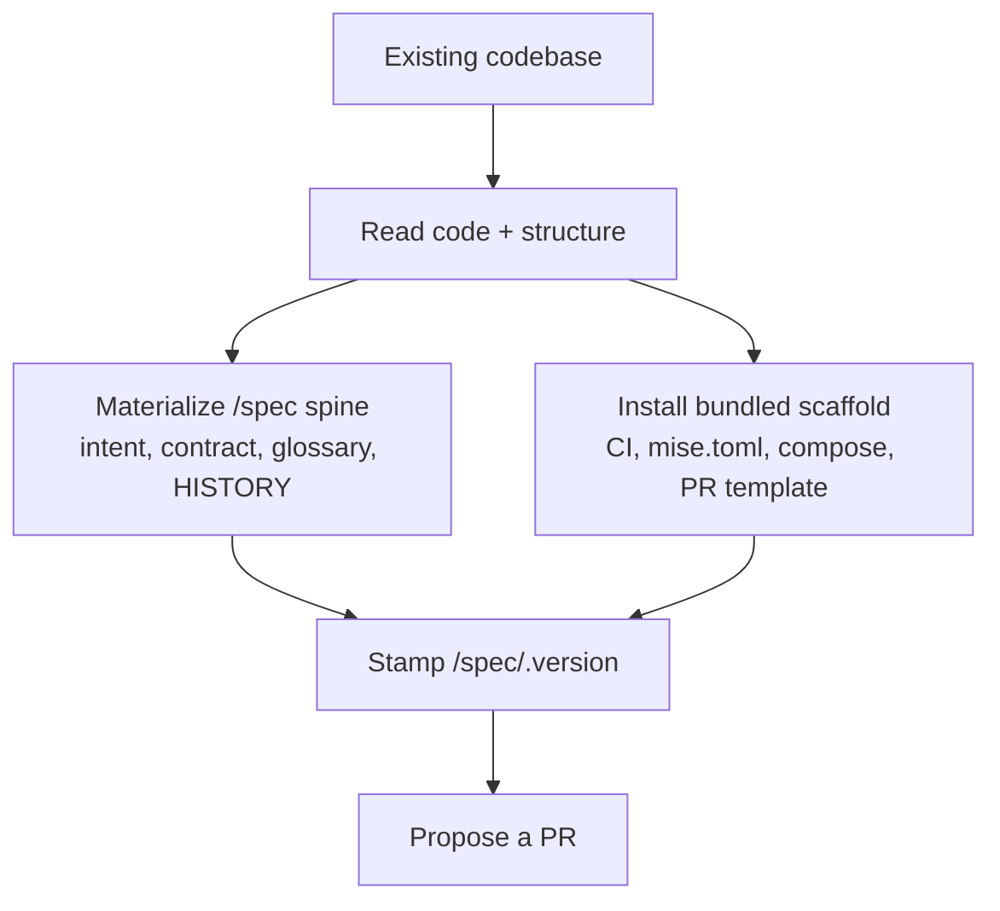

# `/steer:adopt`

Reverse-engineer a `/spec` spine from an existing codebase and add the bundled
scaffold, leaving the repo working spec-first.

!!! info "When to use"
    Use when a repo has working code but no `/spec` spine and no `mise.toml`, or
    when asked to adopt or onboard an existing app onto the standards.

## What it does

1. Reads the existing code to capture **what is** — not what someone decided.
2. Materializes the `/spec` spine from the bundled templates — including the
   `design/` home (`README.md`, `source.md`, the living `architecture.md`
   diagram) and `sources/README.md`.
3. Installs the repo scaffold (toolchain, CI, PR template).
4. If the tracker is GitHub Issues, bootstraps the label taxonomy
   (`/steer:issues bootstrap-labels`) and verifies the org-level
   Priority/Effort/date issue fields (`/steer:tracker-sync bootstrap-fields`) —
   the same tracker setup `/steer:init` performs.
5. Stamps `/spec/.version` with the plugin version.

## Guardrails

- **Read-then-propose.** Adopt never clobbers human content and lands changes via
  a PR, never a direct push to `main`.
- **No ADR from inference.** Adopt must never infer a *ratified* ADR from code.
  The as-built spine records what exists; a decision that was never explicitly
  made is not an ADR. See [Product spine](../concepts/product-spine.md).

## After adopting

- Run `/steer:audit spec` to compare the as-built spine against the tracker's intent.
- Run `/steer:sync` after future plugin releases to stay current.
