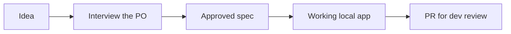

# `/steer:build`

A guided flow for a **non-technical product owner**: idea → interview → approved
spec → working local app → PR for dev review, with Claude driving all tooling.

!!! info "When to use"
    Use when a non-developer wants to build or prototype an app idea, or to
    resume a PO build whose repo already has `/spec/BUILD-STATUS.md`.

**Argument hint:** `[idea or product description]`

## Flow

## Relationship to other skills

- `/steer:build` is the **build** path; [`/steer:spec`](spec.md) is its
  **no-build counterpart** — spec-only, ends at an approved intent without
  writing code.
- A build in progress tracks state in `/spec/BUILD-STATUS.md`, so `/steer:build`
  can resume an interrupted session.
- Approval still records evidence and the PR is still **dev-gated** — Claude
  drives the tooling but a human reviews before merge. See the
  [Authorization model](../concepts/authorization-model.md).
