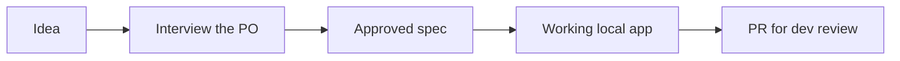

# `/steer:build`

A guided flow for a **non-technical product owner**: idea → interview → approved
spec → working local app → PR for dev review, with Claude driving all tooling.

!!! info "When to use"
    Use when a non-developer wants to build or prototype an app idea, or to
    resume a PO build whose repo already has `/spec/BUILD-STATUS.md`.

**Argument hint:** `[idea or product description]`

## Flow

## The PO happy path

You bring the idea and the judgement; Claude drives every tool. The whole loop is
five plain-language steps — you never type an issue, spec, or work command:

1. **Describe your idea.** In plain language: *"I want an app that lets the team
   log client visits and see them on a weekly calendar."* Run
   `/steer:build <your idea>`, or just say it — the always-on router rule sends it
   to the right skill.
2. **Claude interviews you and routes the work.** It asks the questions it needs
   (who uses it, what matters, what's out of scope), turns your answers into a
   spec, and pauses for you to **approve** before any code is written. Behind the
   scenes it handles the issue, the spec, and the work items for you.
3. **Preview it locally.** Claude builds a working local app and tells you how to
   run it. You click around and react in plain language — *"the date filter
   should default to this week"* — and it iterates.
4. **A developer reviews.** When you're happy, the build ends at a **PR for dev
   review**. This is the hand-off, by design — a developer is the human at the
   merge gate.
5. **PR.** Once the developer approves, the change merges. You've shipped without
   touching the tracker or the code.

If a session is interrupted, just run `/steer:build` again — it resumes from
`/spec/BUILD-STATUS.md`.

!!! warning "\"Prototype\" is not an escape hatch"
    Saying *"just a prototype"*, *"quick"*, or *"throwaway"* relaxes only the
    **ceremony** — a lighter interview, no per-feature issue/branch/PR, high-risk
    choices stubbed and marked. It does **not** skip the plugin's **bundled
    scaffold** (`mise.toml`, `compose.yaml`, CI, PR template, `.gitignore`, …) or
    the `/spec` spine. A prototype is still greenfield: it gets the scaffold (so it
    costs nothing to graduate later) and at least a minimal `/spec`. Hand-rolling
    `package.json` / build config / CI from scratch instead of installing the
    scaffold is skipped bootstrap, not prototype mode.

!!! info "Where the gates are"
    Claude commits on its own, but **approving the spec** and **opening/merging
    the PR** are always human decisions. See the
    [Authorization model](../concepts/authorization-model.md).

## Relationship to other skills

- `/steer:build` is the **build** path; [`/steer:spec`](spec.md) is its
  **no-build counterpart** — spec-only, ends at an approved intent without
  writing code.
- A build in progress tracks state in `/spec/BUILD-STATUS.md`, so `/steer:build`
  can resume an interrupted session.
- Approval still records evidence and the PR is still **dev-gated** — Claude
  drives the tooling but a human reviews before merge. See the
  [Authorization model](../concepts/authorization-model.md).
