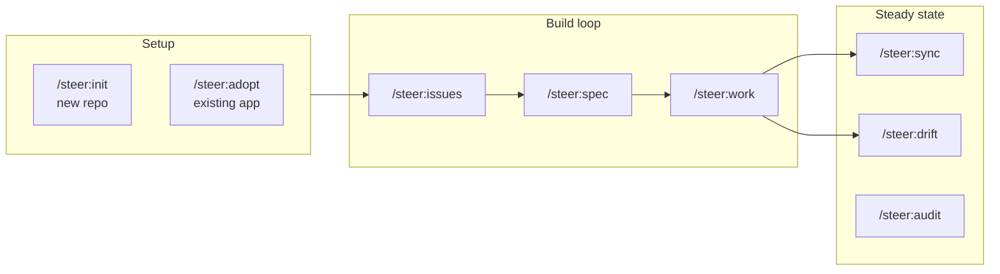

# Workflows overview

A **workflow** is a multi-step skill that drives a phase of the product
lifecycle. This section documents the ones a developer or PO invokes directly.
For the full per-command catalog (including internal helpers), see the
[Skills reference](../reference/skills.md).

!!! tip "You don't have to remember these commands"
    The always-on router rule makes Claude the dispatcher: **describe what you
    want in plain language** ("I have an app idea", "fix #123", "what should I do
    next?") and Claude routes to the matching skill itself, announcing the choice
    in one line. The `/steer:*` forms below are the explicit way to invoke a
    workflow — handy when you already know the one you want — not something you
    must memorize. Decision gates (creating issues, approving a spec, pushing a
    PR, deploying) still pause for a human regardless of how the skill was
    reached.

## Setup (one-time)

| Skill | Use when |
| --- | --- |
| `/steer:init` | A new repo with no `/spec` spine — installs the bundled scaffold + spine. |
| [`/steer:adopt`](adopt.md) | An existing app with working code but no spine. |

## Build loop

| Skill | Use when |
| --- | --- |
| [`/steer:issues`](issues.md) | Drive an idea from capture → draft spec → decomposed work. |
| [`/steer:spec`](spec.md) | Think a feature through and shape/approve acceptance criteria. |
| [`/steer:work`](work.md) | Start, resume, or finish a specific issue. |
| [`/steer:build`](build.md) | A non-developer wants to build or prototype an idea. |

## Steady state

| Skill | Use when |
| --- | --- |
| `/steer:sync` | After a plugin release — apply migrations, reconcile spine + scaffold. |
| `/steer:drift` | Audit the built app against its tracker specs (read-only). |
| `/steer:audit` | Periodic whole-repo standards-conformance health pass (read-only). |
| `/steer:next` | "What should I do next?" across the whole workspace (read-only). |
