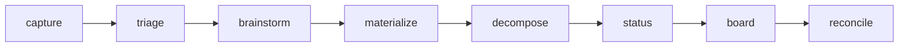

# `/steer:issues`

The high-level GitHub Issues lifecycle for the `/spec` spine. A thin
orchestrator: it delegates product/spec reasoning to `/steer:spec`, audit
findings to `/steer:audit`, drift to `/steer:audit spec`, and question promotion to
`/steer:questions` — and routes **all** GitHub reads/writes through
`/steer:tracker-sync`.

!!! info "When to use"
    Use to manage the backlog: capture an idea, triage the inbox, brainstorm,
    materialize a spec, decompose into work, check status, or reconcile.

**Argument hint:** `[capture | triage | brainstorm | materialize | decompose | epic | status | board | reconcile] [#issue | feature-id]`

## Phases

| Phase | What it does |
| --- | --- |
| `capture` | Record a raw idea as an issue without losing open questions. Searches the existing backlog first — to dedupe and to link related/dependent/conflicting issues. |
| `triage` | Sort the inbox; set state/labels, and **escalate-only auto-set the native Priority field** from mechanical signals (`risk:security`→Urgent, blocking-question gate→High, …) — `max(current, floor)`, never downgrading a human's value. Effort/dates stay human-set. |
| `brainstorm` | Explore an idea before committing to a spec. Searches the existing issues (open **and** closed) to surface overlaps, dependencies, and conflicts, and records them as related-issue cross-links. |
| `materialize` | Turn an explored idea into a `/spec` intent. (Features only — an epic has no intent and is not materializable.) |
| `decompose` | Break an approved spec into tracked work items (Feature → Tasks/Bugs). |
| `epic` | Manage the tier **above** features: create an epic (`--new`) and link existing features under it (`#E --add #F1,#F2`) as native sub-issues, so a goal spanning several features is one `Epic → Feature → Task` hierarchy. `Type=Epic` is set only when the org enables it; otherwise the epic keeps `steer:kind=epic` with the Type unset. Milestones stay release grouping — an orthogonal axis. |
| `status` | Report lifecycle state across issues; for an epic, a child-feature rollup. |
| `board` | Read-only ranked, relationship-aware backlog overview (Ranked / Relationships / Dedup candidates / Hygiene). Never writes; defers cross-workflow "what's most critical" to `/steer:next`. |
| `reconcile` | Bounded re-sync of issues against the spine. |

## Boundaries

- `/steer:issues` **never edits code** — that's `/steer:work`'s job.
- `/spec` stays product truth; the issue is the work/decision layer.
- Agent-authored issues follow a machine-readable contract (stable headings +
  hidden markers + managed blocks) so they round-trip safely.
- **Related-issue links.** When `brainstorm`/`capture` find a connection to
  another issue, it's recorded under a `Related issues` heading as
  `#N — <relationship> (why)` — `relates-to`, `depends-on`, `blocks`,
  `conflicts-with`, `supersedes`, or `superseded-by`. The `#N` mention creates
  GitHub's native backlink (GitHub has no typed relationship beyond
  parent/sub-issue). A `conflicts-with`/`supersedes` is **surfaced for a human**,
  never auto-resolved.

See the [Lifecycle](../concepts/lifecycle.md) for the full state set, and
[`/steer:work`](work.md) for execution.
