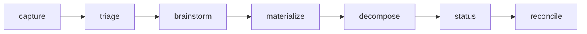

# `/steer:issues`

The high-level GitHub Issues lifecycle for the `/spec` spine. A thin
orchestrator: it delegates product/spec reasoning to `/steer:spec`, audit
findings to `/steer:audit`, drift to `/steer:drift`, and question promotion to
`/steer:questions` — and routes **all** GitHub reads/writes through
`/steer:tracker-sync`.

!!! info "When to use"
    Use to manage the backlog: capture an idea, triage the inbox, brainstorm,
    materialize a spec, decompose into work, check status, or reconcile.

**Argument hint:** `[capture | triage | brainstorm | materialize | decompose | status | reconcile] [#issue | feature-id]`

## Phases

| Phase | What it does |
| --- | --- |
| `capture` | Record a raw idea as an issue without losing open questions. |
| `triage` | Sort the inbox; set state/labels. |
| `brainstorm` | Explore an idea before committing to a spec. |
| `materialize` | Turn an explored idea into a `/spec` intent. |
| `decompose` | Break an approved spec into tracked work items. |
| `status` | Report lifecycle state across issues. |
| `reconcile` | Bounded re-sync of issues against the spine. |

## Boundaries

- `/steer:issues` **never edits code** — that's `/steer:work`'s job.
- `/spec` stays product truth; the issue is the work/decision layer.
- Agent-authored issues follow a machine-readable contract (stable headings +
  hidden markers + managed blocks) so they round-trip safely.

See the [Lifecycle](../concepts/lifecycle.md) for the full state set, and
[`/steer:work`](work.md) for execution.
