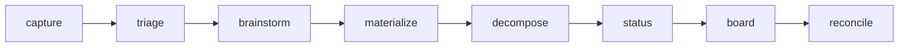

# `/steer:issues`

The high-level GitHub Issues lifecycle for the `/spec` spine. A thin
orchestrator: it delegates product/spec reasoning to `/steer:spec`, audit
findings to `/steer:audit`, drift to `/steer:audit spec`, and question promotion to
`/steer:questions` — and routes GitHub reads/writes through
`/steer:tracker-sync`, with one sanctioned exception: the `bootstrap-labels`
mode's inline label creation.

!!! info "When to use"
    Use to manage the backlog: capture an idea, triage the inbox, brainstorm,
    materialize a spec, decompose into work, check status, or reconcile.

**Argument hint:** `[capture | triage [#N|--all] | brainstorm | materialize | decompose | epic [--new "<title>"] [#E --add #F1,#F2] | status | board [--all] | reconcile [--all] | publish-audit [<target>] | publish-drift [report] | publish-adoption | publish-findings [--source <id>] | bootstrap-labels] [#issue | feature-id]`

## Phases

```mermaid
flowchart LR
    capture --> triage --> brainstorm --> materialize --> decompose --> status --> board --> reconcile
```

| Phase | What it does |
| --- | --- |
| `capture` | Record a raw idea as an issue without losing open questions. Searches the existing backlog first — open **and** closed — to dedupe and to link related/dependent/conflicting issues. A closed duplicate is the one that matters most: filing it again is how the same rejected or already-shipped idea re-enters the backlog. |
| `triage` | Sort the inbox; set state/labels, and **escalate-only auto-set the native Priority field** from mechanical signals (`risk:security`→Urgent, blocking-question gate→High, …) — `max(current, floor)`, never downgrading a human's value. Effort/dates stay human-set. |
| `brainstorm` | Explore an idea before committing to a spec. Searches the existing issues (open **and** closed) to surface overlaps, dependencies, and conflicts, and records them as related-issue cross-links. |
| `materialize` | Turn an explored idea into a `/spec` intent. (Features only — an epic has no intent and is not materializable.) |
| `decompose` | Break an approved spec into tracked work items (Feature → Tasks/Bugs). |
| `epic` | Manage the tier **above** features: create an epic (`--new`) and link existing features under it (`#E --add #F1,#F2`) as native sub-issues, so a goal spanning several features is one `Epic → Feature → Task` hierarchy. `Type=Epic` is set only when the org enables it; otherwise the epic keeps `steer:kind=epic` with the Type unset. Milestones stay release grouping — an orthogonal axis. |
| `status` | Report lifecycle state across issues; for an epic, a child-feature rollup. |
| `board` | Read-only ranked, relationship-aware backlog overview (Ranked / Relationships / Dedup candidates / Hygiene). Never writes; defers cross-workflow "what's most critical" to `/steer:next`. |
| `reconcile [--all]` | Bounded re-sync of issues against the spine. `--all` widens the sweep to every open issue — the after-the-fact recovery path for issues created without a contract. |
| `publish-audit [<target>]` | File an `/steer:audit` finding set as an audit-run parent plus selected finding children. |
| `publish-drift` | File an `/steer:audit spec` finding set as decision-checklist `spec-drift` issues; never auto-resolves. |
| `publish-adoption` | Reconcile selected `spec/PRODUCTIONIZATION.md` gaps into `kind=finding` / `source:adoption` issues (stable `finding-key` per gap). |
| `publish-findings` | File `kind=finding` issues from a `/code-review` or `/security-review` run (`--source code-review\|security-review`). |
| `bootstrap-labels` | Idempotently create/reconcile the supported label taxonomy (`gh label create --force`) so Issue Forms and agent labels actually apply. |

## Boundaries

- `/steer:issues` **never edits code** — that's `/steer:work`'s job.
- `/spec` stays product truth; the issue is the work/decision layer.
- **In a polyrepo, the tracker and the specs live in the workspace.** A member
  repo (`spec/PRODUCT.md`) carries neither `spec/tracker.md` nor
  `spec/features/**` by design, so both are resolved at the workspace first —
  never filed locally to work around the absence. Two facts shape decomposition:
  **sub-issues do cross repositories** within an org (100 children per parent, 8
  levels), so a workspace epic can parent member issues unmodified; **closing
  keywords do not**, so a workspace issue never auto-closes from a member PR and
  is closed explicitly after merge. See
  [Product spine](../concepts/product-spine.md).
- Agent-authored issues follow a machine-readable contract (stable headings +
  hidden markers + managed blocks) so they round-trip safely.
- **Clickable references.** Rendered issues surface their references for a human
  reader without disturbing the markers: every spec/code file path becomes a
  Markdown link to the file on the default branch (`REPO_BLOB_BASE/<path>`, with a
  `#L<n>` anchor when a line is cited), and implementable kinds carry a visible
  `Delivery` line mirroring the `steer:pull-request` / `steer:branch` markers so
  the delivering PR/branch is clickable. Markers stay canonical; the links and
  line are the derived view.
- **Related-issue links.** When `brainstorm`/`capture` find a connection to
  another issue, it's recorded under a `Related issues` heading as
  `#N — <relationship> (why)` — `relates-to`, `depends-on`, `blocks`,
  `conflicts-with`, `supersedes`, or `superseded-by`. The `#N` mention creates
  GitHub's native backlink (GitHub has no typed relationship beyond
  parent/sub-issue). A `conflicts-with`/`supersedes` is **surfaced for a human**,
  never auto-resolved.

See the [Lifecycle](../concepts/lifecycle.md) for the full state set, and
[`/steer:work`](work.md) for execution.
