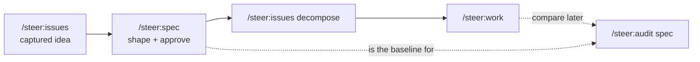

# `/steer:spec`

Think a feature through before committing to implementation: shape acceptance
criteria, clarify open questions, validate a spec's question state, and record
approval evidence.

!!! info "When to use"
    Use to think a feature through before implementation, shape acceptance
    criteria, sweep the draft for gaps, validate a spec's question state, or
    refine a spec you intend to compare against the code later via
    `/steer:audit spec`.

!!! tip "Lite mode — works on any repo, no bootstrap"
    `/steer:spec` runs **spec-only on an unmanaged repo** (no `/spec` spine, no
    toolchain): the feature intent drafts under `spec/features/<id>/` and nothing
    is scaffolded. Thinking a feature through is the one activity sanctioned
    without bootstrap. `/steer:setup` is surfaced as the *follow-up* when the team
    is ready to build — not a precondition. (Feature **code** still requires the
    bootstrap first.)

**Argument hint:** `[feature-id | approve <feature-id> | clarify <feature-id> | validate [feature-id | --all]]`

## Modes

| Mode | What it does |
| --- | --- |
| `/steer:spec <feature-id>` | Open or shape the feature's `intent.md` + `contract.md`. |
| `/steer:spec clarify <feature-id>` | Structured de-ambiguation sweep, run before approval — interrogates the draft against the classic gap classes (edge cases, error paths, permissions, data lifecycle, non-functional constraints, out-of-scope boundary) and converts each **real** gap into a `Q-NNN` open question. Never invents an answer. |
| `/steer:spec validate [feature-id \| --all]` | Check the spec's open-question state and structural completeness, plus the cross-artifact **analyze** pass — intent ↔ contract ↔ tracker consistency and acceptance-criteria quality (all warnings). |
| `/steer:spec approve <feature-id>` | Record approval evidence on the intent. |

## Approval evidence

Approving a spec stamps owner + timestamp on the intent. The fixture suite
asserts the intent template keeps the approval-evidence fields:

```text
> Approved by:
> Approved at:
```

This makes approval an auditable event, not an implicit state — the
[Authorization model](../concepts/authorization-model.md) draft → approved
transition has a named owner.

!!! warning "Approval is sign-off on *intent*, not technical validation"
    `Status: approved` means the owner has signed off on **what** the feature
    should do — the acceptance criteria are agreed and the blocking questions are
    resolved. It does **not** assert that any implementation is correct, safe, or
    production-ready. A non-technical owner's approval can't carry that assurance,
    and steer deliberately doesn't pretend it does: the technical gate is a human
    dev reviewing the PR ("review *is* productionization"), which is what moves
    the spec to `implemented` and later `validated`. Treat an `approved` spec as a
    vetted target, not a vetted build. In
    [solo-trunk mode](../concepts/authorization-model.md) there is no separate dev
    PR gate, so that assurance rests on whoever commits to trunk — read `approved`
    accordingly.

## Where it fits



The spec is the in-repo source of truth that `/steer:audit spec` later compares the
built code against.
