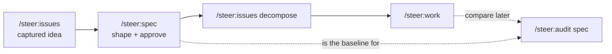

# `/steer:spec`

Think a feature through before committing to implementation: shape acceptance
criteria, validate a spec's question state, and record approval evidence.

!!! info "When to use"
    Use to think a feature through before implementation, shape acceptance
    criteria, validate a spec's question state, or refine a spec you intend to
    compare against the code later via `/steer:audit spec`.

**Argument hint:** `[feature-id | approve <feature-id> | validate [feature-id | --all]]`

## Modes

| Mode | What it does |
| --- | --- |
| `/steer:spec <feature-id>` | Open or shape the feature's `intent.md` + `contract.md`. |
| `/steer:spec validate [feature-id \| --all]` | Check the spec's open-question state and structural completeness. |
| `/steer:spec approve <feature-id>` | Record approval evidence on the intent. |

## Approval evidence

Approving a spec stamps owner + timestamp on the intent. The fixture suite
asserts the intent template keeps the approval-evidence fields:

```text
> Approved by:
> Approved at:
```

This makes approval an auditable event, not an implicit state — the
[Authorization model](../concepts/authorization-model.md) draft → approved
transition has a named owner.

## Where it fits



The spec is the in-repo source of truth that `/steer:audit spec` later compares the
built code against.
