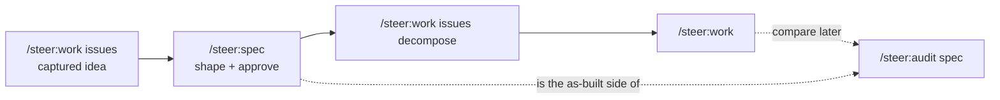

# `/steer:spec`

Think a feature through before committing to implementation: shape acceptance
criteria, clarify open questions, validate a spec's question state, and record
approval evidence.

!!! info "When to use"
    Use to think a feature through before implementation, shape acceptance
    criteria, sweep the draft for gaps, validate a spec's question state, or
    refine the spine that `/steer:audit spec` later diffs against the tracker's
    intent.

!!! tip "Lite mode - works on any repo, no bootstrap"
    `/steer:spec` runs **spec-only on an unmanaged repo** (no `/spec` spine, no
    toolchain): the feature intent drafts under `spec/features/<id>/` and nothing
    is scaffolded. Thinking a feature through is the one activity sanctioned
    without bootstrap. `/steer:setup` is surfaced as the *follow-up* when the team
    is ready to build - not a precondition. (Feature **code** still requires the
    bootstrap first.) Lite mode does not extend to every mode: all four folded
    modes need a spine - `questions` would sweep one that does not exist, `adr`
    writes `/spec/decisions/`, `intake` writes `spec/sources/` and `roadmap` has
    no work-set to lay out - so each stops and routes to `/steer:setup` instead.

**Argument hint:** `[feature-id | approve <feature-id> | clarify <feature-id> | validate [feature-id | --all] | questions | adr | intake | roadmap]`

## Modes

| Mode | What it does |
| --- | --- |
| `/steer:spec <feature-id>` | Open or shape the feature's `intent.md` + `contract.md`. |
| `/steer:spec clarify <feature-id>` | Structured de-ambiguation sweep, run before approval - interrogates the draft against the classic gap classes (edge cases, error paths, permissions, data lifecycle, non-functional constraints, out-of-scope boundary) and converts each **real** gap into a `Q-NNN` open question. Never invents an answer. |
| `/steer:spec validate [feature-id \| --all]` | Check the spec's open-question state and structural completeness, plus the cross-artifact **analyze** pass - intent <-> contract <-> tracker consistency and acceptance-criteria quality (all warnings). |
| `/steer:spec approve <feature-id>` | Record approval evidence on the intent. One of the three **promptable** gates: it offers **Approve · Reject · Decide later** in-session, showing the acceptance criteria and locked scope, and records the channel alongside the owner + timestamp. A blocking open question gated at `required_before: intent-approval` is a precondition - a failed question gate means the prompt is never shown; a blocking question gated at a *later* transition blocks that gate, not this one. |
| `/steer:spec questions` | Sweep the **whole spine's** open questions and drive each to an answer - distinct from `clarify`, which interrogates only the draft in hand. `questions bundle [<feature-id>]` renders the PO-answerable ones as one fillable questionnaire (Markdown fallback). Needs the spine. |
| `/steer:spec adr [<slug>]` | Record a hard-to-reverse or cross-cutting choice as a numbered ADR, then offer its `Deciders` in-session ratification. `adr accept <n>` is the single writer of `Proposed -> Accepted`. See [Decisions](../decisions/index.md). Needs the spine. |
| `/steer:spec intake <path-to-doc>` | Absorb a PO office document (docx/pptx/xlsx/pdf) into the spine by diffing it against the last absorbed version. `intake clarify <path>` folds a client's **answers** document - a different job from `clarify <feature-id>`, which interrogates the draft in hand. `intake status` prints the read-only ledger of every absorbed source - not the client-facing `/steer:status` report. See [Intake](intake.md). Needs the spine. |
| `/steer:spec roadmap` | Lay unshipped intent on a release timeline as milestone-grouped issues - no argument is a read-only preview, then `roadmap from-features` / `roadmap from-gap` / `roadmap sync` (milestones, not `/steer:setup sync`'s scaffold). GitHub-only: it stops when `/spec/tracker.md` declares another tracker. |

## Approval evidence

Approving a spec stamps owner + timestamp on the intent. The fixture suite
asserts the intent template keeps the approval-evidence fields:

```text
> Approved by:
> Approved at:
```

This makes approval an auditable event, not an implicit state - the
[Authorization model](../concepts/authorization-model.md) draft -> approved
transition has a named owner.

!!! warning "Approval is sign-off on *intent*, not technical validation"
    `Status: approved` means the owner has signed off on **what** the feature
    should do - the acceptance criteria are agreed and the blocking questions are
    resolved. It does **not** assert that any implementation is correct, safe, or
    production-ready. A non-technical owner's approval can't carry that assurance,
    and steer deliberately doesn't pretend it does: the technical gate is a human
    dev reviewing the PR ("review *is* productionization"). That review is the
    quality gate, and it writes no spec state at all: `Status:` stays `approved`
    through the entire build, so an `approved` feature may be unstarted, mid-build,
    or merged - only its tracker issue (`in-progress` -> `validate` -> `done`) says
    which. `Status:` advances again only at the release, to `live`. Treat an
    `approved` spec as a vetted target, not a vetted build. In
    [solo-trunk mode](../concepts/authorization-model.md) there is no separate dev
    PR gate, so that assurance rests on whoever commits to trunk - read `approved`
    accordingly.

## Where it fits


```mermaid
flowchart LR
    issue["/steer:work issues<br/>captured idea"] --> spec["/steer:spec<br/>shape + approve"]
    spec --> decompose["/steer:work issues decompose"]
    decompose --> work["/steer:work"]
    work -. compare later .-> drift["/steer:audit spec"]
    spec -. is the as-built side of .-> drift
```

The spine is the **as-built** side - a faithful description of what the product
actually does. `/steer:audit spec` diffs it against the **tracker spec** (what it
was supposed to do, exported from the issue tracker) and surfaces every divergence.
