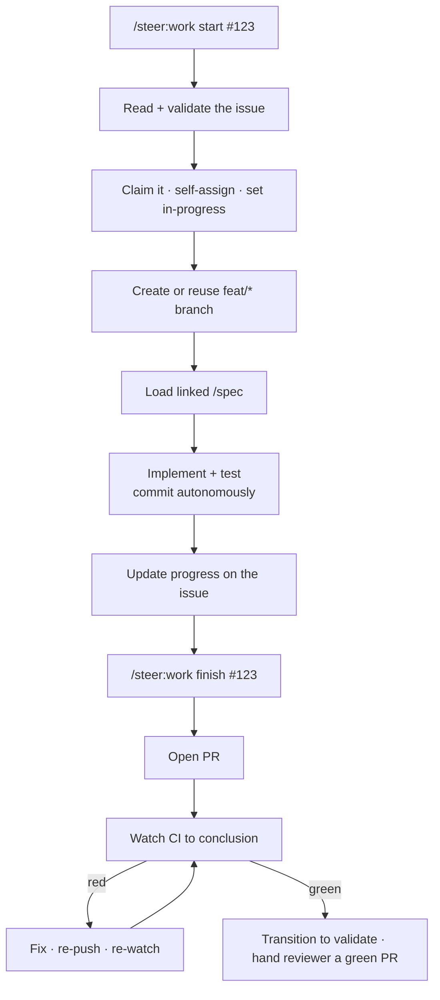

# `/steer:work`

Execute a GitHub issue end-to-end from local Claude Code — the execution
counterpart to [`/steer:issues`](issues.md) (which owns backlog management and
never edits code).

!!! info "When to use"
    Use to start, resume, check, or finish a specific issue.

**Argument hint:** `[start | resume | status | finish] [#issue ...]`

## End-to-end flow

## Modes

| Mode | What it does |
| --- | --- |
| `start` | Validate, claim (self-assigns the invoking GitHub user), branch, load specs, begin implementing. |
| `resume` | Pick a claimed issue back up where it left off — including offering to re-enter the Claude Code session that last worked it. |
| `status` | Report progress on the issue(s). |
| `finish` | Open the PR, **watch CI to conclusion** (`gh pr checks --watch`) and fix a red build before transitioning to `validate` — the reviewer gets a green PR, not a running or red one. |

## Local work marker

`start` writes a local, git-ignored marker at `spec/.work/<branch>.md` (slashes →
underscores). Its existence is what the end-of-turn
[Stop-hook reconciliation](../reference/hooks.md) uses to recognize a branch as
issue-governed — ahead of any branch-name guess — so an unconventionally named
but properly claimed branch is still recognized.

The marker also records a newest-first list of the **Claude Code session(s)**
that worked the branch. The Stop hook keeps the most-recent session at the head
each turn, and `resume` reads it: if a different prior session is recorded, it
offers `claude --resume <id>` (and the transcript path) so you can re-enter that
conversation for context. These session ids are local-only breadcrumbs — they
stay in the git-ignored marker and never reach the tracker.

## Rules it follows

- **One issue per branch/PR** by default.
- Git and PR delivery follow the repo's commit/PR-autonomy rules — commits are
  autonomous, **pushing/opening the PR is gated**. See the
  [Authorization model](../concepts/authorization-model.md).
- **After pushing, `finish` watches CI to green and fixes a red build** before
  treating the work as done — read-only CI status (`gh pr checks`, `gh run
  view`, `gh run watch`) is pre-approved for this; `git push` and the PR/merge
  steps stay gated. If you have stepped away, the in-turn watch blocks the turn;
  re-enter monitoring with a `/loop` over `gh pr checks` (steer ships no
  background poller). Merge and deploy remain a human's call.
- All tracker-metadata I/O routes through `/steer:tracker-sync`.
