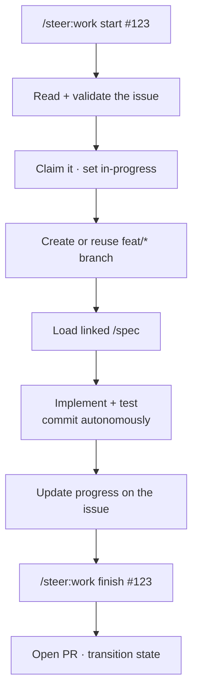

# `/steer:work`

Execute a GitHub issue end-to-end from local Claude Code — the execution
counterpart to [`/steer:issues`](issues.md) (which owns backlog management and
never edits code).

!!! info "When to use"
    Use to start, resume, check, or finish a specific issue.

**Argument hint:** `[start | resume | status | finish] [#issue ...]`

## End-to-end flow

## Modes

| Mode | What it does |
| --- | --- |
| `start` | Validate, claim, branch, load specs, begin implementing. |
| `resume` | Pick a claimed issue back up where it left off. |
| `status` | Report progress on the issue(s). |
| `finish` | Open the PR and transition lifecycle state. |

## Rules it follows

- **One issue per branch/PR** by default.
- Git and PR delivery follow the repo's commit/PR-autonomy rules — commits are
  autonomous, **pushing/opening the PR is gated**. See the
  [Authorization model](../concepts/authorization-model.md).
- All tracker-metadata I/O routes through `/steer:tracker-sync`.
