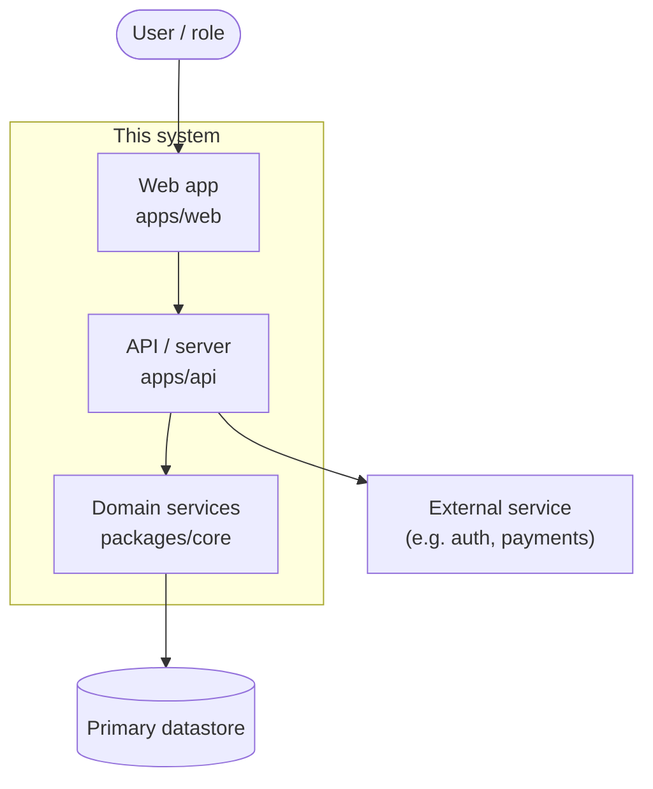
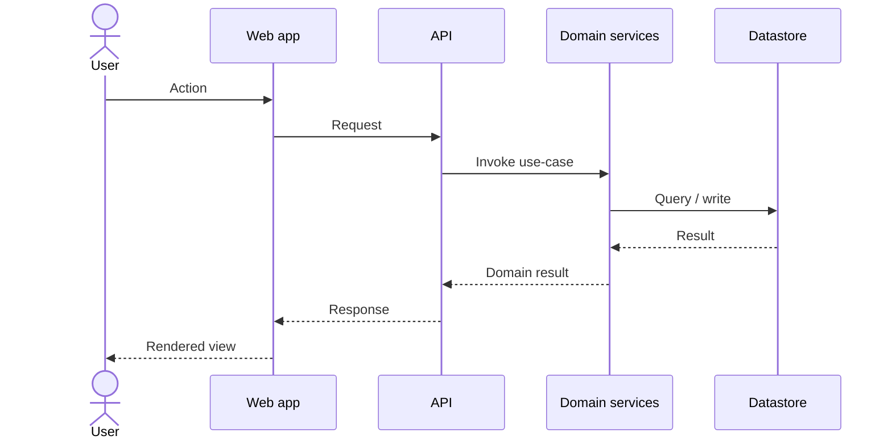

# Architecture diagram

The **living, global view of the system** — the one picture a new contributor (or
Claude) opens to see how the pieces fit. [`ARCHITECTURE.md`](../../ARCHITECTURE.md)
links here rather than inlining a diagram, so this file is the single home for the
system-level diagram and the narrative there stays prose + tables.

**Keep it current** — update this diagram in the *same PR* that changes the stack,
adds/removes/renames an app or package, or reshapes cross-component data flow
(living-docs rule). A stale architecture diagram is worse than none.

**Which tier are you on?** Full how-to (diagram types, LikeC4 setup, drift
discipline) is in **`/steer:reference architecture-diagrams`**.

- **Tier 1 — Mermaid (default, no toolchain).** Hand-author the blocks below. They
  render natively in GitHub's file view and in the docs site — nothing to install.
- **Tier 2 — LikeC4 (opt-in).** Define a C4 model under `architecture/*.likec4` and
  generate the Mermaid below from it (`mise run diagrams:render` — see the reference
  topic). When on Tier 2 the blocks below are **generated; do not hand-edit** —
  edit the `.likec4` source and regenerate.

## System context & containers

*Replace the placeholders with the real apps, packages, datastores, and external
systems. Group deployable containers in subgraphs; keep it to the level a reader can
hold in their head — link detailed/per-area diagrams from the list at the bottom.*

## Request → response flow

*The primary path through the layers (UI → server → services → data). Replace with a
representative flow; add more sequence blocks only for flows that aren't obvious from
the container diagram above.*

## Detailed & per-area diagrams

Link deeper diagrams that don't belong in the global view above — they live in this
folder or a subfolder and are referenced (not inlined) from here.

- [none yet — add links as the system grows]
