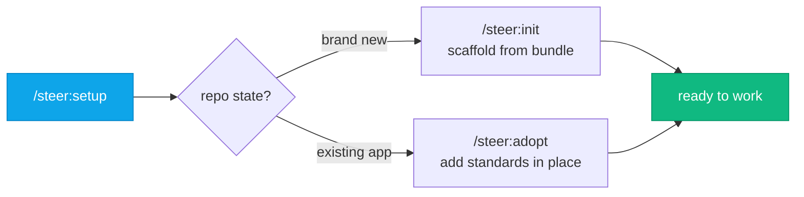

# Claude Code &amp; <span class="accent">steer</span>

## A working session

<div class="opacity-70 mt-6 text-xl">

What **Claude Code** is, when to reach for it — and how to use the **steer** plugin well

</div>

<div class="abs-br m-6 text-sm opacity-50">
press <kbd>Space</kbd> to advance
</div>

<style>
.accent { color: #38bdf8; }
kbd {
  background: rgba(255,255,255,0.1); border-radius: 6px; padding: 2px 8px;
  border: 1px solid rgba(255,255,255,0.2);
}
</style>

<!--
Two audiences. Part 1 is for everyone (POs especially) — what the tool is and
when to reach for it vs Cowork. Part 2 is the dev crash course on the steer plugin.
-->

---
layout: center
class: text-center
---

# Two parts

<div class="grid grid-cols-2 gap-8 mt-8 text-left">

<div v-click class="p-6 rounded-xl border border-sky-400/30 bg-sky-400/5">

### Part 1 — for everyone
**What Claude Code is & when to use it**

- What it actually does
- Cowork vs Claude Code — which when
- You set how hands-on it is

<div class="text-sm opacity-60 mt-3">No code knowledge needed 👋</div>

</div>

<div v-click class="p-6 rounded-xl border border-emerald-400/30 bg-emerald-400/5">

### Part 2 — for devs
**The `steer` plugin crash course**

- What it is & how it works
- The loop: spec → issues → work → PR
- What the hooks actually enforce
- Skills cheat-sheet + efficiency

</div>

</div>

---
layout: section
---

# Part 1
## What Claude Code is — and when to use it
<div class="opacity-60 mt-2">For everyone</div>

---
layout: center
---

# What is Claude Code?

<div class="text-2xl mt-8 leading-relaxed max-w-4xl mx-auto">

An <span class="accent font-semibold">agentic coding tool</span> that

<v-clicks>

reads your **whole codebase**, edits files, runs commands,

and integrates with your **dev tools** — git, tests, issues.

</v-clicks>

</div>

<div v-click class="mt-10 text-lg opacity-70">

You describe the outcome in plain language. It plans, does the work across many
files, and **checks that it works**.

</div>

<div class="abs-bl m-4 text-xs opacity-40">Source: Anthropic — Claude Code docs (code.claude.com/docs)</div>

<style>.accent { color: #38bdf8; }</style>

---

# What it actually does

<div class="text-sm opacity-60 mb-3">Anthropic's own framing of the job</div>

<div class="grid grid-cols-3 gap-4">

<div v-click class="p-4 rounded-xl border border-sky-400/25 bg-sky-400/5">

### 🧹 Tedious work
Tests for untested code, lint fixes, dependency bumps, release notes.

</div>

<div v-click class="p-4 rounded-xl border border-violet-400/25 bg-violet-400/5">

### 🏗️ Build & debug
Features **across many files** from a plain-language ask; traces bugs to root cause.

</div>

<div v-click class="p-4 rounded-xl border border-emerald-400/25 bg-emerald-400/5">

### 🔀 Git, end to end
Stages changes, writes commit messages, branches, **opens PRs**.

</div>

<div v-click class="p-4 rounded-xl border border-amber-400/25 bg-amber-400/5">

### 🧠 Whole-repo context
Understands the project, not just the open file — coordinated edits.

</div>

<div v-click class="p-4 rounded-xl border border-rose-400/25 bg-rose-400/5">

### 🔌 Connected
**MCP** plugs in your tools — issues, docs, data, custom services.

</div>

<div v-click class="p-4 rounded-xl border border-cyan-400/25 bg-cyan-400/5">

### 🧩 Customizable
**CLAUDE.md** memory, shared **skills**, **hooks**, parallel **subagents**.

</div>

</div>

<style>.accent { color: #38bdf8; }</style>

---

# Cowork or Claude Code?

<div class="text-sm opacity-60 mb-3">Two Claude tools that work your files directly — different jobs</div>

<div class="grid grid-cols-2 gap-5 cowork-cards">

<div v-click class="p-4 rounded-xl border border-violet-400/30 bg-violet-400/5">

### 💼 Claude Cowork
<div class="text-sm opacity-60 mb-1">Knowledge & business work — no codebase needed</div>

- **Polished deliverables**: Excel with working formulas, PowerPoint, formatted docs
- **Edit drafts in place**: highlight text → "Edit with Claude"
- **Projects**: workspaces with their own files, context, instructions & memory
- **Scheduled tasks**: run on-demand or on a cadence you set

</div>

<div v-click class="p-4 rounded-xl border border-sky-400/30 bg-sky-400/5">

### 🛠️ Claude Code
<div class="text-sm opacity-60 mb-1">When the work lives in a git repo</div>

- **Whole-repo context**: one ask → coordinated multi-file edits
- **Closes its own loop**: runs commands & tests, reads failures, fixes — then opens the PR
- **Extensible**: `CLAUDE.md`, skills, hooks, MCP, plugins
- **This is where <span class="accent">steer</span> runs** — our standards, every session

</div>

</div>

<div v-click class="mt-3 text-center opacity-80 text-sm">

Shared by both: <b>direct local-file access</b>, <b>sub-agent coordination</b>, <b>long-running tasks</b>.
The split is the <b>job</b>: <b>Cowork</b> for office & knowledge deliverables · <b>Code</b> for the codebase.

</div>

<style>
.accent { color: #38bdf8; }
.cowork-cards { font-size: 0.92rem; line-height: 1.35; }
.cowork-cards ul { margin-top: 0.4rem; }
.cowork-cards li + li { margin-top: 0.3rem; }
.cowork-cards h3 { margin-bottom: 0.2rem; }
</style>

<!--
This is the "why Code, not Cowork, for code" slide. Cowork is the PO/knowledge-work
tool: spreadsheets, decks, documents — no repo. Claude Code is the engineering tool,
and the only one steer plugs into. If the deliverable is software in a git repo, it's
Code; if it's an Excel/PPT/doc, it's Cowork. Same underlying Claude, two surfaces.
-->

---

# "But Cowork *can* write code…"

<div class="text-sm opacity-60 mb-3">It can — and it'll even run. That's not the same as <i>optimal</i>. Here's the documented why.</div>

<div class="grid grid-cols-3 gap-4">

<div v-click class="p-4 rounded-xl border border-rose-400/30 bg-rose-400/5">

### 🔒 No-install sandbox
Cowork runs in an Anthropic-managed, locked-down Linux VM. You **can't install** `docker`, `mise`, language toolchains or `gh` — so the real **build / test / CI** flow can't run.

</div>

<div v-click class="p-4 rounded-xl border border-amber-400/30 bg-amber-400/5">

### 🔌 GitHub is connector-only
The plugin's MCP doesn't carry over. GitHub works **only** via the built-in connector — **repo-scoped**, no `gh` fallback. Org-level Issue Types & fields are out of reach.

</div>

<div v-click class="p-4 rounded-xl border border-violet-400/30 bg-violet-400/5">

### 🪧 Best-effort, PO-only
`steer` classes Cowork as **knowledge-work** and injects a lean ruleset — the code/test/deploy rules are deliberately omitted. **Engineering belongs in Claude Code.**

</div>

</div>

<div v-click class="mt-6 text-center text-lg">

Cowork is a <b>great PO surface</b> — specs, docs, triage. But the engineering loop needs a toolchain its sandbox <b>can't host</b>.

</div>

<div class="abs-bl m-4 text-xs opacity-40">Source: steer docs → Known limitations (validated June 2026)</div>

<!--
The point of this slide: "it works" ≠ "it's the right tool." These three are
ENVIRONMENT boundaries, documented in known-limitations.md, not opinions. The
no-install sandbox is the big one — no mise/docker/gh means no real build, no
test run, no CI gate. GitHub is connector-only and repo-scoped. And steer itself
treats Cowork as PO/knowledge-work (Tier 3). Next slide: we actually measured it.
-->

---

# We measured it — same app, same plugin

<div class="text-sm opacity-60 mb-3">
<code>build123d Studio</code> built twice: once in <b>Cowork</b>, once in <b>Claude Code</b>. <b><span class="accent">steer was enabled in both.</span></b> Fair fight.
</div>

<div class="cmp">

| | 💼 **Cowork** | 🛠️ **Claude Code** |
|---|---|---|
| **Git history** | <span class="bad">1 dump commit</span> | <span class="good">13 commits: spec → ADR → build</span> |
| **Structure** | <span class="bad">31 files, one flat folder</span> | <span class="good">128 files, proper monorepo</span> |
| **Spec spine** | <span class="bad">✗ none</span> | <span class="good">✓ vision · contracts · tracker</span> |
| **Decisions (ADR)** | <span class="bad">✗ none</span> | <span class="good">✓ stack decision recorded</span> |
| **Tests** | <span class="bad">✗ 0</span> | <span class="good">✓ 8 test files</span> |
| **Dependencies** | <span class="bad">vendored <code>three.min.js</code> dumps</span> | <span class="good">locked: <code>uv.lock</code> · <code>pnpm-lock</code></span> |
| **CI / PR flow** | <span class="bad">✗ none</span> | <span class="good">✓ CI · PR template · gates</span> |

</div>

<div v-click class="mt-4 text-center text-lg">

Both shipped a <b>running app</b>. Only Claude Code shipped one that's <span class="accent">specced, tested and reviewable</span> — because only Claude Code could run the toolchain that gets you there.

</div>

<style>
.accent { color: #38bdf8; }
.cmp table { font-size: 0.82rem; width: 100%; }
.cmp th, .cmp td { padding: 5px 10px; }
.cmp td:first-child { opacity: 0.7; }
.good { color: #34d399; }
.bad { color: #fb7185; }
</style>

<!--
This is the empirical backstop for the previous slide. Same app, same steer
plugin enabled on both branches (benchmark-cowork vs feat/bootstrap-build123d-studio
in the steer-plugin-test repo) — so this is NOT "Cowork didn't have the standards."
It did. The difference is the environment: Cowork's sandbox couldn't run the build/
test/git workflow, so it produced one big dump of a flat app with zero tests and
vendored min.js files. Claude Code walked the full spec→issues→work→PR loop. The
honest takeaway: Cowork "works," but optimal engineering output needs Claude Code.
-->

---

# You set how hands-on it is

<div class="text-sm opacity-60 mb-4">An autonomy dial, not all-or-nothing — pick the oversight level per task</div>

<div class="flex items-stretch justify-center gap-3 text-base">

<div v-click class="px-4 py-3 rounded-xl border border-white/20 bg-white/5 w-48">
<div class="font-bold">Ask before edits</div>
<div class="text-sm opacity-60 mt-1">checks in before changes — full oversight <span class="opacity-50">(default)</span></div>
</div>

<div v-click class="flex items-center text-2xl accent">→</div>

<div v-click class="px-4 py-3 rounded-xl border-2 border-sky-400/60 bg-sky-400/10 w-48">
<div class="font-bold accent">Edit automatically ⭐</div>
<div class="text-sm opacity-70 mt-1">applies edits without asking — keep momentum</div>
</div>

<div v-click class="flex items-center text-2xl accent">→</div>

<div v-click class="px-4 py-3 rounded-xl border border-white/20 bg-white/5 w-48">
<div class="font-bold">Plan mode</div>
<div class="text-sm opacity-60 mt-1">research & propose, change nothing yet</div>
</div>

</div>

<div v-click class="mt-5 grid grid-cols-2 gap-4 max-w-4xl mx-auto text-sm">

<div class="p-3 rounded-xl border border-white/15 bg-white/5">

**In the Desktop app** — pick the mode from the **selector next to the send button**. **Auto mode** (runs autonomously with safety checks) appears there once you enable it in Desktop **settings**.

</div>

<div class="p-3 rounded-xl border border-white/15 bg-white/5">

**In the CLI** — cycle the same modes with <kbd>Shift</kbd>+<kbd>Tab</kbd> <span class="opacity-50">(no Shift+Tab on Desktop)</span>. On a long run, set a standing **allowlist** once with `/permissions` — e.g. `Bash(npm run *)`.

</div>

</div>

<style>
.accent { color: #38bdf8; }
kbd { background: rgba(255,255,255,0.12); border-radius: 6px; padding: 1px 8px; border: 1px solid rgba(255,255,255,0.25); }
</style>

<!--
Frame this as a capability, not a fix: you choose the oversight level. Most of the
room is on the Desktop app, where there is NO Shift+Tab — you pick the mode from the
selector beside the send button, and "Auto mode" only shows up after you turn it on
in Desktop settings. Shift+Tab is the CLI-only way to cycle the same modes.
Auto-accept ("Edit automatically") keeps long sessions flowing; "Ask before edits"
keeps you in the loop for sensitive work.
-->

---

# Get the most out of Claude Code

<div class="text-sm opacity-60 mb-5">A few habits that make it dramatically better — auto mode is just the start</div>

<div class="grid grid-cols-3 gap-x-6 gap-y-5">

<div v-click class="flex gap-3 items-start">
<div class="text-2xl">🎚️</div>
<div><b>Auto mode.</b> Let it run hands-off with safety checks — the dial you just saw.</div>
</div>

<div v-click class="flex gap-3 items-start">
<div class="text-2xl">🚀</div>
<div><b>Fast mode.</b> <code>/fast</code> — faster output from the <b>same</b> Opus model (it doesn't drop to a smaller/cheaper one).</div>
</div>

<div v-click class="flex gap-3 items-start">
<div class="text-2xl">🧵</div>
<div><b>Lean on subagents.</b> Offload search & heavy work; they return just the result, sparing your context.</div>
</div>

<div v-click class="flex gap-3 items-start">
<div class="text-2xl">🔌</div>
<div><b>Connect your tools.</b> <b>MCP</b> wires in issues, docs, data and internal services.</div>
</div>

<div v-click class="flex gap-3 items-start">
<div class="text-2xl">🧠</div>
<div><b>Give it memory.</b> <code>CLAUDE.md</code> holds project context so you never re-explain.</div>
</div>

<div v-click class="flex gap-3 items-start">
<div class="text-2xl">🔁</div>
<div><b>Let it close the loop.</b> It runs the tests, reads the failure, fixes — don't relay each step.</div>
</div>

</div>

<style>.accent { color: #38bdf8; }</style>

<!--
This replaces the old "why it's fast" slide. Auto mode leads because it's the
single biggest lever (and we just covered it). The rest are the everyday power-ups:
/fast for speed, subagents to protect context, MCP to connect tools, CLAUDE.md for
memory, and trusting it to close its own test/fix loop instead of micromanaging.
-->

---
layout: center
class: text-center
---

# Part 1 in one line

<div class="text-3xl mt-10 leading-relaxed max-w-4xl mx-auto">

Claude Code does <span class="accent">whole tasks across your codebase</span> —
and you dial in exactly how much it checks with you.

</div>

<div v-click class="mt-12 text-xl opacity-70">

Describe the outcome · review the result · set the autonomy that fits.

</div>

<style>.accent { color: #38bdf8; }</style>

---
layout: section
---

# Part 2
## The `steer` plugin crash course
<div class="opacity-60 mt-2">For developers</div>

---

# What is `steer`?

<div class="text-xl mt-6 leading-relaxed">

<v-clicks>

- An **engineering-standards plugin** for Claude Code.
- It injects our org's standards into **every** session — so Claude works the way we work, without you re-explaining it each time.
- Not a product. One thing, installed once, shared across all our repos.

</v-clicks>

</div>

<div v-click class="mt-10 p-5 rounded-xl border border-emerald-400/30 bg-emerald-400/5 text-lg">

Think of it as **a senior engineer's standards, always in the room**: spec-first, issue-first, tested, reviewed before it ships.

</div>

---

# How it works — four moving parts

<div class="grid grid-cols-2 gap-5 mt-6">

<div v-click class="p-5 rounded-xl border border-sky-400/30 bg-sky-400/5">

### 📜 Always-on rules
A `SessionStart` hook injects `rules/*.md` every session. **This is the load-bearing part** — it's what makes Claude follow the standards.

</div>

<div v-click class="p-5 rounded-xl border border-violet-400/30 bg-violet-400/5">

### 🧩 Skills
On-demand `/steer:<skill>` commands — `setup`, `spec`, `work`, `issues`… The verbs you drive the workflow with.

</div>

<div v-click class="p-5 rounded-xl border border-amber-400/30 bg-amber-400/5">

### 🪝 Hooks (gates)
`PreToolUse` / `Stop` checks that nudge — or in one case **block** — at the moment of action.

</div>

<div v-click class="p-5 rounded-xl border border-emerald-400/30 bg-emerald-400/5">

### 🔌 MCP
`tracker-sync` talks to GitHub issues: **MCP → `gh` → manual** fallback chain.

</div>

</div>

<div v-click class="mt-6 text-center opacity-70">

A **portable nucleus** (skills + MCP, runs anywhere) and a **hook layer** (rules + gates, runs where the Claude Code engine runs).

</div>

---

# Install — once, two lines

```text
/plugin marketplace add element22llc/e22-plugins
/plugin install steer@e22-plugins
```

<div class="mt-8"></div>

<v-clicks>

- Same two commands for **everyone**, PO or dev.
- Building apps? You'll also want **Docker Desktop** (the build flow runs containers).
- Use **Claude Code** — the CLI, an IDE extension, or the Desktop **Code** tab — so the rules, gates and MCP all run.

</v-clicks>

<div v-click class="mt-8 text-center text-lg accent">

Then point Claude at a repo and run `/steer:setup`.

</div>

<style>.accent { color: #38bdf8; }</style>

---

# `/steer:setup` routes you in

<div class="flex justify-center mt-4">



</div>

<div class="grid grid-cols-2 gap-6 mt-6">

<div v-click class="p-4 rounded-xl border border-sky-400/30 bg-sky-400/5">

**`init`** installs the bundled scaffold — CI workflows, `mise.toml` tasks, `compose.yaml`, README quickstart, PR template. The repo starts standards-compliant.

</div>

<div v-click class="p-4 rounded-xl border border-violet-400/30 bg-violet-400/5">

**`adopt`** brings an existing codebase under the standards without flattening what's already there.

</div>

</div>

---
layout: center
---

# The core loop

<div class="flex justify-center mt-4">


</div>

<div v-click class="mt-6 text-center text-xl">

Idea → **shape it** → **break it down** → **build it** → **review it**.
<br>Every arrow is a `/steer:` skill. The last one is **always a human**.

</div>

---

# Walking the loop

<div class="grid grid-cols-1 gap-3 mt-4 text-lg">

<div v-click class="flex gap-4 items-start p-3 rounded-lg border border-white/10 bg-white/5">
<div class="text-2xl">📐</div>
<div><b><code>/steer:spec</code></b> — work out what it should do <i>before</i> code. Produces the <b>spec spine</b> (intent, contract, decisions) that survives compaction.</div>
</div>

<div v-click class="flex gap-4 items-start p-3 rounded-lg border border-white/10 bg-white/5">
<div class="text-2xl">🎫</div>
<div><b><code>/steer:issues</code></b> — decompose into tracked work. <b>Issue-first</b>: code changes trace back to an issue.</div>
</div>

<div v-click class="flex gap-4 items-start p-3 rounded-lg border border-white/10 bg-white/5">
<div class="text-2xl">⚙️</div>
<div><b><code>/steer:work</code></b> — implement against an issue on an <code>issue/&lt;n&gt;-&lt;slug&gt;</code> branch. Claude commits autonomously.</div>
</div>

<div v-click class="flex gap-4 items-start p-3 rounded-lg border border-white/10 bg-white/5">
<div class="text-2xl">🔀</div>
<div>Claude opens a <b>PR</b> — and <b>stops</b>. Push / PR / merge are <b>gated on a human</b>.</div>
</div>

</div>

---

# Be honest about the hooks

<div class="text-base opacity-70 mb-4">Only one of them actually <i>blocks</i>. Know which is which.</div>

<div class="grid grid-cols-1 gap-3">

<div v-click class="p-3 rounded-lg border border-emerald-400/40 bg-emerald-400/5">
<b>🟢 SessionStart → inject rules</b> — <b>real & load-bearing.</b> No rules = no standards.
</div>

<div v-click class="p-3 rounded-lg border border-rose-400/40 bg-rose-400/5">
<b>🔴 PreToolUse → version-pin check</b> — the <b>one hard <code>deny</code></b>. Blocks runtime/image pins below the floor.
</div>

<div v-click class="p-3 rounded-lg border border-amber-400/40 bg-amber-400/5">
<b>🟡 PreToolUse → spec-first / issue-first</b> — <b>advisory nudges</b>. They remind, then let the write proceed. Fail open.
</div>

<div v-click class="p-3 rounded-lg border border-violet-400/40 bg-violet-400/5">
<b>🟣 The push / PR gate</b> — <b>not a hook at all.</b> It's a rule Claude follows. <b>A human reviewer is the real backstop.</b>
</div>

</div>

<div v-click class="mt-5 text-center opacity-80">

The guarantee comes from **Claude following the rules + you reviewing** — not from a wall of blocks.

</div>

---

# Commit autonomy & the human gate

<div class="grid grid-cols-2 gap-8 mt-8">

<div v-click class="p-6 rounded-xl border border-emerald-400/30 bg-emerald-400/5">

### ✅ Claude does on its own
- Works on an `issue/<n>-<slug>` branch (issue work)
- **Commits autonomously** as it goes
- Keeps the spec spine & issues in sync

</div>

<div v-click class="p-6 rounded-xl border border-rose-400/30 bg-rose-400/5">

### 🛑 Claude stops for a human
- **Push** — never unprompted
- **Open / merge a PR**
- **Deploy** — always your call

</div>

</div>

<div v-click class="mt-10 text-center text-xl">

That pause isn't a bug — it's the **design**. The PR is the hand-off, not a failure.

</div>

---

# Skills cheat-sheet

<div class="grid grid-cols-3 gap-x-8 gap-y-2 mt-6 text-base">

<div v-click><b class="accent">setup</b> — detect & route</div>
<div v-click><b class="accent">init</b> / <b class="accent">adopt</b> — scaffold / absorb</div>
<div v-click><b class="accent">build</b> — PO idea → app</div>
<div v-click><b class="accent">spec</b> — shape behavior first</div>
<div v-click><b class="accent">issues</b> — decompose, triage & status</div>
<div v-click><b class="accent">work</b> — implement an issue</div>
<div v-click><b class="accent">intake</b> — absorb a PO doc</div>
<div v-click><b class="accent">questions</b> — answer open questions</div>
<div v-click><b class="accent">adr</b> — capture a decision</div>
<div v-click><b class="accent">audit</b> — standards check</div>
<div v-click><b class="accent">sync</b> — reconcile state</div>
<div v-click><b class="accent">protect</b> — branch protection</div>
<div v-click><b class="accent">next</b> — what to do now</div>
<div v-click><b class="accent">standards</b> — load rules by hand</div>
<div v-click><b class="accent">doctor</b> — diagnose setup</div>
<div v-click><b class="accent">roadmap</b> — release timeline</div>
<div v-click><b class="accent">report</b> — file a steer bug upstream</div>
<div v-click><b class="accent">tidy</b> — clean up</div>

</div>

<div v-click class="mt-8 text-center opacity-70">

Don't memorize them. Run <code>/steer:next</code> and let it tell you the next move.

</div>

<style>.accent { color: #38bdf8; }</style>

---

# Working efficiently — the habits

<div class="grid grid-cols-2 gap-5 mt-6">

<div v-click class="p-5 rounded-xl border border-sky-400/30 bg-sky-400/5">

### ⌨️ Set your autonomy
<kbd>Shift</kbd>+<kbd>Tab</kbd> → auto-accept edits <span class="opacity-60">(Desktop: mode selector)</span>. Add a `/permissions` allowlist for your common commands.

</div>

<div v-click class="p-5 rounded-xl border border-violet-400/30 bg-violet-400/5">

### 🧠 Protect your context
Let steer **delegate heavy/search work to subagents** — they return just the result, keeping your main thread clean.

</div>

<div v-click class="p-5 rounded-xl border border-amber-400/30 bg-amber-400/5">

### 🧪 Gate before you commit
`mise run check` before each commit, `mise run ci` before a PR — the same checks CI runs.

</div>

<div v-click class="p-5 rounded-xl border border-emerald-400/30 bg-emerald-400/5">

### 📐 Spec-first, issue-first
Don't fight the nudges. A 2-minute spec saves an hour of wrong code.

</div>

</div>

<style>kbd { background: rgba(255,255,255,0.12); border-radius: 6px; padding: 1px 8px; border: 1px solid rgba(255,255,255,0.25); }</style>

---
layout: center
class: text-center
---

# Recap

<div class="grid grid-cols-2 gap-8 mt-8 text-left">

<div v-click class="p-6 rounded-xl border border-sky-400/30 bg-sky-400/5">

### Everyone
- Claude Code does **whole tasks** across the repo
- **Cowork** for decks & docs · **Code** for the codebase
- **You** set the autonomy: Desktop mode selector / CLI <kbd>Shift</kbd>+<kbd>Tab</kbd>

</div>

<div v-click class="p-6 rounded-xl border border-emerald-400/30 bg-emerald-400/5">

### Devs
- `steer` = standards, always on
- Loop: **spec → issues → work → PR**
- Hooks nudge; **you** are the gate
- Lost? `/steer:next`

</div>

</div>

<style>kbd { background: rgba(255,255,255,0.12); border-radius: 6px; padding: 1px 8px; border: 1px solid rgba(255,255,255,0.25); }</style>

---
layout: center
class: text-center
---

# Go build something

<div class="text-xl opacity-70 mt-6 leading-relaxed">

Docs &amp; the full reference: the `steer` documentation site

</div>

<div class="mt-10 flex justify-center gap-4 text-lg">

<div class="px-5 py-3 rounded-xl border border-sky-400/40 bg-sky-400/5">
New here? → describe your idea, let Claude drive
</div>
<div class="px-5 py-3 rounded-xl border border-emerald-400/40 bg-emerald-400/5">
Dev? → <code>/steer:setup</code> on a repo
</div>

</div>

<div class="mt-12 text-2xl">

Questions? 🙋

</div>
