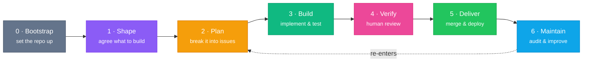
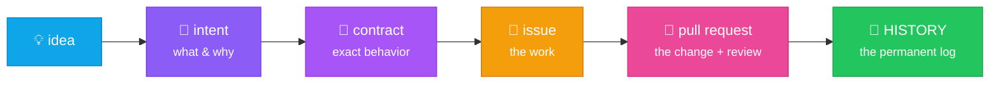

# Building software with steer

## From idea to shipped change — every step on the record

The development lifecycle we run, **why it looks the way it does**, and what you gain from it

press <kbd>Space</kbd> to advance

<!--
Client-facing deck. Two audiences in the room: non-technical stakeholders who
want to know "how does my idea become working software, and can I trust the
process?", and developers who want to know what the machinery actually does.
Every slide leads with the plain-language point; the technical grounding is in
the cards and fine print.
-->

---
layout: center
class: text-center
---

# How to read this deck

### 🧭 The big picture
**For everyone**

- How an idea becomes shipped software
- What's written down, and where
- What stays a **human decision**
- What you gain as a client

No code knowledge needed 👋

### ⚙️ The machinery
**For developers**

- The artifacts: specs, contracts, ADRs, issues
- The gates: what blocks, what nudges
- The traceability chain, end to end
- Claude Code **and** GitHub Copilot

Same slides, two depths — headlines for the first lens, fine print for the second.

---

# The problem worth solving

AI assistants made writing code cheap. That moved the risk — it didn't remove it.

### 🌀 Fast, but opaque
Features appear quickly — and six months later **nobody can say why** the app behaves the way it does, or who decided it should.

### 🧠 Knowledge in heads
Requirements live in chat threads and memory. When a person (or a chat session) is gone, **the context is gone**.

### 🎲 Every repo different
Each project invents its own process, tooling and habits — so quality depends on **who happened to build it**.

The fix isn't slowing the AI down — it's making the process durable, traceable and consistent around it.

<!--
Frame the deck around the real pain: AI-assisted development is fast, and speed
without records creates "vibe-coded" software — it runs, but intent, decisions
and accountability evaporate. steer exists to keep the speed and add the record.
-->

---

# What is steer?

<v-clicks>

- An **engineering-standards plugin** that rides inside the AI coding assistant.
- It carries a complete **software development life cycle**: the same path from rough idea to shipped, documented change — on **every** project, with **every** developer.
- Installed once per repo. From then on, every AI session works to the same standards **without anyone re-explaining them**.

</v-clicks>

Think of it as **a senior engineer's discipline, always in the room**: agree what to build, track the work, test it, and have a human review it before it ships.

Runs in <b>Claude Code</b> and in <b>GitHub Copilot</b> — same standards, generated from one source of truth. <i>(More on that later.)</i>

---
layout: center
---

# One rule holds it all together

### 📐 The spec
is durable **product truth**

What the software should do and why — written down, in the repo, in plain language.

### 🎫 The tracker
is the **work & decision layer**

Every change starts as a tracked issue. Discussion and status live there.

### 🧑‍⚖️ Human review
is **the gate**

Nothing merges or deploys without a human developer approving it. Ever.

Neither layer silently overwrites the other — and the AI **never crosses the review gate on its own**.

<!--
This is steer's core invariant, verbatim from the docs: "/spec is durable
product truth. The issue tracker is the work/decision layer. The human PR
review is the gate." Everything else in the deck hangs off this slide.
-->

---
layout: center
---

# The lifecycle at a glance

Every project walks the **same path**, and every phase ends at a **named gate**.

Devs drive each phase with <code>/steer:</code> commands — <code>spec</code>, <code>issues</code>, <code>work</code>, <code>audit</code>… The next four slides walk the loop.

---

# 1 · Shape — agree before building

Working out <i>what</i> and <i>why</i> before any code exists — the cheapest place to change your mind

### 📄 Intent — for product owners
Each feature gets an **intent** document: what it does, why it matters, and how we'll know it's done — **in plain language you can read and approve**.

### 📑 Contract — for developers
Behavior, data and error rules precise enough to build and test against. Hard-to-reverse choices get a numbered **decision record (ADR)**.

### ❓ Open questions
Anything unresolved becomes a numbered question with an owner — **visible, not forgotten**. Your answers are captured back into the spec.

### 🚦 The gate
The spec can't be **approved** while a blocking question is unanswered. Approval is the owner's sign-off on intent — recorded, dated, in the repo.

Your Word / PowerPoint / Excel briefs are absorbed directly (<code>/steer:intake</code>) — versioned, diffed against the previous edition, and mapped to open questions.

<!--
Non-technical takeaway: you can read and approve what will be built, and your
unanswered questions are tracked artifacts — not lost Slack messages.
Technical: intent.md + contract.md per feature, ADRs under /spec/decisions/,
Q-NNN open questions, /steer:spec approve is blocked on blocking questions.
-->

---

# 2 · Plan &nbsp;→&nbsp; 3 · Build

### 🎫 Plan — issue-first
The approved spec is decomposed into **tracked issues** — triaged, sized, prioritized.

**The rule: no change without an issue.** Every modification traces back to a ticket *before* the first line changes — enforced by a session gate, not just good intentions.

Tracker-agnostic: GitHub Issues, Jira, Linear or Azure DevOps — one file in the repo declares which, everything else adapts.

### ⚙️ Build — one issue, end to end
The AI claims the issue, branches, loads the linked spec, implements, **writes the tests**, and opens the pull request — updating the issue as it goes.

**Autonomy where it's safe:** commits, pushes and opening the PR are autonomous. **Merge and deploy are never implied.**

Optional <code>--reviewed</code> mode adds independent plan- and code-review passes by a separate read-only reviewer agent <i>before</i> the PR.

Speed comes from autonomy on the safe steps — not from skipping the record.

<!--
Plan: /steer:issues — capture → triage → decompose; issue-first is enforced by
a PreToolUse/Stop gate in Claude Code. Build: /steer:work — claim, branch,
implement, test, PR; steer-reviewer subagent on --reviewed. The autonomy
boundary is the key message for both audiences.
-->

---

# 4 · Verify — the human gate

"Review <i>is</i> productionization" — the one gate no AI crosses

### ✅ Definition of Done
A PR isn't reviewable until it clears the checklist: **tests cover what changed**, docs updated, CI green, spec kept in sync — the same bar on every project.

### 🚩 Drift gates
Nine classes of sensitive change — intent drift, contract drift, security-sensitive, compliance-impacting, … — are **flagged in the PR** the moment they're noticed.

A raised flag **blocks merge** until the human reviewer resolves it — and the AI **may not waive its own flag**.

A human developer approves every pull request. That's not a formality — it's **the** quality gate the whole lifecycle is built around.

<!--
Drift gate classes (rule 55): intent drift, contract drift, undocumented
behavior change, security-sensitive, compliance-impacting, operational, local
setup changed, app docs invalidated, architecture/stack drift. The "can't waive
its own flag" rule is the honest differentiator — worth saying out loud.
-->

---

# 5 · Deliver &nbsp;·&nbsp; 6 · Maintain

### 🚀 Deliver
Merge → deploy, behind **enforced branch protection**: no direct pushes to main, production deploys gated by a reviewed PR.

Early-stage projects can run a lighter solo mode — with CI backstops, and automatic nudges to graduate to full PR flow once a deploy target or second contributor appears.

### 🔍 Maintain
Scheduled **read-only audits** sweep the codebase against the standards and check the built software still matches the spec — findings are **filed as ranked issues**, never silently fixed.

Plus: <code>/steer:status</code> renders a shareable, client-ready progress report straight from the record — real counts, no fabricated status.

Findings feed back into **Plan** — the loop closes instead of decaying.

<!--
Deliver: /steer:protect, prod-branch gating (rule 52), solo-trunk graduation.
Maintain: /steer:audit code/spec (read-only, files findings), /steer:next,
/steer:status (artifact report). Production incidents have a sanctioned
fast-path (work --hotfix) that relaxes ordering but keeps every human gate and
requires post-incident backfill — mention verbally if asked about emergencies.
-->

---
layout: center
---

# The thread you can pull, months later

Ask *"why does the app do this?"* about **any behavior, at any time** —
and walk from the answer back to the decision, the discussion and the person who approved it.

Documentation is written **in the same PR as the change** — extract-don't-embellish — so the record never lags the code.
Every merged change appends one entry to an append-only <code>HISTORY.md</code>: what, why, who, references.

<!--
This is the traceability chain from TRACEABILITY.md: intent → contract →
tracker ref → implementation → PR review → HISTORY. The "living docs" rule
means the artifacts update in the same PR, not in a doc sprint later. New
joiner onboarding: read the last quarter of HISTORY.md in five minutes.
-->

---

# What stays human — always

The AI proposes, drafts, flags and files. These decisions it <b>never</b> takes:

🔀

<b>Merging a pull request</b> — pushing a branch and opening the PR are autonomous; <b>approving and merging is a human developer's call</b>.

🚀

<b>Deploying</b> — releases to any environment are decided by people, gated by branch protection.

⚖️

<b>Ratifying decisions</b> — an architecture decision stays <i>Proposed</i> until a human accepts it.

🔑

<b>Secrets & settings</b> — real credentials and repository security settings are never written by the AI.

That pause at the PR isn't friction — it's the **design**. Accountability stays with people.

<!--
From the authorization model / rule 95-not-the-gate. This is the slide that
answers the unspoken client question: "so the AI just does whatever it wants?"
No — four hard human gates, by construction.
-->

---

# What you gain — as a client

### 👀 Visibility, on demand
Progress reports generated **from the record** — real issue states, real PR status. Specs you can read; open questions with your name on them.

### 🧾 Audit-ready by construction
The everyday artifacts double as evidence: an append-only change log, decision records with status, reviewed PRs as the production gate. Practices **aligned with SOC 2 / ISO 27001 expectations** — produced as a side effect of working, not a scramble before an audit.

### 🔓 No lock-in to heads
Any developer — yours or ours — can open the repo and reconstruct intent, decisions and history **without archaeology**. Reading the last quarter of the change log takes five minutes.

### 📏 Predictability
Every repo has the same shape, the same gates, the same definition of done — so quality doesn't depend on **who** built it or **which week** it was built in.

<!--
Careful wording on compliance (from TRACEABILITY.md): "aligned", never
"compliant" — steer produces evidence and practices; certification is an
organizational scope. If asked directly: the artifacts map cleanly to SOC 2
change-management evidence requests, but no tool makes you compliant.
-->

---

# What you gain — as a developer

### 📦 A repo that arrives ready
Bootstrap installs the full scaffold: pinned toolchain (mise), CI workflows, compose file, PR template — **identical across projects**.

### 🧠 Context that survives
Specs, decisions and work state live in **files, not chat memory** — a new session (or a new dev) picks up exactly where the last one left off.

### 🛡️ Guardrails, not bureaucracy
Ceremony scales with risk: small changes flow, high-risk changes get flagged. The gates that block are few, named, and there for a reason.

### 🔍 An independent reviewer
A read-only reviewer agent examines plans and diffs in an **isolated context** — findings must cite file-and-line evidence. No evidence, no finding.

### 🧭 Never lost
<code>/steer:next</code> reconstructs the workspace state cold and points at the single best next action. <code>/steer:help</code> browses everything.

### ♻️ Standards that update
One plugin version, all repos: <code>/steer:sync</code> reconciles a repo against the latest standards and opens the update as a normal, reviewable PR.

---

# Works where you work

One source of truth, two assistants — the standards are <b>generated</b>, not maintained twice

### 🤖 Claude Code
The full engine: always-on rules injected every session, live gates at the moment of action, the reviewer agent, tracker integration.

CLI, IDE extension, or the Desktop Code tab.

### 🐙 GitHub Copilot
The same standards, **generated into Copilot's native formats** and committed to the repo:

- <code>.github/copilot-instructions.md</code> — the full ruleset
- <code>.github/prompts/steer-*.prompt.md</code> — the workflows
- <code>.github/agents/</code> — the reviewer agent

Regenerated from the same source on every release — parity by build, not by hand.

Your developers keep their tools. The **process and the record are identical** either way —
because the spec, the tracker and the PR gate live in the repo, not in the assistant.

<!--
Grounded in CROSS-SURFACE.md: rules → generated copilot-instructions.md;
skills → prompt capsules; reviewer agent ported; two gate scripts dual-target
(Copilot CLI). Honest nuance if asked: Copilot is best-effort tier — content
parity yes, but the live hook gates only exist on Copilot CLI, not VS Code.
The durable artifacts (spec/tracker/PR) are assistant-independent, which is
the real portability argument.
-->

---

# A change, end to end

What "add CSV export" actually looks like on the record

You ask

"Our analysts need to export results as CSV" — said in a meeting, or sent as a document.

Shape

An <b>intent</b> is drafted for you to read; the contract pins the details. One open question — <i>"which columns?"</i> — is assigned to you. You answer; the spec is <b>approved</b>.

Plan

Issue <b>#142 — CSV export</b> is filed, linking back to the spec.

Build

The AI implements on branch <code>issue/142-csv-export</code>, writes the tests, updates the user docs, opens <b>PR #143</b> — and stops.

Verify · Deliver

A developer reviews and merges; the change deploys through the protected branch. <code>HISTORY.md</code> gains one line: <i>what, why, who, refs #142/#143</i>.

A year later

Someone asks <i>"why does the export quote every field?"</i> — the contract says why, and the trail leads back to your answer on the open question.

<!--
The concrete walk-through that makes the abstractions land. Every artifact
named here is real: intent/contract, Q-NNN answer captured, issue-first,
issue/<n>-<slug> branch, PR + human merge, HISTORY.md entry.
-->

---

# Starting a project — three doors in

### 🌱 New build
A greenfield repo is bootstrapped **standards-compliant from commit one** — scaffold, CI, spec spine all installed before the first feature.

### 🏗️ Existing codebase
Adoption reverse-engineers the spec **from the code you already have**, triages what to keep / refactor / rewrite, and adds the standards without flattening working software.

### 💡 Just an idea
Non-technical owners start from a **guided interview** — idea → spec → working prototype — then hand off to a developer for the review lane. No tooling knowledge needed.

Prototype-fast **or** production-grade isn't a fork in the road here — the prototype is already on the rails that lead to production.

<!--
init / adopt / build. The closing line is the differentiator: /steer:build
output lands with a spec spine and tracker, so "productionizing the prototype"
is a review, not a rewrite. adopt's Keep/Refactor/Rewrite/Reject triage lands
in PRODUCTIONIZATION.md.
-->

---
layout: center
class: text-center
---

# In one line

AI speed, with every decision on the record —
and a human hand on every gate that matters.

<b>Traceable</b> — idea to shipped change, one walkable thread.

<b>Consistent</b> — same lifecycle, gates and quality bar on every repo.

<b>Accountable</b> — humans approve; the record proves it.

---
layout: center
class: text-center
---

# Thank you

Full documentation, workflows and reference:

**<https://ai.element-22.com>**

Product owner? → bring an idea, we'll shape it together

Developer? → the docs walk every workflow

Questions? 🙋

